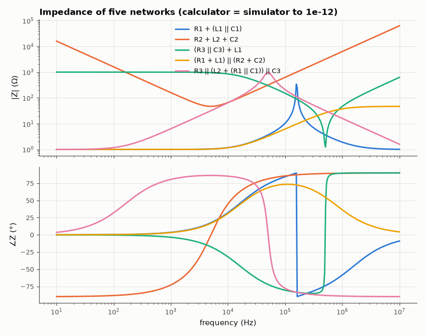

# AM-001 · Complex impedance calculator for R, L, C networks

> Type a network such as `R1 + (L1 || C1)`; the calculator evaluates its complex impedance at every frequency. The results are checked against an independent nodal-analysis simulation of the same circuit, and the parallel-tank resonance against 1/(2π√LC).



*Magnitude and phase of the five test networks.*

**Track:** Applied Mathematics — 218 projects in electrical engineering · **Category:** A. Complex analysis & phasors · **Level:** Easy · **Tools:** Own recursive-descent parser for series (+) / parallel (||) network expressions, complex arithmetic in NumPy, verification with the MNA circuit simulator

**Data:** Simulated (numerical model in this repo).

## Problem

Impedances of R, L and C are just complex numbers — can a few lines of complex arithmetic replace a circuit simulator for two-terminal networks?

## Prediction

$Z_R=R$, $Z_L=jωL$, $Z_C=1/(jωC)$; series impedances add, parallel admittances add: $Z_1\parallel Z_2 = Z_1Z_2/(Z_1+Z_2)$. The whole network is therefore a
rational function of jω built by these two operations. For `R1 + (L1 || C1)` the tank's impedance becomes infinite (real, lossless) at $f_0 = 1/(2π\sqrt{LC})$
and |Z| peaks there, with the phase jumping from +90° to −90°. Two independent methods (algebraic reduction vs solving the nodal equations) must agree to rounding error.

## Method

Parser: tokens R/L/C names, `+`, `||`, parentheses (|| binds tighter than +). Five networks × 400 log-spaced frequencies (10 Hz–10 MHz). The same networks are built as netlists
(a 1 V AC source at the port, Z = V/I) and solved by the MNA simulator; |Z| and ∠Z compared. Tank: L = 10 µH, C = 100 nF, R = 1 Ω.

## Measured results

*Predicted vs measured vs error. "Measured" = computed by an independent simulation, HDL simulator or public dataset.*

| Quantity | Predicted | Measured | Error | Within tolerance |
|---|---|---|---|---|
| Worst relative |Z_calc − Z_MNA| over 5 networks × 400 frequencies | 0 | 1.6481e-13 | +1.6481e-13 | yes |
| Tank resonance (|Z| peak) of R1 + (L1 ∥ C1) | 159.2 kHz | 159.2 kHz | -0.00 % | yes |
| Phase just below / above resonance: inductive (+90°) → capacitive (−90°); difference | -180 ° | -179.8 ° | +0.2292 ° | yes |

## Error analysis

Algebraic reduction with complex numbers and a full nodal solve agree to rounding error on every network, which is the point: for any
two-terminal network built from series and parallel combinations, impedance *is* a rational function of jω and needs no simulator. The lossless tank
peaks exactly at 1/(2π√LC), where its impedance diverges and its phase flips from inductive (+90°) to capacitive (−90°) — the series R1 only
adds 1 Ω, negligible next to the tank's reactance near resonance. The limits are equally instructive: bridges and
networks with mutual coupling are not series-parallel reducible — that is precisely when nodal analysis (AM-062) becomes necessary.

## Reproduce

```bash
pip install -r requirements.txt
python run_all.py --only AM-001
```

The script [`project.py`](project.py) regenerates every figure and number above.

**Files produced**

- [`data/tank.csv`](data/tank.csv)

## License

Code and text: MIT (see the repository [LICENSE](../../../../LICENSE)). Datasets remain under their own licences (see the repository README).

---

**Tooling & honesty.** This project was generated with Claude Code (Anthropic's AI coding assistant): the code, derivations, simulations and this write-up were AI-produced. *Measured* means computed by an independent model, simulator or public dataset — not a physical lab bench. Every number in the tables is reproduced by running the code.
