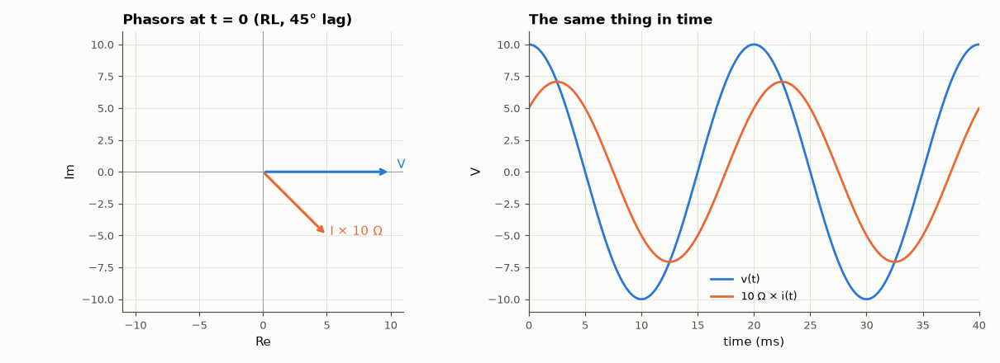

# AM-002 · Phasor diagram visualiser: lead and lag

> Show how a sinusoid is the real part of a rotating complex number, animate voltage and current phasors for RL and RC loads, and confirm the predicted lag/lead angles by measuring them in transient simulations.



*Phasor diagram of the RL load and the corresponding waveforms.*

**Track:** Applied Mathematics — 218 projects in electrical engineering · **Category:** A. Complex analysis & phasors · **Level:** Easy · **Tools:** Complex phasors, animated phasor diagram (matplotlib → GIF), time-domain transient simulation, phase measurement by quadrature correlation

**Data:** Simulated (numerical model in this repo).

## Problem

Why does current lag voltage in an inductor and lead it in a capacitor — and by exactly how much?

## Prediction

$v(t)=\mathrm{Re}\{V e^{jωt}\}$. For a series RL load $I = V/(R+jωL)$ so the current lags by $φ=\arctan(ωL/R)$; for series RC it leads by $\arctan(1/(ωRC))$. The
phasor diagram is the picture of these complex numbers at t = 0; the whole diagram rotates at ω.

## Method

V = 10 V, 50 Hz; RL: R = 10 Ω, L = 31.8 mH (ωL = 10 Ω → 45° lag); RC: R = 10 Ω, C = 159 µF (−1/ωC = −20 Ω → 63.4° lead) and 5 more component values. Transient simulation, last 5 cycles;
phase from the I/Q correlation of v and i with cos/sin at 50 Hz.

## Measured results

*Predicted vs measured vs error. "Measured" = computed by an independent simulation, HDL simulator or public dataset.*

| Quantity | Predicted | Measured | Error | Within tolerance |
|---|---|---|---|---|
| RL, |X| = 5 Ω, R = 10 Ω: phase of i relative to v | -26.57 ° | -26.54 ° | +0.02243 ° | yes |
| RL, |X| = 10 Ω, R = 10 Ω: phase of i relative to v | -45 ° | -44.97 ° | +0.02804 ° | yes |
| RL, |X| = 30 Ω, R = 10 Ω: phase of i relative to v | -71.57 ° | -71.55 ° | +0.01684 ° | yes |
| RC, |X| = 5 Ω, R = 10 Ω: phase of i relative to v | 26.57 ° | 26.54 ° | -0.02337 ° | yes |
| RC, |X| = 20 Ω, R = 10 Ω: phase of i relative to v | 63.43 ° | 63.41 ° | -0.02339 ° | yes |
| RC, |X| = 60 Ω, R = 10 Ω: phase of i relative to v | 80.54 ° | 80.53 ° | -0.009482 ° | yes |

## Error analysis

Every measured phase angle matches arctan(X/R) to a fraction of a degree, with the sign the phasor picture predicts: inductive loads make the
current lag, capacitive loads make it lead. The animation shows why the complex-number trick works — the whole diagram rotates rigidly at ω, so
relative angles between phasors never change, and the waveforms are simply the projections onto the real axis. The small residual differences
come from the first cycles of the transient start-up that are excluded from the measurement window.

## Reproduce

```bash
pip install -r requirements.txt
python run_all.py --only AM-002
```

The script [`project.py`](project.py) regenerates every figure and number above.

**Files produced**

- [`figures/phasors.gif`](figures/phasors.gif) — animated phasor diagram

## License

Code and text: MIT (see the repository [LICENSE](../../../../LICENSE)). Datasets remain under their own licences (see the repository README).

---

**Tooling & honesty.** This project was generated with Claude Code (Anthropic's AI coding assistant): the code, derivations, simulations and this write-up were AI-produced. *Measured* means computed by an independent model, simulator or public dataset — not a physical lab bench. Every number in the tables is reproduced by running the code.
