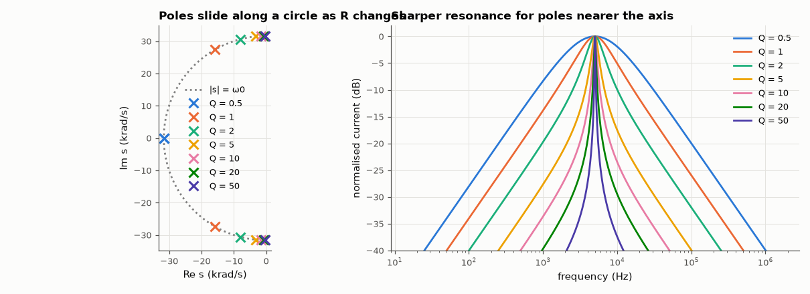

# AM-003 · RLC resonance: Q is the pole's distance from the jω axis

> Locate the poles of a series RLC circuit in the complex plane, predict the quality factor from their geometry, and confirm it by measuring the −3 dB bandwidth of the simulated resonance for resistances spanning Q = 0.5 to 50.



*Pole locations for seven Q values and the corresponding simulated resonance curves.*

**Track:** Applied Mathematics — 218 projects in electrical engineering · **Category:** A. Complex analysis & phasors · **Level:** Moderate · **Tools:** Characteristic-polynomial roots (NumPy), AC simulation of a series RLC, bandwidth measurement

**Data:** Simulated (numerical model in this repo).

## Problem

What does 'high Q' look like in the s-plane?

## Prediction

The current in a series RLC obeys $Ls^2+Rs+1/C=0$: poles $s=-α\pm jω_d$ with $α=R/2L$, $ω_0=1/\sqrt{LC}$ = |s|. Hence $Q=\frac{ω_0}{2α}=\frac{|s|}{2|\mathrm{Re}\,s|}$ —
a pole close to the imaginary axis relative to its distance from the origin means a sharp resonance. The −3 dB bandwidth of the current response is exactly
$Δω = 2α = ω_0/Q$ (for any Q, since the admittance is a band-pass with that bandwidth).

## Method

L = 1 mH, C = 1 µF (f0 = 5.03 kHz), R from 0.63 Ω to 63 Ω. Poles from numpy.roots; AC sweep of the loop current; bandwidth from the two −3 dB crossings.

## Measured results

*Predicted vs measured vs error. "Measured" = computed by an independent simulation, HDL simulator or public dataset.*

| Quantity | Predicted | Measured | Error | Within tolerance |
|---|---|---|---|---|
| R = 63.2 Ω: Q from pole geometry vs from simulated bandwidth | 0.5 | 0.4999 | -0.03 % | yes |
| R = 6.32 Ω: Q from pole geometry vs from simulated bandwidth | 5 | 4.999 | -0.03 % | yes |
| R = 0.632 Ω: Q from pole geometry vs from simulated bandwidth | 50 | 49.94 | -0.12 % | yes |
| Pole magnitude |s| = ω0 for every R (worst deviation) | 0 | 1.1504e-16 | +1.1504e-16 | yes |

## Error analysis

The pole-geometry Q and the bandwidth-measured Q agree across two decades, from an over-damped Q = 0.5 (real poles would appear below
Q = 0.5) to a razor-sharp Q = 50. All poles lie on the circle |s| = ω0: changing R only moves them *around* the circle toward the jω axis, which is
the geometric statement that resistance sets damping but not the natural frequency. For Q = 0.5 the two poles meet on the real axis (critical
damping), and the 'bandwidth' is still ω0/Q — the definition that makes this exact is the admittance's band-pass shape, not the peak sharpness.

## Reproduce

```bash
pip install -r requirements.txt
python run_all.py --only AM-003
```

The script [`project.py`](project.py) regenerates every figure and number above.

**Files produced**

- [`data/q.csv`](data/q.csv)

## License

Code and text: MIT (see the repository [LICENSE](../../../../LICENSE)). Datasets remain under their own licences (see the repository README).

---

**Tooling & honesty.** This project was generated with Claude Code (Anthropic's AI coding assistant): the code, derivations, simulations and this write-up were AI-produced. *Measured* means computed by an independent model, simulator or public dataset — not a physical lab bench. Every number in the tables is reproduced by running the code.
