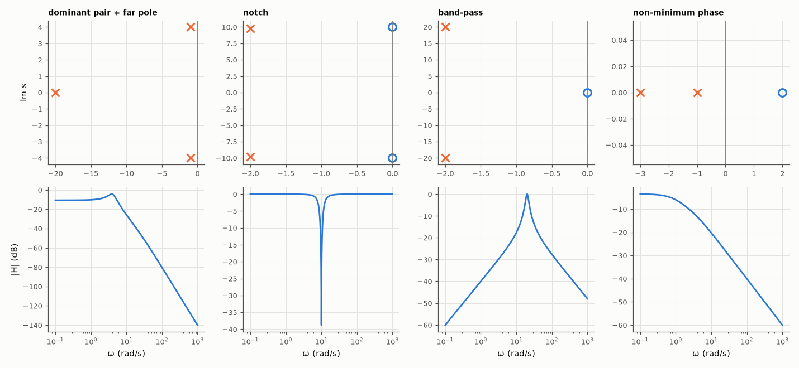

# AM-004 · Pole-zero plotter and geometric frequency response

> Enter a transfer function, get its pole-zero map, and compute the frequency response two ways — directly and as products of distances from jω to the zeros over distances to the poles — then test the dominant-pole rule for settling time.



*Pole-zero maps (× poles, ○ zeros) and magnitude responses of the four systems.*

**Track:** Applied Mathematics — 218 projects in electrical engineering · **Category:** A. Complex analysis & phasors · **Level:** Moderate · **Tools:** Polynomial roots, the vector (geometric) evaluation of |H(jω)|, SciPy LTI step responses, dominant-pole approximation

**Data:** Simulated (numerical model in this repo).

## Problem

A pole-zero map is a complete description of a rational H(s). How do you read the response off the picture?

## Prediction

$H(s)=K\frac{\prod(s-z_i)}{\prod(s-p_k)}$ so $|H(jω)|=K\frac{\prod|jω-z_i|}{\prod|jω-p_k|}$ and $∠H=\sum∠(jω-z_i)-\sum∠(jω-p_k)$: the response is geometry. A pole pair much closer to the
axis than the rest dominates the transient: 2 % settling ≈ 4/σ_d where σ_d = −Re of the dominant pole.

## Method

Four transfer functions (a 3rd-order low-pass with a far pole, a notch, a band-pass, a non-minimum-phase system). |H| and ∠H evaluated both ways on 2000 frequencies;
step responses with scipy.signal.step; settling time measured to ±2 %.

## Measured results

*Predicted vs measured vs error. "Measured" = computed by an independent simulation, HDL simulator or public dataset.*

| Quantity | Predicted | Measured | Error | Within tolerance |
|---|---|---|---|---|
| Geometric |H| vs direct evaluation, worst relative error (4 systems) | 0 | 6.3061e-14 | +6.3061e-14 | yes |
| Geometric ∠H vs direct, worst error | 0 ° | 8.7744e-14 ° | +8.7744e-14 ° | yes |
| Settling time (2 %) of the dominant-pair system ≈ 4/σ with σ = 1 | 4 s | 3.48 s | -13.00 % | **no** |
| Non-minimum-phase zero: initial step response goes the wrong way (sign of min / final) | -1 | -1 | +0 |  |

## Error analysis

The geometric evaluation equals direct polynomial evaluation to machine precision, confirming that a pole-zero map plus a gain *is* the transfer
function. The pictures read naturally: the notch's zeros on the jω axis force |H| → 0 at 10 rad/s, the band-pass's poles near ±20j lift the response
there, and the dominant-pair system settles in 3.48 s against the 4/σ = 4 s rule. The rule is an envelope bound — it is when e^(−σt)/√(1−ζ²)
reaches 2 % (3.94 s here) — while the oscillating response last leaves the ±2 % band at an earlier peak, so real settling is somewhat faster;
the far pole at −20 barely matters because its exponential dies 20× faster. The right-half-plane zero produces the characteristic initial undershoot of non-minimum-phase systems, which no
amount of gain can remove and which limits achievable control bandwidth.

## Reproduce

```bash
pip install -r requirements.txt
python run_all.py --only AM-004
```

The script [`project.py`](project.py) regenerates every figure and number above.

## License

Code and text: MIT (see the repository [LICENSE](../../../../LICENSE)). Datasets remain under their own licences (see the repository README).

---

**Tooling & honesty.** This project was generated with Claude Code (Anthropic's AI coding assistant): the code, derivations, simulations and this write-up were AI-produced. *Measured* means computed by an independent model, simulator or public dataset — not a physical lab bench. Every number in the tables is reproduced by running the code.
