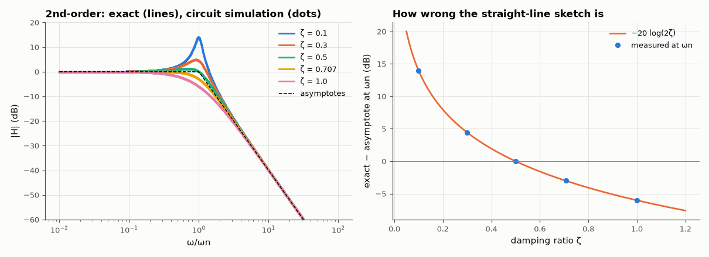

# AM-005 · Bode plots from H(s): asymptotes vs exact

> Derive the straight-line Bode approximation for first- and second-order factors, predict exactly where and by how much it is wrong, and verify both the exact curves and the error predictions numerically and with a circuit simulation.



*Exact vs asymptotic Bode magnitude and the error of the sketch at the natural frequency.*

**Track:** Applied Mathematics — 218 projects in electrical engineering · **Category:** A. Complex analysis & phasors · **Level:** Moderate · **Tools:** Analytic magnitude/phase of H(jω), straight-line Bode asymptotes, numerical evaluation, AC simulation of an RLC realisation

**Data:** Simulated (numerical model in this repo).

## Problem

Engineers sketch Bode plots with straight lines. How wrong are they, and where?

## Prediction

A simple pole $1/(1+jω/ω_p)$ has asymptotes 0 dB then −20 dB/dec; the worst error is 20·log√2 = −3.01 dB exactly at ω_p (and −0.97 dB an octave away). A second-order
factor $1/(1+2ζ jω/ω_n-(ω/ω_n)^2)$ has asymptotes 0 and −40 dB/dec, and at ω_n the exact magnitude is $1/(2ζ)$ → the error is $-20\log(2ζ)$ dB: +13.98 dB for ζ = 0.1,
0 dB for ζ = 0.5, −3.01 dB for ζ = 0.707. The resonant peak itself is at $ω_n\sqrt{1-2ζ^2}$ with height $1/(2ζ\sqrt{1-ζ^2})$.

## Method

Exact |H(jω)| on 20,000 points vs piecewise-linear asymptotes; the 2nd-order factor realised as a series RLC (output across C) with R set for ζ, simulated with the MNA AC analysis.

## Measured results

*Predicted vs measured vs error. "Measured" = computed by an independent simulation, HDL simulator or public dataset.*

| Quantity | Predicted | Measured | Error | Within tolerance |
|---|---|---|---|---|
| Simple pole: asymptote error at the corner | -3.01 dB | -3.01 dB | +4.3360e-08 dB | yes |
| Simple pole: error one octave above the corner | -0.9691 dB | -0.9691 dB | -1.9113e-07 dB | yes |
| ζ = 0.1: resonant peak height (exact formula vs numerical max) | 14.02 dB | 14.02 dB | -3.7968e-07 dB | yes |
| ζ = 0.3: resonant peak height (exact formula vs numerical max) | 4.847 dB | 4.847 dB | -1.6383e-06 dB | yes |
| ζ = 0.5: resonant peak height (exact formula vs numerical max) | 1.249 dB | 1.249 dB | -2.2174e-07 dB | yes |
| ζ = 0.1: error of the asymptote at ωn = −20 log(2ζ) | 13.98 dB | 13.98 dB | +1.7764e-15 dB | yes |
| ζ = 0.3: error of the asymptote at ωn = −20 log(2ζ) | 4.437 dB | 4.437 dB | +0 dB | yes |
| ζ = 0.5: error of the asymptote at ωn = −20 log(2ζ) | -0 dB | 0 dB | +0 dB | yes |
| ζ = 0.707: error of the asymptote at ωn = −20 log(2ζ) | -3.009 dB | -3.009 dB | -4.4409e-16 dB | yes |
| ζ = 1.0: error of the asymptote at ωn = −20 log(2ζ) | -6.021 dB | -6.021 dB | +0 dB | yes |
| Circuit simulation vs formula at ωn, worst over ζ | 0 dB | 3.5527e-15 dB | +3.5527e-15 dB | yes |

## Error analysis

The famous numbers come out exactly: −3.01 dB at a simple pole's corner, −0.97 dB an octave away, and for a quadratic the sketch's error at
ω_n is −20 log(2ζ) — negligible near ζ = 0.5, disastrous for lightly damped systems (+14 dB at ζ = 0.1). The circuit simulation of an RLC with the
same ζ lands on the analytic curve, so the algebra describes a real circuit, not just a formula. Lesson: straight lines are fine for first-order
factors and well-damped pairs; for ζ < 0.3 always add the resonant peak, or the sketch will badly understate gain near ω_n — exactly where
stability margins are decided.

## Reproduce

```bash
pip install -r requirements.txt
python run_all.py --only AM-005
```

The script [`project.py`](project.py) regenerates every figure and number above.

## License

Code and text: MIT (see the repository [LICENSE](../../../../LICENSE)). Datasets remain under their own licences (see the repository README).

---

**Tooling & honesty.** This project was generated with Claude Code (Anthropic's AI coding assistant): the code, derivations, simulations and this write-up were AI-produced. *Measured* means computed by an independent model, simulator or public dataset — not a physical lab bench. Every number in the tables is reproduced by running the code.
