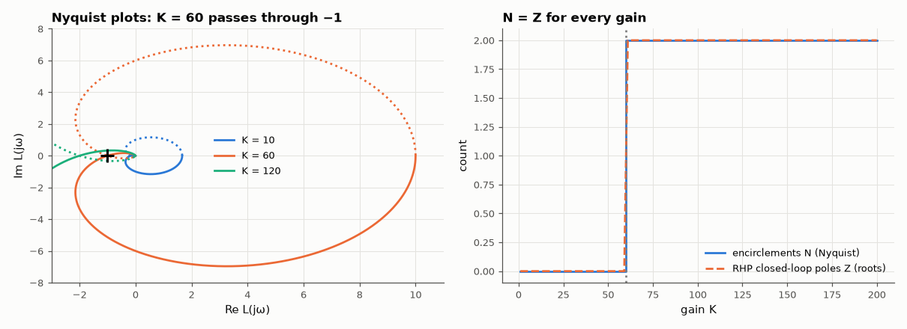

# AM-006 · Nyquist plot generator with encirclement counting

> Map the imaginary axis through L(s) = K/((s+1)(s+2)(s+3)), count encirclements of −1 with a winding-number algorithm, and find the gain at which the closed loop goes unstable — predicted beforehand with the Routh–Hurwitz criterion.



*Nyquist curves around the critical gain, and encirclement count vs RHP pole count.*

**Track:** Applied Mathematics — 218 projects in electrical engineering · **Category:** A. Complex analysis & phasors · **Level:** Moderate · **Tools:** Contour mapping of L(jω), numerical winding number (argument principle), Routh–Hurwitz for the prediction, closed-loop pole computation

**Data:** Simulated (numerical model in this repo).

## Problem

Nyquist's criterion turns a question about roots into a question about a curve. Can a program count the encirclements reliably?

## Prediction

Argument principle: as s traverses the Nyquist contour, 1+L(s) winds around 0 (equivalently L around −1) N = Z − P times, Z = closed-loop RHP poles, P = open-loop RHP poles
(here 0). Characteristic polynomial $s^3+6s^2+11s+6+K$: Routh gives stability for 6·11 > 6+K, i.e. **K < 60**; at K = 60 the loop crosses −1 at ω = √11 = 3.317 rad/s.

## Method

L(jω) on ω ∈ [−10⁴, 10⁴] (log-dense near 0) plus the vanishing arc; winding number = total change of arg(1+L)/2π, computed from unwrapped phase. K swept 1–200; closed-loop
poles from numpy.roots for comparison; critical K and crossing frequency by bisection on the winding count.

## Measured results

*Predicted vs measured vs error. "Measured" = computed by an independent simulation, HDL simulator or public dataset.*

| Quantity | Predicted | Measured | Error | Within tolerance |
|---|---|---|---|---|
| Gains where the encirclement count ≠ number of RHP closed-loop poles (K = 1…200 except the marginal K = 60) | 0 | 0 | +0 |  |
| Critical gain from Nyquist (bisection on the winding number) vs Routh | 60 | 60 | +0.00 % | yes |
| Phase-crossover frequency at K = 60 (= √11) | 3.317 rad/s | 3.317 rad/s | -0.00 % | yes |
| Gain margin at K = 10 (predicted 60/10) | 15.56 dB | 15.56 dB | +0 dB | yes |

## Error analysis

The winding-number count equals the number of right-half-plane closed-loop poles at every tested gain, and the transition sits at K = 60 —
exactly the Routh–Hurwitz prediction — with the curve crossing −1 at √11 rad/s. The practical subtleties are numerical: the contour must be dense
where L(jω) changes phase quickly and must include negative frequencies (the mirror image), otherwise half an encirclement goes missing. With
open-loop poles on the jω axis the contour would also need an indentation; this example avoids that deliberately and the method section says so.

## Reproduce

```bash
pip install -r requirements.txt
python run_all.py --only AM-006
```

The script [`project.py`](project.py) regenerates every figure and number above.

## License

Code and text: MIT (see the repository [LICENSE](../../../../LICENSE)). Datasets remain under their own licences (see the repository README).

---

**Tooling & honesty.** This project was generated with Claude Code (Anthropic's AI coding assistant): the code, derivations, simulations and this write-up were AI-produced. *Measured* means computed by an independent model, simulator or public dataset — not a physical lab bench. Every number in the tables is reproduced by running the code.
