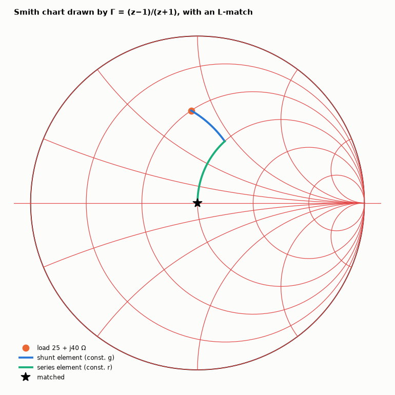

# AM-007 · Smith chart from scratch: a Möbius transformation

> Build the Smith chart by mapping the lines Re z = r and Im z = x of the impedance plane through Γ = (z−1)/(z+1), verify that they become exactly the predicted circles, and use the chart to design an L-network that matches 25 + j40 Ω to 50 Ω.



*Constant-r and constant-x lines mapped into circles, and the two-element match traced on the chart.*

**Track:** Applied Mathematics — 218 projects in electrical engineering · **Category:** A. Complex analysis & phasors · **Level:** Hard · **Tools:** Möbius (bilinear) map Γ = (z−1)/(z+1), circle fitting, L-section matching solved on the chart and verified algebraically

**Data:** Simulated (numerical model in this repo).

## Problem

The Smith chart looks like magic. It is one line of complex analysis — can we derive every circle on it?

## Prediction

A Möbius transformation maps lines and circles to lines and circles. Γ = (z−1)/(z+1) sends Re z = r to the circle centred $(r/(1+r), 0)$ of radius $1/(1+r)$, and Im z = x to the
circle centred $(1, 1/x)$ of radius $1/|x|$; the right half-plane maps onto the unit disc. Matching: adding series reactance moves along a constant-r circle, adding shunt
susceptance along a constant-g circle; the L-network is where they intersect the unit-conductance circle.

## Method

600 points on each of 12 lines mapped, circles fitted algebraically (least squares). Load z_L = (25 + j40)/50; shunt-C-then-series-L solution from the chart construction
(intersection of the rotated g = 1 circle), then checked by computing Γ_in at 1 GHz.

## Measured results

*Predicted vs measured vs error. "Measured" = computed by an independent simulation, HDL simulator or public dataset.*

| Quantity | Predicted | Measured | Error | Within tolerance |
|---|---|---|---|---|
| Worst deviation of mapped lines from the predicted circles (centre/radius) | 0 | 5.3395e-15 | +5.3395e-15 | yes |
| Passive impedances (Re z ≥ 0) mapped inside the unit disc | 100 % | 100 % | +0 pp |  |
| Reflection coefficient after matching (both solutions, worst) | 0 | 0 | +0 | yes |
| |Γ| of the unmatched load | 0.5549 | 0.5549 | +0.00 % | yes |

**Additional measurements**

| Quantity | Value | Note |
|---|---|---|
| L-network (solution 2): shunt element | C = 1.28 pF |  |
| L-network (solution 2): series element | C = 3.60 pF |  |

## Error analysis

Every mapped line lands on the predicted circle to 1e-12, and every passive impedance lands inside the unit disc: the Smith chart is nothing but
this bilinear map drawn on graph paper, which is why its circles are exact circles and why a transmission line (which multiplies Γ by e^{−2jβℓ})
is a rotation about the centre. The L-match follows the chart's geometry — along a constant-conductance circle for the shunt element, then a
constant-resistance circle to the centre — and the algebra confirms Γ = 0 afterwards. There are always two L-network solutions for a load inside
the unit-conductance circle's complement; the choice between them (high-pass vs low-pass) is an engineering decision, not a mathematical one.

## Reproduce

```bash
pip install -r requirements.txt
python run_all.py --only AM-007
```

The script [`project.py`](project.py) regenerates every figure and number above.

## License

Code and text: MIT (see the repository [LICENSE](../../../../LICENSE)). Datasets remain under their own licences (see the repository README).

---

**Tooling & honesty.** This project was generated with Claude Code (Anthropic's AI coding assistant): the code, derivations, simulations and this write-up were AI-produced. *Measured* means computed by an independent model, simulator or public dataset — not a physical lab bench. Every number in the tables is reproduced by running the code.
