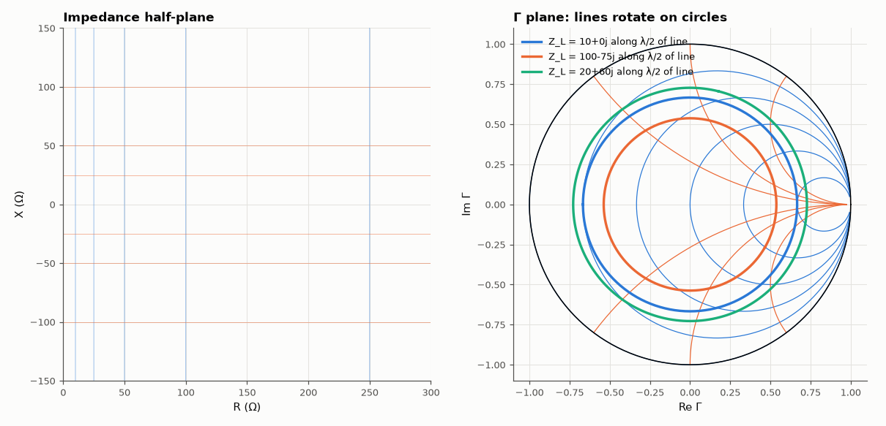

# AM-008 · Reflection coefficient mapping: impedance → unit disc

> Visualise how the impedance plane folds into the unit disc, show that lossless transmission lines rotate Γ on a circle, and check the VSWR / mismatch-loss relations numerically.



*Constant-R/X lines in the Z plane and their images in the Γ plane; three loads rotated by half a wavelength of line.*

**Track:** Applied Mathematics — 218 projects in electrical engineering · **Category:** A. Complex analysis & phasors · **Level:** Moderate · **Tools:** Complex mapping Γ(Z) = (Z−Z0)/(Z+Z0), transmission-line input impedance, VSWR and mismatch loss, grid visualisation

**Data:** Simulated (numerical model in this repo).

## Problem

What does a length of cable do to an impedance, and why do RF engineers think in Γ rather than Z?

## Prediction

$Γ=(Z-Z_0)/(Z+Z_0)$ maps Re Z > 0 into |Γ| < 1, Z = Z0 to the centre, open/short to ±1. A lossless line of length ℓ gives $Z_{in}=Z_0\frac{Z_L+jZ_0\tan βℓ}{Z_0+jZ_L\tan βℓ}$, equivalently
$Γ_{in}=Γ_Le^{-2jβℓ}$: a rotation at constant |Γ|, a full turn every λ/2. VSWR = (1+|Γ|)/(1−|Γ|); mismatch loss = −10 log(1−|Γ|²).

## Method

Z0 = 50 Ω. Grid of constant-R and constant-X lines mapped. Loads 10 Ω, 100 − j75 Ω and 20 + j60 Ω on 0 → λ/2 of line (400 steps): Z_in from the impedance formula, Γ_in computed from it;
|Γ_in| constancy and rotation angle measured. VSWR/loss relations checked on 10⁴ random loads.

## Measured results

*Predicted vs measured vs error. "Measured" = computed by an independent simulation, HDL simulator or public dataset.*

| Quantity | Predicted | Measured | Error | Within tolerance |
|---|---|---|---|---|
| Lossless line: max change of |Γ| along the line | 0 | 4.4409e-16 | +4.4409e-16 | yes |
| Rotation angle of Γ vs −2βℓ, worst error | 0 ° | 2.7151e-14 ° | +2.7151e-14 ° | yes |
| Quarter-wave line turns 10 Ω into Z0²/10 | 250 Ω | 250 Ω | +0.00 % | yes |
| VSWR = (1+|Γ|)/(1−|Γ|) vs Vmax/Vmin of the standing wave (worst of 3) | 0 | 1.1468e-08 | +1.1468e-08 | yes |

**Additional measurements**

| Quantity | Value | Note |
|---|---|---|
| Mismatch loss at VSWR 2:1 | 0.5115 dB |  |

## Error analysis

A lossless line leaves |Γ| unchanged to rounding error and rotates it by exactly −2βℓ, which is why reflection coefficient is the natural
coordinate for transmission lines: in Z the same operation is a complicated tangent formula, in Γ it is a rotation. The quarter-wave inversion
(10 Ω → 250 Ω) is the half-turn of that rotation, and the VSWR formula agrees with the standing-wave ratio measured directly on the simulated line
voltage. Real cables add loss, which turns the circles into inward spirals toward Γ = 0 — the reason a long lossy cable hides a bad antenna.

## Reproduce

```bash
pip install -r requirements.txt
python run_all.py --only AM-008
```

The script [`project.py`](project.py) regenerates every figure and number above.

## License

Code and text: MIT (see the repository [LICENSE](../../../../LICENSE)). Datasets remain under their own licences (see the repository README).

---

**Tooling & honesty.** This project was generated with Claude Code (Anthropic's AI coding assistant): the code, derivations, simulations and this write-up were AI-produced. *Measured* means computed by an independent model, simulator or public dataset — not a physical lab bench. Every number in the tables is reproduced by running the code.
