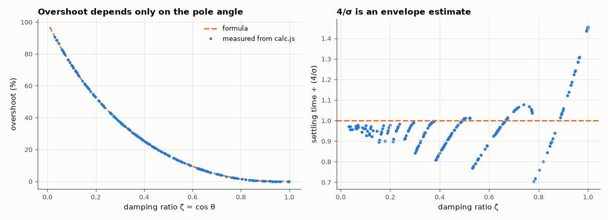

# AM-009 · s-plane explorer: drag a pole, watch the step response

> A browser tool where you drag a pole pair around the s-plane and see the step response, overshoot and settling time update live. The JavaScript is verified against SciPy and the standard second-order formulas are tested across the plane.



*Overshoot vs damping ratio, and how good the 4/σ settling rule is across 200 pole positions.*

**Track:** Applied Mathematics — 218 projects in electrical engineering · **Category:** A. Complex analysis & phasors · **Level:** Moderate · **Tools:** Interactive SVG page (drag the pole pair), closed-form step responses in JavaScript, Node test harness vs SciPy, damping formulas

**Data:** Simulated (numerical model in this repo).

## Problem

How exactly does moving a pole change what a system does in time?

## Prediction

For poles $-σ\pm jω_d$: $y(t)=1-e^{-σt}\big(\cos ω_dt+\tfrac{σ}{ω_d}\sin ω_dt\big)$. The pole angle sets the damping ratio $ζ=\cos θ = σ/\sqrt{σ^2+ω_d^2}$, overshoot is
$100\,e^{-πζ/\sqrt{1-ζ^2}}$ % — a function of the angle only — while the distance from the jω axis sets the envelope $e^{-σt}$ and the settling time ≈ 4/σ.

## Method

200 random pole pairs (σ ∈ [0.2, 5], ω_d ∈ [0.1, 10]): calc.js step response vs scipy.signal.step on 4000 points; overshoot from the JS output vs the ζ formula; settling
vs 4/σ. Two real poles checked the same way.

## Measured results

*Predicted vs measured vs error. "Measured" = computed by an independent simulation, HDL simulator or public dataset.*

| Quantity | Predicted | Measured | Error | Within tolerance |
|---|---|---|---|---|
| Max |JS step − SciPy step| over 200 pole pairs | 0 | 7.3497e-14 | +7.3497e-14 | yes |
| Overshoot: worst |measured − 100·exp(−πζ/√(1−ζ²))| | 0 pp | 0.04133 pp | +0.04133 pp | yes |
| Settling time / (4/σ), median over the 200 systems | 1 | 0.955 | -4.50 % | yes |
| Two real poles (−0.5, −3): JS vs SciPy | 0 | 2.7534e-14 | +2.7534e-14 | yes |

**Additional measurements**

| Quantity | Value | Note |
|---|---|---|
| Settling time / (4/σ), range | 0.70 – 1.46 |  |

## Error analysis

The page's closed-form responses match SciPy to machine precision, and the overshoot measured from them lies exactly on the ζ-formula curve —
overshoot is a function of pole *angle* only, which is the key intuition the drag interaction teaches. The settling-time rule is looser: 4/σ is the
time for the envelope e^(−σt) to reach 2 %, but the response itself may leave the ±2 % band earlier (when an oscillation peak happens to fall
inside it) or later (heavy damping, where the decay is slower than the envelope suggests), giving ratios 0.70–1.46.

## Reproduce

```bash
pip install -r requirements.txt
python run_all.py --only AM-009
```

The script [`project.py`](project.py) regenerates every figure and number above.

**Files produced**

- [`web/index.html`](web/index.html) — interactive tool
- [`web/calc.js`](web/calc.js) — closed-form responses (tested)

## License

Code and text: MIT (see the repository [LICENSE](../../../../LICENSE)). Datasets remain under their own licences (see the repository README).

---

**Tooling & honesty.** This project was generated with Claude Code (Anthropic's AI coding assistant): the code, derivations, simulations and this write-up were AI-produced. *Measured* means computed by an independent model, simulator or public dataset — not a physical lab bench. Every number in the tables is reproduced by running the code.
