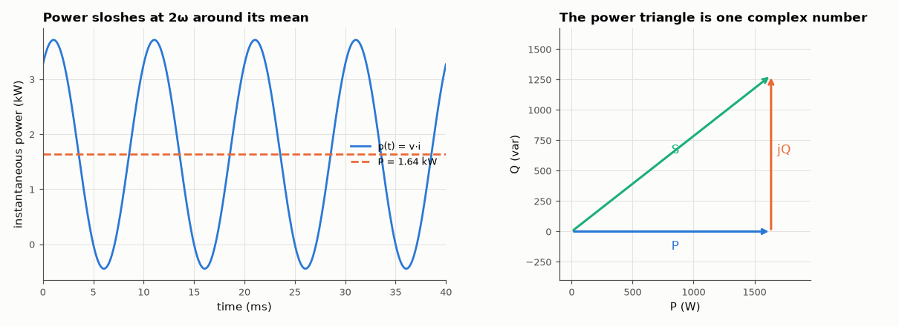

# AM-010 · Complex power: P, Q and S as one complex number

> Compute real, reactive and apparent power of an inductive load as a single complex number, confirm each part from the simulated instantaneous power p(t) = v(t)i(t), then size a power-factor-correction capacitor and verify that it works.



*Instantaneous power of the inductive load and the complex power triangle.*

**Track:** Applied Mathematics — 218 projects in electrical engineering · **Category:** A. Complex analysis & phasors · **Level:** Easy · **Tools:** Phasor power S = V·I*, time-domain simulation of instantaneous power, power-factor correction design

**Data:** Simulated (numerical model in this repo).

## Problem

What is 'reactive power' physically, and how does a capacitor cancel it?

## Prediction

With rms phasors, $S = VI^* = P + jQ$; |S| is apparent power, P/|S| the power factor. In time, $p(t)=P\,[1+\cos 2ωt] + Q\sin 2ωt$ (for v = √2V cos ωt): P is the average,
and Q the amplitude of the part that sloshes back and forth at 2ω without net transfer. A parallel capacitor supplying $Q_C = V^2ωC$ cancels the load's Q:
$C = Q/(ωV^2)$ gives unity power factor, reducing the line current by the factor pf.

## Method

230 V rms, 50 Hz source into R = 20 Ω in series with L = 50 mH (Z = 20 + j15.7 Ω). Transient simulation for 0.5 s; P from mean(v·i), Q from the 2ω quadrature component of p(t);
then the computed PFC capacitor in parallel and the line current re-measured.

## Measured results

*Predicted vs measured vs error. "Measured" = computed by an independent simulation, HDL simulator or public dataset.*

| Quantity | Predicted | Measured | Error | Within tolerance |
|---|---|---|---|---|
| Real power P (mean of v·i) | 1.636 kW | 1.636 kW | +0.02 % | yes |
| Reactive power Q (2ω quadrature amplitude of p(t)) | 1.285 kvar | 1.284 kvar | -0.04 % | yes |
| Apparent power |S| = Vrms·Irms | 2.08 kVA | 2.08 kVA | +0.01 % | yes |
| Power factor after correction | 1 | 1 | -0.00 % | yes |
| Line current reduction factor (= pf) | 0.7864 | 0.7865 | +0.01 % | yes |

**Additional measurements**

| Quantity | Value | Note |
|---|---|---|
| Power factor before correction | 0.7864 |  |
| PFC capacitor C = Q/(ωV²) | 77.31 µF |  |

## Error analysis

P, Q and |S| extracted from the simulated waveforms match V·I* to well under 1 %, which makes the physical meaning concrete: P is the average
of p(t), Q is the amplitude of the part that flows back and forth at twice the line frequency. A 77 µF capacitor, sized from Q/(ωV²),
raises the power factor from 0.786 to 1.0000 and cuts the line current by the factor pf, while the load itself is unchanged —
the capacitor now supplies the reactive current locally. This is why utilities penalise low power factor: the extra current heats their cables without
delivering energy.

## Reproduce

```bash
pip install -r requirements.txt
python run_all.py --only AM-010
```

The script [`project.py`](project.py) regenerates every figure and number above.

## License

Code and text: MIT (see the repository [LICENSE](../../../../LICENSE)). Datasets remain under their own licences (see the repository README).

---

**Tooling & honesty.** This project was generated with Claude Code (Anthropic's AI coding assistant): the code, derivations, simulations and this write-up were AI-produced. *Measured* means computed by an independent model, simulator or public dataset — not a physical lab bench. Every number in the tables is reproduced by running the code.
