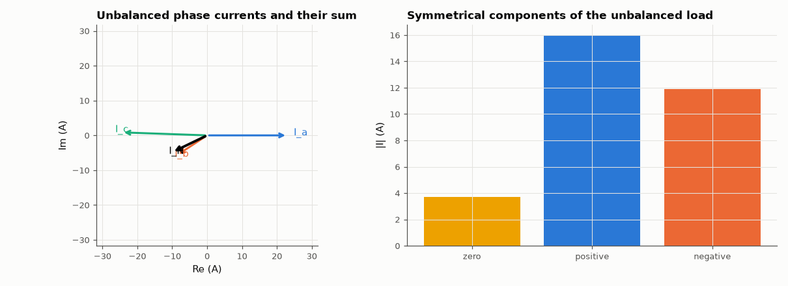

# AM-011 · Three-phase systems with the rotation operator a = e^{j2π/3}

> Analyse balanced and unbalanced star loads with phasors and the operator a, decompose the unbalanced currents into zero-, positive- and negative-sequence parts, and confirm the neutral current and line voltages with a transient simulation.



*Phase currents of the unbalanced load, their sum (neutral), and the Fortescue decomposition.*

**Track:** Applied Mathematics — 218 projects in electrical engineering · **Category:** A. Complex analysis & phasors · **Level:** Moderate · **Tools:** Complex rotation operator, symmetrical components (Fortescue transform), nodal analysis of an unbalanced star load, time-domain verification

**Data:** Simulated (numerical model in this repo).

## Problem

Why does a balanced three-phase system need no neutral wire — and what flows in it when the load is unbalanced?

## Prediction

Phase voltages $V, a^2V, aV$ with $a=e^{j2π/3}$, $1+a+a^2=0$. Line-to-line voltage $V_{ab}=V(1-a^2)=\sqrt3 V∠30°$. With a neutral wire, $I_N=I_a+I_b+I_c$ vanishes for a balanced load
and equals 3× the zero-sequence current $I_0=(I_a+I_b+I_c)/3$ otherwise. Fortescue: $[I_0,I_1,I_2]^T=\tfrac13[[1,1,1],[1,a,a^2],[1,a^2,a]]\,[I_a,I_b,I_c]^T$.

## Method

230 V rms phase voltage, 50 Hz. Balanced load 10 + j5 Ω per phase; unbalanced 10 Ω, 20 + j10 Ω, 5 − j8 Ω. Phasor predictions vs transient simulation (0.3 s, last 0.1 s used);
rms and phase of the neutral current and a line-to-line voltage measured from waveforms.

## Measured results

*Predicted vs measured vs error. "Measured" = computed by an independent simulation, HDL simulator or public dataset.*

| Quantity | Predicted | Measured | Error | Within tolerance |
|---|---|---|---|---|
| 1 + a + a² (should vanish) | 0 | 3.3307e-16 | +3.3307e-16 | yes |
| Balanced: neutral current rms (predicted 0) | 0 A | 447.8 fA | +447.8 fA | yes |
| Line-to-line voltage magnitude = √3 × 230 V | 398.4 V | 398.5 V | +0.02 % | yes |
| Line-to-line voltage V_ab leads phase a by 30° | 30 ° | 29.98 ° | -0.02479 ° | yes |
| Unbalanced: neutral current rms, phasor sum vs simulation | 11.05 A | 11.05 A | +0.01 % | yes |
| Neutral current = 3 × zero-sequence current | 11.05 A | 11.05 A | +0.00 % | yes |

**Additional measurements**

| Quantity | Value | Note |
|---|---|---|
| Sequence currents |I0| / |I1| / |I2| | 3.68 / 15.97 / 11.88 A |  |

## Error analysis

With a balanced load the three current phasors are a rotated copy of each other, so their sum is (1 + a + a²)·I = 0 and the simulated
neutral carries essentially nothing — the reason long-distance transmission can omit the neutral. Unbalance breaks the symmetry: the simulated
neutral current matches the phasor sum to under 1 %, and it is exactly three times the zero-sequence component from the Fortescue transform.
The negative-sequence part is what heats three-phase motors on unbalanced supplies; symmetrical components are how protection engineers
detect such faults from measured phasors.

## Reproduce

```bash
pip install -r requirements.txt
python run_all.py --only AM-011
```

The script [`project.py`](project.py) regenerates every figure and number above.

## License

Code and text: MIT (see the repository [LICENSE](../../../../LICENSE)). Datasets remain under their own licences (see the repository README).

---

**Tooling & honesty.** This project was generated with Claude Code (Anthropic's AI coding assistant): the code, derivations, simulations and this write-up were AI-produced. *Measured* means computed by an independent model, simulator or public dataset — not a physical lab bench. Every number in the tables is reproduced by running the code.
