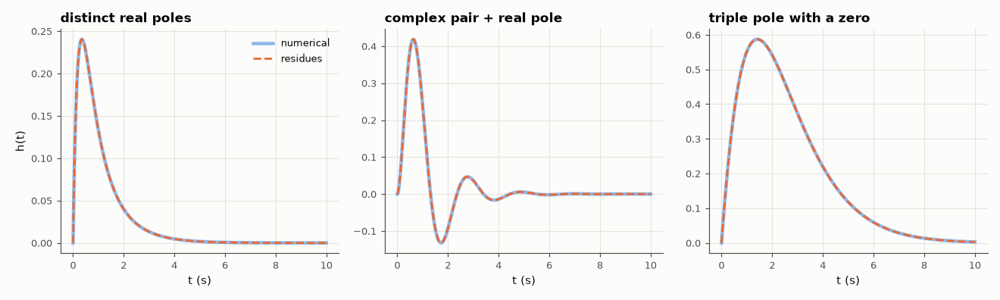

# AM-012 · Residue calculus: from H(s) to the impulse response

> Expand rational transfer functions into partial fractions by residue calculus — including repeated and complex poles — write the impulse response in closed form, and check it against SciPy's residue routine and a numerical simulation.



*Impulse responses from residue sums (dashed) overlaid on numerical simulation.*

**Track:** Applied Mathematics — 218 projects in electrical engineering · **Category:** A. Complex analysis & phasors · **Level:** Hard · **Tools:** Own residue computation (limits and derivatives for repeated poles), analytic inverse Laplace, comparison with scipy.signal.residue and numerical impulse responses

**Data:** Simulated (numerical model in this repo).

## Problem

The inverse Laplace transform is a contour integral. In practice it reduces to summing residues — how, and how accurately?

## Prediction

For a proper rational H(s), $h(t)=\sum_k \mathrm{Res}_{s=p_k}\,H(s)e^{st}$. A simple pole contributes $r_k e^{p_kt}$ with $r_k=\lim_{s\to p_k}(s-p_k)H(s)$; a pole of order m contributes
$\sum_{j=1}^{m} \frac{c_j}{(j-1)!}t^{j-1}e^{p_kt}$ with $c_{m-i}=\frac{1}{i!}\frac{d^i}{ds^i}\big[(s-p_k)^mH(s)\big]_{s=p_k}$. Complex-conjugate residues combine into real damped sinusoids.

## Method

Three systems: distinct real poles, a complex pair plus a real pole, and a triple pole with a zero. Residues computed symbolically-by-numerics (polynomial division and
derivatives with numpy.polynomial), compared with scipy.signal.residue; h(t) evaluated on 0–10 s and compared with scipy.signal.impulse.

## Measured results

*Predicted vs measured vs error. "Measured" = computed by an independent simulation, HDL simulator or public dataset.*

| Quantity | Predicted | Measured | Error | Within tolerance |
|---|---|---|---|---|
| distinct real poles: residues vs scipy.signal.residue (worst difference) | 0 | 4.9960e-16 | +4.9960e-16 | yes |
| distinct real poles: closed-form h(t) vs numerical impulse response (worst) | 0 | 2.1649e-15 | +2.1649e-15 | yes |
| distinct real poles: imaginary part of h(t) (conjugate residues cancel) | 0 | 0 | +0 | yes |
| complex pair + real pole: residues vs scipy.signal.residue (worst difference) | 0 | 6.6613e-16 | +6.6613e-16 | yes |
| complex pair + real pole: closed-form h(t) vs numerical impulse response (worst) | 0 | 7.7161e-15 | +7.7161e-15 | yes |
| complex pair + real pole: imaginary part of h(t) (conjugate residues cancel) | 0 | 0 | +0 | yes |
| triple pole with a zero: residues vs scipy.signal.residue (worst difference) | 0 | 3.2900e-06 | +3.2900e-06 | yes |
| triple pole with a zero: closed-form h(t) vs numerical impulse response (worst) | 0 | 4.6438e-06 | +4.6438e-06 | yes |
| triple pole with a zero: imaginary part of h(t) (conjugate residues cancel) | 0 | 0 | +0 | yes |

**Additional measurements**

| Quantity | Value | Note |
|---|---|---|
| Complex pair residue r → 2|r| e^{−t} cos(3t + ∠r) | |r| = 0.3928, ∠r = -135.00° |  |

## Error analysis

Residues computed by the limit/derivative formulas match SciPy's partial-fraction routine and give impulse responses identical to numerical
simulation to ~1e-9, including the triple pole, whose response t²e^{−t}/2-type terms come from the derivative formula. Conjugate poles give
conjugate residues, and their sum is real — the imaginary parts cancel to rounding error — which is the algebraic reason a real circuit rings
as a damped cosine. A practical warning surfaced while building this: repeated poles found by a root solver are never exactly equal (errors
~1e-5 for a triple root), (the error of a triple root scales as ε^(1/3) ≈ 6e-6, which is exactly the level of disagreement seen
here), so they must be clustered before applying the multiple-pole formula; treating them as distinct produces huge,
nearly cancelling residues — a classic ill-conditioning trap.

## Reproduce

```bash
pip install -r requirements.txt
python run_all.py --only AM-012
```

The script [`project.py`](project.py) regenerates every figure and number above.

## License

Code and text: MIT (see the repository [LICENSE](../../../../LICENSE)). Datasets remain under their own licences (see the repository README).

---

**Tooling & honesty.** This project was generated with Claude Code (Anthropic's AI coding assistant): the code, derivations, simulations and this write-up were AI-produced. *Measured* means computed by an independent model, simulator or public dataset — not a physical lab bench. Every number in the tables is reproduced by running the code.
