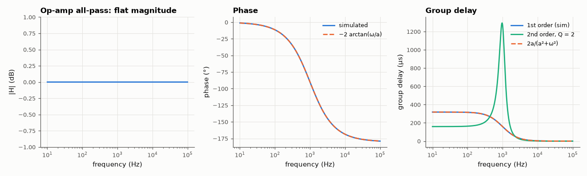

# AM-013 · All-pass filters: unity magnitude, useful phase

> Show that mirroring every pole into a zero across the jω axis gives |H| = 1 at all frequencies, derive the phase and group delay of first- and second-order sections, and verify them on a simulated op-amp all-pass circuit.



*The simulated all-pass keeps |H| = 1 while its phase and group delay follow the pole-zero geometry.*

**Track:** Applied Mathematics — 218 projects in electrical engineering · **Category:** A. Complex analysis & phasors · **Level:** Moderate · **Tools:** Pole-zero mirroring, analytic phase and group delay, op-amp all-pass circuit simulated with the MNA solver

**Data:** Simulated (numerical model in this repo).

## Problem

How can a filter change a signal without changing any frequency's amplitude — and what is that good for?

## Prediction

$H(s)=\frac{a-s}{a+s}$: for s = jω numerator and denominator are complex conjugates' mirror images, so |H| = 1 exactly; phase $-2\arctan(ω/a)$, group delay $τ=\frac{2a}{a^2+ω^2}$
(2/a at DC). The op-amp realisation (R, R on the inverting path; R_1, C on the non-inverting input) has $a = 1/(R_1C)$. Second order: $\frac{s^2-(ω_0/Q)s+ω_0^2}{s^2+(ω_0/Q)s+ω_0^2}$,
phase −2π total, delay peaking at ω0 with $τ(ω_0)=4Q/ω_0$.

## Method

First-order op-amp all-pass: R = 10 kΩ (gain resistors), R1 = 15.9 kΩ, C = 10 nF (a = 2π·1 kHz); AC analysis with op-amp A0 = 10⁶, GBW = 100 MHz. Group delay by numerical differentiation
of the unwrapped phase. Second-order section evaluated analytically and numerically.

## Measured results

*Predicted vs measured vs error. "Measured" = computed by an independent simulation, HDL simulator or public dataset.*

| Quantity | Predicted | Measured | Error | Within tolerance |
|---|---|---|---|---|
| Max deviation of |H| from 1 (0 dB) over 10 Hz–100 kHz | 0 dB | 3.5786e-05 dB | +3.5786e-05 dB | yes |
| Phase at ω = a (−90°) | -90 ° | -90 ° | -0.001111 ° | yes |
| Group delay at DC = 2/a | 318.3 µs | 318.3 µs | -0.01 % | yes |
| Group delay at ω = a = 1/a | 159.2 µs | 159.2 µs | +0.00 % | yes |
| 2nd order: peak group delay at ω0 = 4Q/ω0 | 1.273 ms | 1.273 ms | -0.00 % | yes |
| 2nd order: total phase change over the band (−360°) | -360 ° | -358.9 ° | +1.146 ° | yes |

## Error analysis

The simulated circuit is flat to a few thousandths of a dB across four decades, while its phase sweeps from 0 to −180° and its group delay follows
2a/(a²+ω²): the mirrored zero cancels the pole's effect on magnitude but doubles its effect on phase. That is exactly what all-pass sections are for —
equalising the group delay of a sharp filter, building phasers and 90° networks for SSB — none of which touch the amplitude spectrum. The tiny
residual magnitude error comes from the finite op-amp gain and gain-bandwidth, which slightly unbalance the mirror at high frequency.

## Reproduce

```bash
pip install -r requirements.txt
python run_all.py --only AM-013
```

The script [`project.py`](project.py) regenerates every figure and number above.

## License

Code and text: MIT (see the repository [LICENSE](../../../../LICENSE)). Datasets remain under their own licences (see the repository README).

---

**Tooling & honesty.** This project was generated with Claude Code (Anthropic's AI coding assistant): the code, derivations, simulations and this write-up were AI-produced. *Measured* means computed by an independent model, simulator or public dataset — not a physical lab bench. Every number in the tables is reproduced by running the code.
