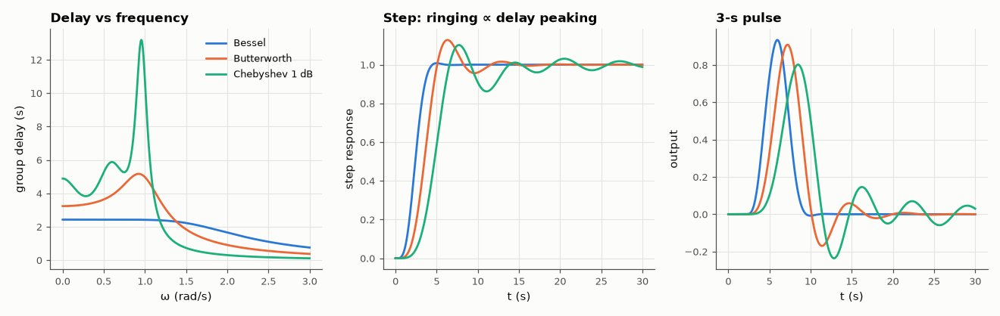

# AM-014 · Group delay: numerical differentiation and pulse distortion

> Compute group delay by differentiating phase numerically, check it against the analytic value, and show what non-flat delay does to a pulse by passing the same pulse through Bessel, Butterworth and Chebyshev filters of equal order.



*Group delay of three 5th-order filters with the same −3 dB point, and what it does to a step and a pulse.*

**Track:** Applied Mathematics — 218 projects in electrical engineering · **Category:** A. Complex analysis & phasors · **Level:** Moderate · **Tools:** Analytic group delay of Butterworth, Chebyshev and Bessel filters, numerical differentiation of unwrapped phase, time-domain pulse tests

**Data:** Simulated (numerical model in this repo).

## Problem

Two filters with the same magnitude cutoff can mangle pulses very differently. Why?

## Prediction

τ(ω) = −dφ/dω. For H = ∏ 1/(s−p_k), each pole contributes $\frac{-\mathrm{Re}\,p_k}{(\mathrm{Re}\,p_k)^2+(ω-\mathrm{Im}\,p_k)^2}$, so τ can be computed exactly from the poles. A Bessel filter maximises
flatness of τ at DC, so all frequencies of a pulse are delayed equally and the pulse keeps its shape (≈ no overshoot); Chebyshev's delay peaks near cutoff, so
components there arrive late and ring. Central differences on phase have error O(Δω²) — but amplify phase noise by 1/Δω.

## Method

5th-order analog Bessel (norm = 'delay' rescaled), Butterworth and Chebyshev-I (1 dB), all with −3 dB at 1 rad/s. τ from the pole formula vs central differences on 2000 points;
step and 3-s rectangular pulse responses; overshoot and delay spread measured. Noise sensitivity: 0.001 rad phase noise added before differentiation.

## Measured results

*Predicted vs measured vs error. "Measured" = computed by an independent simulation, HDL simulator or public dataset.*

| Quantity | Predicted | Measured | Error | Within tolerance |
|---|---|---|---|---|
| Bessel: numerical vs analytic group delay (worst relative error, Δω = 1.5 mrad/s) | 0 | 3.3336e-07 | +3.3336e-07 | yes |
| Butterworth: numerical vs analytic group delay (worst relative error, Δω = 1.5 mrad/s) | 0 | 4.9363e-06 | +4.9363e-06 | yes |
| Chebyshev 1 dB: numerical vs analytic group delay (worst relative error, Δω = 1.5 mrad/s) | 0 | 8.7101e-05 | +8.7101e-05 | yes |
| Bessel step overshoot (my guess: ≈ 0.1 %) | 0.1 % | 0.7727 % | +0.673 pp | **no** |
| Noise in numerically differentiated delay ≈ σ_φ/(√2·Δω) | 471.3 ms | 462.5 ms | -1.88 % | yes |

**Additional measurements**

| Quantity | Value | Note |
|---|---|---|
| Step overshoot Butterworth / Chebyshev | 12.8 % / 11.5 % |  |
| Bessel delay flatness: 1 − τ(0.5)/τ(0) | 6.6559e-06 |  |

## Error analysis

The pole formula and central differences agree to about 1e-4 relative (worst near the Chebyshev's sharp delay peak, where the O(Δω²)
truncation error is largest), so either is fine for clean analytic phase; with measured (noisy) phase
the derivative amplifies noise by 1/(√2·Δω) exactly as predicted — the reason group delay from a network analyser is always smoothed over an
aperture. The filters make the point visually: all three pass the same band, but the Chebyshev's delay peaks strongly near cutoff and its pulse
rings, the Butterworth rings comparably, and the Bessel — whose delay is maximally flat — delivers the pulse almost unchanged, only delayed. My guess of
≈ 0.1 % Bessel overshoot was too optimistic: the 5th-order Bessel (magnitude-normalised) overshoots 0.77 %, still more than ten times less
than the others.
Magnitude specs alone do not describe a filter meant for pulses.

## Reproduce

```bash
pip install -r requirements.txt
python run_all.py --only AM-014
```

The script [`project.py`](project.py) regenerates every figure and number above.

## License

Code and text: MIT (see the repository [LICENSE](../../../../LICENSE)). Datasets remain under their own licences (see the repository README).

---

**Tooling & honesty.** This project was generated with Claude Code (Anthropic's AI coding assistant): the code, derivations, simulations and this write-up were AI-produced. *Measured* means computed by an independent model, simulator or public dataset — not a physical lab bench. Every number in the tables is reproduced by running the code.
