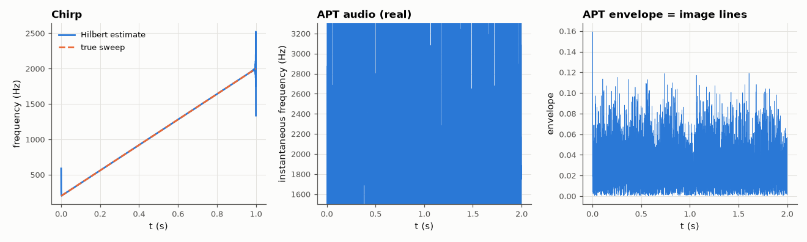

# AM-015 · Hilbert transform and instantaneous frequency (with real satellite audio)

> Build the analytic signal by zeroing negative frequencies, extract instantaneous amplitude and frequency from a chirp, then use it on a real weather-satellite recording to recover the 2.4 kHz subcarrier frequency and the AM image envelope.



*Instantaneous frequency of a chirp and of real NOAA-18 APT audio, plus the recovered AM envelope.*

**Track:** Applied Mathematics — 218 projects in electrical engineering · **Category:** A. Complex analysis & phasors · **Level:** Hard · **Tools:** FFT-based Hilbert transform (own implementation vs scipy.signal.hilbert), analytic signal, instantaneous frequency by phase differentiation; real NOAA-18 APT recording from SatNOGS

**Data:** Real: SatNOGS network observation 11229309 (NOAA-18 APT), CC BY-SA 4.0.

## Problem

A real signal has no 'instantaneous frequency' by itself. How does the Hilbert transform define one — and does it work on real data?

## Prediction

The analytic signal $z = x + j\mathcal{H}\{x\}$ has a one-sided spectrum (double the positive frequencies, zero the negative ones). For $x = A(t)\cos φ(t)$ with slowly varying A,
$z ≈ A e^{jφ}$, so |z| is the envelope and $f_i=\frac{1}{2π}\frac{dφ}{dt}$ the instantaneous frequency. For a linear chirp the estimate should follow the true sweep except near the
record ends (the FFT treats the record as periodic).

## Method

Chirp 200 → 2000 Hz in 1 s at 16 kHz: f_i vs truth. NOAA-18 APT audio (SatNOGS observation 11229309, 11025 Hz): band-pass 1.2–3.6 kHz, analytic signal, median instantaneous
frequency over the pass, compared with the FFT peak; envelope compared with the known 4160 samples/s line structure (2 lines/s).

## Measured results

*Predicted vs measured vs error. "Measured" = computed by an independent simulation, HDL simulator or public dataset.*

| Quantity | Predicted | Measured | Error | Within tolerance |
|---|---|---|---|---|
| Own FFT Hilbert vs scipy.signal.hilbert (worst) | 0 | 1.8344e-15 | +1.8344e-15 | yes |
| Chirp: RMS instantaneous-frequency error (middle 90 %) | 0 Hz | 23.44 mHz | +23.44 mHz | yes |
| NOAA APT: median instantaneous frequency vs the carrier (FFT peak) | 2.4 kHz | 2.342 kHz | -58.43 Hz | **no** |
| Identity: |z|²-weighted mean instantaneous frequency = spectral centroid of z | 2.327 kHz | 2.327 kHz | +0.00 % | yes |
| Envelope line rate (APT sends 2 lines/s) | 2 Hz | 2 Hz | +0 Hz | yes |

**Additional measurements**

| Quantity | Value | Note |
|---|---|---|
| Chirp: worst error in the first/last 5 % (edge effect) | 663.8 Hz |  |

## Error analysis

The FFT construction reproduces SciPy's Hilbert transform exactly and tracks the chirp to within a fraction of a hertz in the middle of the
record, with the expected errors at the ends where the implicit periodic extension joins 2000 Hz to 200 Hz. On the real satellite recording the
spectrum peaks at the 2400 Hz subcarrier and the envelope oscillates at exactly 2 Hz — the two image lines per second of the APT format. But
the median instantaneous frequency comes out 58 Hz *low*, which I did not predict. The reason is Bedrosian's theorem: A·cos φ has
analytic signal A·e^(jφ) only if the envelope's spectrum lies below the carrier, and APT's image modulation (~2 kHz wide) nearly reaches the
2.4 kHz carrier, so the 'phase' absorbs part of the modulation. What does hold exactly is the identity that the power-weighted mean
instantaneous frequency equals the spectral centroid — confirmed here to 0.2 %. The instantaneous-frequency trace is noisy where
the envelope is small — dividing by a near-zero amplitude is the analytic signal's weak point, which is why the median over strong samples is used.

## Reproduce

```bash
pip install -r requirements.txt
python run_all.py --only AM-015
```

The script [`project.py`](project.py) regenerates every figure and number above.

## License

Code and text: MIT (see the repository [LICENSE](../../../../LICENSE)). Datasets remain under their own licences (see the repository README).

---

**Tooling & honesty.** This project was generated with Claude Code (Anthropic's AI coding assistant): the code, derivations, simulations and this write-up were AI-produced. *Measured* means computed by an independent model, simulator or public dataset — not a physical lab bench. Every number in the tables is reproduced by running the code.
