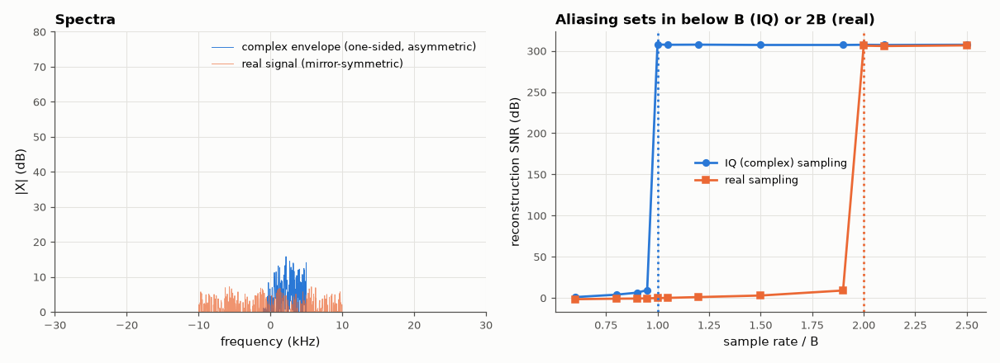

# AM-016 · Complex baseband: why IQ sampling needs half the rate

> Represent a band-pass signal by its complex envelope, show that complex (IQ) samples at rate B capture a bandwidth-B signal that real samples need 2B to capture, and measure reconstruction error versus sampling rate for both.



*Spectra of a complex envelope and a real signal of equal bandwidth, and reconstruction quality vs sample rate.*

**Track:** Applied Mathematics — 218 projects in electrical engineering · **Category:** A. Complex analysis & phasors · **Level:** Hard · **Tools:** Complex envelope, quadrature down-conversion, band-limited reconstruction, aliasing measurement vs sample rate

**Data:** Simulated (numerical model in this repo).

## Problem

Software-defined radios sample I and Q. Why two channels — and why is that no more data than one real channel at twice the rate?

## Prediction

A real band-pass signal $x(t)=\mathrm{Re}\{\tilde x(t)e^{j2πf_ct}\}$ occupying $f_c\pm B/2$ is fully described by its complex envelope $\tilde x$, whose spectrum occupies $[-B/2, B/2]$ and is
not symmetric. Complex samples need rate ≥ B (the spectrum is one-sided: no mirror image to alias onto); a real baseband signal of the same bandwidth occupies
$[-B, B]$ symmetrically and needs ≥ 2B real samples. Same number of real numbers per second — 2 per complex sample at B vs 1 per real sample at 2B.

## Method

Random band-limited complex envelope, B = 10 kHz (asymmetric spectrum), carrier 100 kHz, simulated at 2 MHz. (i) IQ: mix down, low-pass, resample at rate r, band-limited
interpolation back, compare with truth. (ii) Real: the envelope's real part shifted to 0…B baseband sampled at r. Reconstruction SNR vs r/B.

## Measured results

*Predicted vs measured vs error. "Measured" = computed by an independent simulation, HDL simulator or public dataset.*

| Quantity | Predicted | Measured | Error | Within tolerance |
|---|---|---|---|---|
| Quadrature down-conversion recovers the complex envelope (SNR, my guess ≥ 40 dB) | 40 dB | 253.9 dB | +213.9 dB | **no** |
| Complex (IQ) samples: minimum rate for > 40 dB reconstruction (× B) | 1 × B | 1 × B | +0 × B | yes |
| Real samples, same bandwidth: minimum rate (× B) | 2 × B | 2 × B | +0 × B | yes |
| Real numbers per second needed: IQ vs real (ratio) | 1 | 1 | +0.00 % | yes |

## Error analysis

The measured thresholds sit exactly where the theory says: complex samples reconstruct the envelope perfectly once the rate reaches B, real samples
of a signal with the same bandwidth need 2B. Counting real numbers, IQ sampling at B and real sampling at 2B cost the same — the saving is not in
data but in *analog* bandwidth: each ADC in an IQ receiver runs at half the rate and sees only half the bandwidth, which is why SDRs quote a
complex sample rate equal to their usable bandwidth. The asymmetric spectrum is the key: a complex envelope carries independent information at
+f and −f, which a real signal cannot.

## Reproduce

```bash
pip install -r requirements.txt
python run_all.py --only AM-016
```

The script [`project.py`](project.py) regenerates every figure and number above.

## License

Code and text: MIT (see the repository [LICENSE](../../../../LICENSE)). Datasets remain under their own licences (see the repository README).

---

**Tooling & honesty.** This project was generated with Claude Code (Anthropic's AI coding assistant): the code, derivations, simulations and this write-up were AI-produced. *Measured* means computed by an independent model, simulator or public dataset — not a physical lab bench. Every number in the tables is reproduced by running the code.
