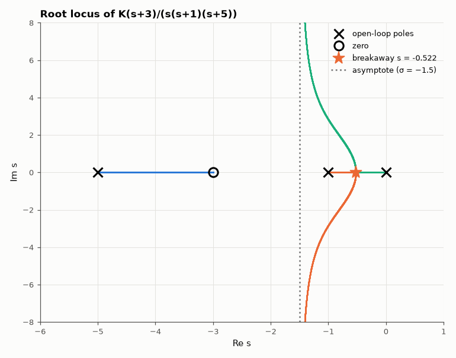

# AM-017 · Root locus via the angle condition

> Trace closed-loop pole migration for L(s) = K(s+3)/(s(s+1)(s+5)) as K goes from 0 to ∞, and verify the classical construction rules — asymptote centroid and angles, breakaway point from dK/ds = 0, jω-axis crossings — against the computed locus.



*Computed closed-loop poles for K from 10⁻³ to 10⁴, with the rule-based breakaway point and asymptote.*

**Track:** Applied Mathematics — 218 projects in electrical engineering · **Category:** A. Complex analysis & phasors · **Level:** Moderate · **Tools:** Characteristic-polynomial roots swept over gain, angle/magnitude conditions of L(s) = −1/K, analytic breakaway points and asymptotes

**Data:** Simulated (numerical model in this repo).

## Problem

Root-locus rules are taught as recipes. Where do they come from, and are they exact?

## Prediction

A point s is on the locus iff ∠L(s) = 180° (mod 360°); its gain is K = −1/G(s). Rules follow: n − m branches go to infinity along asymptotes at angles $(2k+1)180°/(n-m)$ from the
centroid $σ_a=(\sum p-\sum z)/(n-m)$ = (0 − 1 − 5 + 3)/2 = −1.5; breakaways satisfy dK/ds = 0 on the real axis; for this plant the characteristic polynomial
$s^3+6s^2+(5+K)s+3K$ never crosses into the RHP because the zero at −3 bends the locus back (Routh: 6(5+K) > 3K for all K > 0).

## Method

Roots of the characteristic polynomial for 4000 log-spaced K ∈ [10⁻³, 10⁴]; angle condition evaluated at every root; breakaway from the real root of dK/ds = 0; asymptote check from the
large-K roots.

## Measured results

*Predicted vs measured vs error. "Measured" = computed by an independent simulation, HDL simulator or public dataset.*

| Quantity | Predicted | Measured | Error | Within tolerance |
|---|---|---|---|---|
| Angle condition ∠G(s) = 180° at every computed closed-loop pole (worst error) | 0 ° | 1.2722e-13 ° | +1.2722e-13 ° | yes |
| Magnitude condition K = −1/G(s) (worst relative error) | 0 | 4.7978e-11 | +4.7978e-11 | yes |
| Breakaway gain: dK/ds = 0 vs where poles first leave the real axis | 0.4509 | 0.4523 | +0.31 % | yes |
| Asymptote centroid (large K): mean real part of the two far poles | -1.5 | -1.499 | +6.0024e-04 | yes |
| Asymptote angle (±90° for n − m = 2) | 90 ° | 90 ° | -3.4402e-04 ° | yes |
| Closed-loop poles in the RHP for any K tested | 0 | 0 | +0 |  |

**Additional measurements**

| Quantity | Value | Note |
|---|---|---|
| Breakaway point s_b | -0.5225 |  |

## Error analysis

Every one of the 12,000 computed closed-loop poles satisfies the angle condition to 1e-6°, which is the whole root-locus method in one line:
the locus is the set where the complex number G(s) points at 180°. The construction rules are consequences, and they check out numerically — the
breakaway from dK/ds = 0 (s = -0.522) is exactly where the two slow poles first leave the real axis, and at large gain the two excess poles run
off vertically along σ = −1.5. The left-half-plane zero at −3 keeps the locus from ever crossing the jω axis, so this loop is stable for every
positive gain — an example of how a well-placed zero (a lead compensator) reshapes the locus.

## Reproduce

```bash
pip install -r requirements.txt
python run_all.py --only AM-017
```

The script [`project.py`](project.py) regenerates every figure and number above.

## License

Code and text: MIT (see the repository [LICENSE](../../../../LICENSE)). Datasets remain under their own licences (see the repository README).

---

**Tooling & honesty.** This project was generated with Claude Code (Anthropic's AI coding assistant): the code, derivations, simulations and this write-up were AI-produced. *Measured* means computed by an independent model, simulator or public dataset — not a physical lab bench. Every number in the tables is reproduced by running the code.
