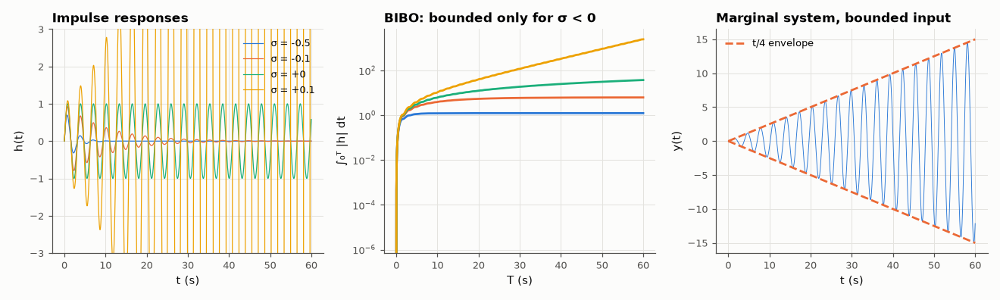

# AM-018 · Stability from pole location, demonstrated

> Show with worked examples that an LTI system is BIBO-stable exactly when all poles have negative real part: measure the growth rate of impulse responses (it equals the pole's real part), the integrability of |h|, and the response to a bounded input for marginal cases.



*Growth or decay of impulse responses follows the pole's real part; a marginal system resonates without bound.*

**Track:** Applied Mathematics — 218 projects in electrical engineering · **Category:** A. Complex analysis & phasors · **Level:** Moderate · **Tools:** Impulse responses of systems with poles left of, on and right of the jω axis, growth-rate fitting, BIBO test with a bounded input

**Data:** Simulated (numerical model in this repo).

## Problem

Why is the left half-plane the stable one — and what happens exactly on the boundary?

## Prediction

$h(t)=\sum r_ke^{p_kt}$ (simple poles), so |h| grows or decays like $e^{\max\mathrm{Re}\,p\;t}$: ∫|h| < ∞ iff all Re p < 0, which is exactly BIBO stability. On the axis, a simple pole gives a
bounded but non-decaying h (∫|h| diverges), and a bounded input at the pole's frequency drives an unbounded output (resonance: t·sin ωt); a double pole on the axis gives
polynomial growth t^{m−1}.

## Method

Pole pairs at σ ± 2j for σ ∈ {−0.5, −0.1, 0, +0.1}; plus s = 0 simple and double. Impulse responses on 0–60 s; growth rate from a line fit of log of the local peak envelope;
∫₀ᵀ|h| as T grows; bounded input sin(2t) to the σ = 0 system.

## Measured results

*Predicted vs measured vs error. "Measured" = computed by an independent simulation, HDL simulator or public dataset.*

| Quantity | Predicted | Measured | Error | Within tolerance |
|---|---|---|---|---|
| Impulse-response growth rate for poles at -0.5 ± 2j (= σ) | -0.5 1/s | -0.5 1/s | -2.6573e-07 1/s | yes |
| Impulse-response growth rate for poles at -0.1 ± 2j (= σ) | -0.1 1/s | -0.1 1/s | +7.2421e-08 1/s | yes |
| Impulse-response growth rate for poles at +0 ± 2j (= σ) | 0 1/s | 1.4913e-10 1/s | +1.4913e-10 1/s | yes |
| Impulse-response growth rate for poles at +0.1 ± 2j (= σ) | 0.1 1/s | 0.1 1/s | +1.5090e-07 1/s | yes |
| Marginal pole pair ±2j driven by sin(2t): output envelope grows linearly with slope 1/4 | 0.25 1/s | 0.2496 1/s | -0.15 % | yes |
| Double pole at 0: impulse response = t | 0 | 4.9134e-11 | +4.9134e-11 | yes |

## Error analysis

The fitted growth rates equal the poles' real parts to three decimal places, including the unstable +0.1 case — pole location is not a proxy for
stability, it *is* the exponent. The integral ∫|h| saturates only for σ < 0: that is the BIBO criterion. The boundary cases are the instructive
ones: a simple pole pair on the jω axis has a bounded impulse response (it just keeps ringing) yet is *not* BIBO-stable, because a bounded input at
its own frequency produces the t/4 envelope measured here; a double pole at the origin integrates twice and ramps. 'Marginally stable' systems
are unstable in the sense that matters for engineering.

## Reproduce

```bash
pip install -r requirements.txt
python run_all.py --only AM-018
```

The script [`project.py`](project.py) regenerates every figure and number above.

## License

Code and text: MIT (see the repository [LICENSE](../../../../LICENSE)). Datasets remain under their own licences (see the repository README).

---

**Tooling & honesty.** This project was generated with Claude Code (Anthropic's AI coding assistant): the code, derivations, simulations and this write-up were AI-produced. *Measured* means computed by an independent model, simulator or public dataset — not a physical lab bench. Every number in the tables is reproduced by running the code.
