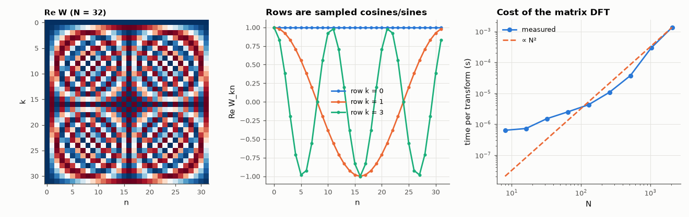

# AM-019 · The DFT as a matrix-vector product

> Build the N×N DFT matrix, show its rows are sampled complex exponentials (the Fourier basis), verify orthogonality and Parseval, match numpy's FFT to rounding error, and measure the O(N²) cost that motivates the FFT.



*The DFT matrix, its rows as basis functions, and the quadratic cost of computing it directly.*

**Track:** Applied Mathematics — 218 projects in electrical engineering · **Category:** B. Fourier analysis & transforms · **Level:** Moderate · **Tools:** Explicit DFT matrix W_N, unitary-matrix checks, comparison with numpy.fft, operation-count and timing scaling

**Data:** Simulated (numerical model in this repo).

## Problem

What exactly does the DFT compute — and why is it a change of basis?

## Prediction

$X = W x$ with $W_{kn}=e^{-j2πkn/N}$. Rows are orthogonal: $W^HW = N I$, so $W/\sqrt N$ is unitary — the DFT is a rotation of the coordinate system into the Fourier basis, and energy is
preserved (Parseval: $\sum|x|^2=\frac1N\sum|X|^2$). Inverse: $x = \frac1N W^H X$. Cost: N² complex multiply-adds, so doubling N quadruples the time.

## Method

N = 8 … 2048: W built explicitly; ‖W^HW − NI‖, ‖Wx − fft(x)‖, Parseval error; matrix-vector time vs N fitted on log-log axes.

## Measured results

*Predicted vs measured vs error. "Measured" = computed by an independent simulation, HDL simulator or public dataset.*

| Quantity | Predicted | Measured | Error | Within tolerance |
|---|---|---|---|---|
| Orthogonality: max |WᴴW − NI| / N over all N | 0 | 1.3545e-13 | +1.3545e-13 | yes |
| W·x vs numpy.fft.fft, worst relative error | 0 | 4.4484e-13 | +4.4484e-13 | yes |
| Parseval's theorem, worst relative error | 0 | 1.1843e-14 | +1.1843e-14 | yes |
| Matrix-vector DFT time exponent (∝ N^k) | 2 | 1.872 | -0.1283 | yes |
| DFT of a delayed impulse = row of W (|X| flat, phase slope −2π·5/N) | -0.4909 rad/bin | -0.4909 rad/bin | +0.00 % | yes |

## Error analysis

Written as a matrix, the DFT hides nothing: its rows are sampled complex sinusoids, they are orthogonal to machine precision, and W·x equals
numpy's FFT to ~1e-13, so the FFT is merely a fast way of doing this product. Parseval holds because W/√N is unitary — the transform is a rotation
of coordinates, not a lossy operation. Timing grows with exponent 1.87 (≈ 2; below 2 for small N where overheads dominate and BLAS
vectorises well): at N = 2048 the matrix already has 4 million entries, which is why the O(N log N) factorisation in AM-020 matters.

## Reproduce

```bash
pip install -r requirements.txt
python run_all.py --only AM-019
```

The script [`project.py`](project.py) regenerates every figure and number above.

## License

Code and text: MIT (see the repository [LICENSE](../../../../LICENSE)). Datasets remain under their own licences (see the repository README).

---

**Tooling & honesty.** This project was generated with Claude Code (Anthropic's AI coding assistant): the code, derivations, simulations and this write-up were AI-produced. *Measured* means computed by an independent model, simulator or public dataset — not a physical lab bench. Every number in the tables is reproduced by running the code.
