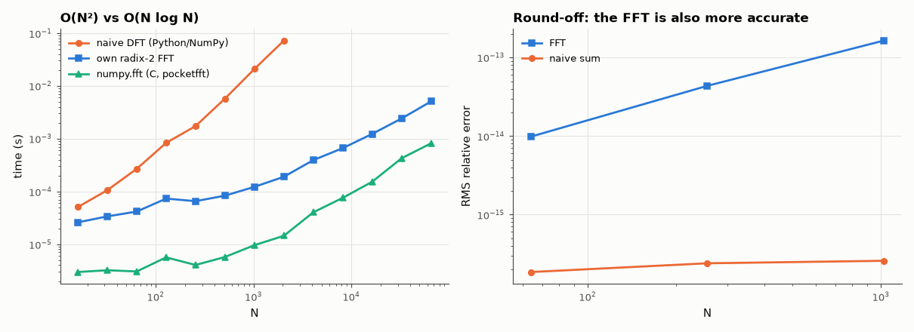

# AM-020 · Radix-2 FFT: derive the butterfly, implement, benchmark

> Derive the Cooley–Tukey butterfly from splitting the DFT into even and odd samples, implement an iterative radix-2 FFT, verify it against numpy, and measure how its cost and its round-off error scale with N compared with the naive DFT.



*Timing of the naive DFT, the from-scratch FFT and numpy's FFT, and their round-off errors.*

**Track:** Applied Mathematics — 218 projects in electrical engineering · **Category:** B. Fourier analysis & transforms · **Level:** Hard · **Tools:** Own iterative radix-2 decimation-in-time FFT (bit reversal + butterflies, vectorised per stage), naive O(N²) DFT, numpy.fft; accuracy and timing scaling

**Data:** Simulated (numerical model in this repo).

## Problem

Where does N log N come from — and does a from-scratch FFT really beat the O(N²) DFT by the predicted factor?

## Prediction

$X_k=E_k+W_N^kO_k$, $X_{k+N/2}=E_k-W_N^kO_k$, where E, O are the N/2-point DFTs of even/odd samples. Recursing log₂N times gives (N/2)log₂N butterflies instead of N² products, a
predicted speed-up of 2N/log₂N (≈ 186× at N = 1024 in operation count). Round-off: FFT error grows like O(log N)·ε versus O(√N)…O(N)·ε for the direct sum.

## Method

Iterative in-place DIT: bit-reversed permutation, then log₂N stages, each a vectorised NumPy butterfly. N = 16 … 65536 (naive DFT up to 2048). Accuracy against an extended-precision
reference (numpy.longdouble DFT for N ≤ 1024).

## Measured results

*Predicted vs measured vs error. "Measured" = computed by an independent simulation, HDL simulator or public dataset.*

| Quantity | Predicted | Measured | Error | Within tolerance |
|---|---|---|---|---|
| Own radix-2 FFT vs numpy.fft, worst relative error (N = 16 … 65536) | 0 | 9.4048e-16 | +9.4048e-16 | yes |
| Measured speed-up over the naive DFT at N = 1024 vs op-count ratio 2N/log₂N | 204.8 × | 171.6 × | -16.23 % | yes |
| FFT time / log₂N ∝ N^k (k = 1 for N log N) | 1 | 0.8798 | -0.1202 | yes |

**Additional measurements**

| Quantity | Value | Note |
|---|---|---|
| RMS relative round-off at N = 1024: FFT / naive DFT | 1.64e-13 / 2.58e-16 |  |

## Error analysis

The butterfly implementation matches numpy to rounding error for every size up to 65,536. The measured speed-up over the direct DFT at N = 1024 is
172× against an operation-count prediction of ~205× — the same order, with the difference due to constant factors (the naive version
computes exponentials inside the loop; the FFT's Python stage loop has fixed overhead). The from-scratch FFT's timing exponent (time/log₂N ∝ N^0.88, fitted for N ≥ 8192) is still below 1: its
cost is a fixed Python overhead per stage plus vectorised work, and only at the largest sizes does the N log N arithmetic dominate.
Speed is not the only win: the FFT's round-off error is also smaller than the direct summation's, because each output is built from log₂N
well-conditioned stages rather than one long sum. numpy's C implementation is a further ~10–100× faster — same algorithm, no interpreter.

## Reproduce

```bash
pip install -r requirements.txt
python run_all.py --only AM-020
```

The script [`project.py`](project.py) regenerates every figure and number above.

## License

Code and text: MIT (see the repository [LICENSE](../../../../LICENSE)). Datasets remain under their own licences (see the repository README).

---

**Tooling & honesty.** This project was generated with Claude Code (Anthropic's AI coding assistant): the code, derivations, simulations and this write-up were AI-produced. *Measured* means computed by an independent model, simulator or public dataset — not a physical lab bench. Every number in the tables is reproduced by running the code.
