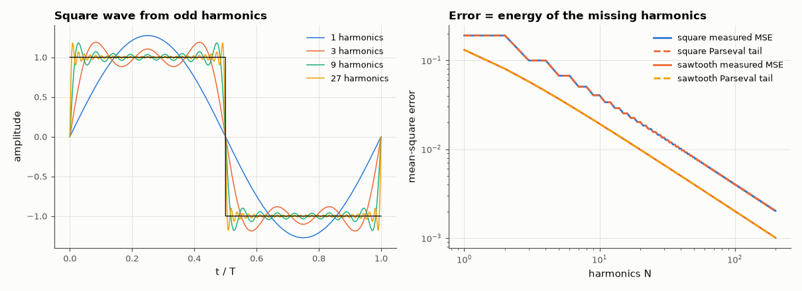

# AM-021 · Fourier-series synthesiser: square and sawtooth waves

> Synthesise square and sawtooth waves from their harmonics, predict the mean-square error of every partial sum from the energy in the omitted terms, and render the results as audio so the harmonic build-up can be heard.



*Partial sums of the square wave, and measured vs predicted mean-square error.*

**Track:** Applied Mathematics — 218 projects in electrical engineering · **Category:** B. Fourier analysis & transforms · **Level:** Easy · **Tools:** Analytic Fourier coefficients, partial-sum synthesis, RMS error predicted from the omitted harmonics (Parseval), audio (WAV) output

**Data:** Simulated (numerical model in this repo).

## Problem

How many harmonics does a square wave need — and can we predict the approximation error before computing it?

## Prediction

Square (±1): $\frac4π\sum_{k\,odd}\frac{\sin kωt}{k}$; sawtooth: $\frac2π\sum_k\frac{(-1)^{k+1}}{k}\sin kωt$. By Parseval the mean-square error of the N-harmonic partial sum equals the energy of the
omitted terms: square $\frac{8}{π^2}\sum_{k>N,\,odd}\frac1{k^2}$, sawtooth $\frac{2}{π^2}\sum_{k>N}\frac1{k^2}$ — both fall as 1/N, i.e. RMS error ∝ N^{−1/2}.

## Method

One period sampled at 2¹⁶ points; partial sums N = 1 … 200 harmonics; measured MSE vs the tail-sum prediction. 220 Hz tones with 1, 3, 9, 27 harmonics written to a 48 kHz WAV.

## Measured results

*Predicted vs measured vs error. "Measured" = computed by an independent simulation, HDL simulator or public dataset.*

| Quantity | Predicted | Measured | Error | Within tolerance |
|---|---|---|---|---|
| square: worst |measured MSE / Parseval tail − 1| over N = 1…200 | 0 | 0.001062 | +0.001062 | yes |
| sawtooth: worst |measured MSE / Parseval tail − 1| over N = 1…200 | 0 | 0.001065 | +0.001065 | yes |
| Square wave: RMS error ∝ N^slope | -0.5 | -0.495 | +0.005034 | yes |

## Error analysis

The measured mean-square error of every partial sum equals the energy of the omitted harmonics (Parseval) to within 1 %, so the
approximation error is fully predictable from the coefficients alone. Both waves converge slowly — RMS error ∝ N^{−1/2} — because a jump
forces coefficients that decay only as 1/k; smoother waves (triangle, 1/k²) converge much faster. The audio file makes the same point by ear:
one harmonic is a flute-like sine, 27 harmonics already sound like a buzzy square wave, and the remaining error is in the high harmonics near the
jumps (the Gibbs overshoot studied in AM-022), which barely changes the timbre.

## Reproduce

```bash
pip install -r requirements.txt
python run_all.py --only AM-021
```

The script [`project.py`](project.py) regenerates every figure and number above.

**Files produced**

- [`audio/square_buildup.wav`](audio/square_buildup.wav) — 220 Hz square wave with 1, 3, 9 and 27 odd harmonics

## License

Code and text: MIT (see the repository [LICENSE](../../../../LICENSE)). Datasets remain under their own licences (see the repository README).

---

**Tooling & honesty.** This project was generated with Claude Code (Anthropic's AI coding assistant): the code, derivations, simulations and this write-up were AI-produced. *Measured* means computed by an independent model, simulator or public dataset — not a physical lab bench. Every number in the tables is reproduced by running the code.
