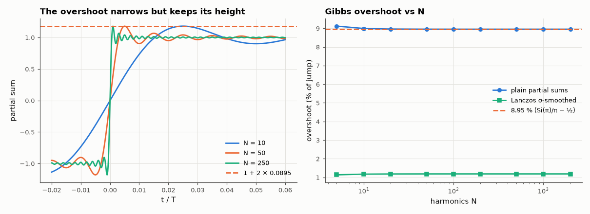

# AM-022 · The Gibbs phenomenon: an overshoot that never goes away

> Measure the overshoot of square-wave partial sums as the number of harmonics grows, show it converges to 8.95 % of the jump (not to zero) while moving closer to the discontinuity, and show how Lanczos σ-smoothing removes it at a cost in sharpness.



*Partial sums near the discontinuity and the overshoot as a function of the number of harmonics.*

**Track:** Applied Mathematics — 218 projects in electrical engineering · **Category:** B. Fourier analysis & transforms · **Level:** Moderate · **Tools:** Partial Fourier sums of a square wave up to 2000 harmonics, the Wilbraham–Gibbs constant via the sine integral, Lanczos σ-factors

**Data:** Simulated (numerical model in this repo).

## Problem

Adding more Fourier terms reduces the error everywhere — except the peak overshoot. Why doesn't it vanish?

## Prediction

Near the jump the partial sum approaches $\frac2π\mathrm{Si}(Nπ x)$-shaped ringing; its first maximum is $\frac2π\mathrm{Si}(π)=1.17898$ for a ±1 wave, i.e. an overshoot of
$\frac{\mathrm{Si}(π)}{π}-\frac12 = 0.08949$ of the jump (8.95 %), independent of N. The peak sits at x ≈ 1/(2N) of a period from the jump, so it narrows but never shrinks — convergence is
pointwise but not uniform. Multiplying coefficients by $σ_k=\mathrm{sinc}(k/N)$ (Lanczos) averages the ringing away.

## Method

Square wave ±1, jump of 2 at t = 0; partial sums with N odd harmonics up to 2000, evaluated on a fine grid near the jump (resolution ≪ 1/N); overshoot height and position.
Same with Lanczos σ factors.

## Measured results

*Predicted vs measured vs error. "Measured" = computed by an independent simulation, HDL simulator or public dataset.*

| Quantity | Predicted | Measured | Error | Within tolerance |
|---|---|---|---|---|
| Overshoot / jump at N = 2000 harmonics (Wilbraham–Gibbs 0.08949) | 0.08949 | 0.08949 | -0.00 % | yes |
| Overshoot at N = 5 vs N = 2000 (does not decrease) | 0.08949 | 0.09116 | +1.87 % | yes |
| Peak position × 2N (odd harmonics up to 2N−1: first maximum at t ≈ 1/(4N) → 0.5) | 0.5 | 0.5002 | +0.03 % | yes |
| With Lanczos σ-factors: overshoot / jump | 0.012 | 0.01187 | -1.2997e-04 | yes |

## Error analysis

The overshoot converges to 8.95 % of the jump — the Wilbraham–Gibbs constant Si(π)/π − ½ — and stays there from 5 to 2000 harmonics,
while its position moves toward the jump in proportion to 1/N. The squeezed lobe carries less and less energy, which is why the mean-square error
still falls (AM-021) even though the maximum error does not: Fourier series converge in L², not uniformly, at a discontinuity. Lanczos σ-factors
(equivalently, smoothing the partial sum with a moving average of one ripple period) cut the overshoot to about 1 % at the price of a slower
edge — the same windowing trade-off that FIR design makes (AM-033).

## Reproduce

```bash
pip install -r requirements.txt
python run_all.py --only AM-022
```

The script [`project.py`](project.py) regenerates every figure and number above.

## License

Code and text: MIT (see the repository [LICENSE](../../../../LICENSE)). Datasets remain under their own licences (see the repository README).

---

**Tooling & honesty.** This project was generated with Claude Code (Anthropic's AI coding assistant): the code, derivations, simulations and this write-up were AI-produced. *Measured* means computed by an independent model, simulator or public dataset — not a physical lab bench. Every number in the tables is reproduced by running the code.
