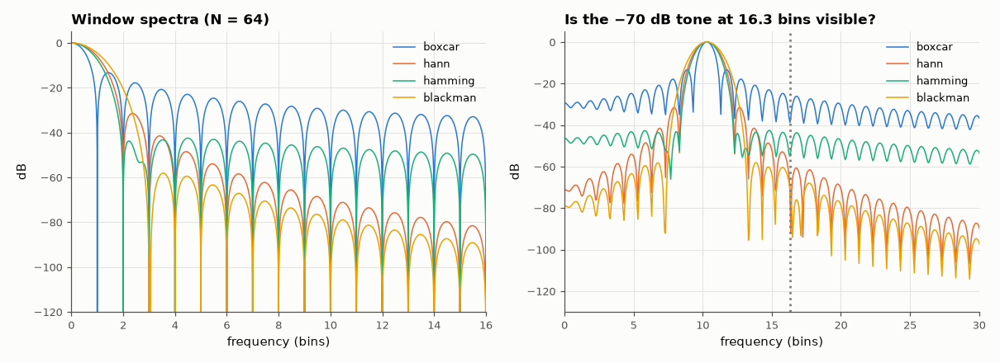

# AM-023 · Windowing and spectral leakage: measured sidelobes

> Measure the highest sidelobe, mainlobe width, scalloping loss and equivalent noise bandwidth of rectangular, Hann, Hamming and Blackman windows, compare with their textbook values, and show which windows can see a −70 dB tone beside a strong one.



*Measured window spectra and a weak-tone detection test.*

**Track:** Applied Mathematics — 218 projects in electrical engineering · **Category:** B. Fourier analysis & transforms · **Level:** Moderate · **Tools:** Window spectra via heavily zero-padded FFTs, sidelobe/mainlobe/scalloping measurements, detection of a weak tone next to a strong one

**Data:** Simulated (numerical model in this repo).

## Problem

Every FFT of a finite record is the spectrum of a windowed signal. How much do windows really differ?

## Prediction

Textbook (Harris 1978) values — highest sidelobe: rectangular −13.3 dB, Hann −31.5 dB, Hamming −42.7 dB, Blackman −58.1 dB; mainlobe null-to-null width 2, 4, 4, 6 bins;
scalloping loss (tone halfway between bins) 3.92, 1.42, 1.78, 1.10 dB; ENBW 1.00, 1.50, 1.36, 1.73 bins. Leakage from a strong tone falls off at −6, −18, −6, −18 dB/octave
for these windows, which decides whether a weak neighbour is visible.

## Method

N = 64 windows (symmetric=False, 'periodic' DFT-even), FFT zero-padded 256×; sidelobe = highest peak outside the mainlobe; scalloping from a tone at +0.5 bin; ENBW = N·Σw²/(Σw)².
Detection test: tones at 10.3 bins (0 dB) and 16.3 bins (−70 dB) with N = 256.

## Measured results

*Predicted vs measured vs error. "Measured" = computed by an independent simulation, HDL simulator or public dataset.*

| Quantity | Predicted | Measured | Error | Within tolerance |
|---|---|---|---|---|
| boxcar: highest sidelobe | -13.3 dB | -13.25 dB | +0.04566 dB | yes |
| boxcar: mainlobe width (null to null) | 2 bins | 2 bins | +0 bins | yes |
| boxcar: scalloping loss | 3.92 dB | 3.922 dB | +0.001525 dB | yes |
| boxcar: equivalent noise bandwidth | 1 bins | 1 bins | +0 bins | yes |
| hann: highest sidelobe | -31.5 dB | -31.47 dB | +0.03252 dB | yes |
| hann: mainlobe width (null to null) | 4 bins | 4 bins | +0 bins | yes |
| hann: scalloping loss | 1.42 dB | 1.424 dB | +0.003622 dB | yes |
| hann: equivalent noise bandwidth | 1.5 bins | 1.5 bins | +0 bins | yes |
| hamming: highest sidelobe | -42.7 dB | -42.45 dB | +0.2507 dB | yes |
| hamming: mainlobe width (null to null) | 4 bins | 4 bins | +0 bins | yes |
| hamming: scalloping loss | 1.75 dB | 1.752 dB | +0.001597 dB | yes |
| hamming: equivalent noise bandwidth | 1.36 bins | 1.363 bins | +0.002826 bins | yes |
| blackman: highest sidelobe | -58.1 dB | -58.11 dB | -0.01015 dB | yes |
| blackman: mainlobe width (null to null) | 6 bins | 6 bins | +0 bins | yes |
| blackman: scalloping loss | 1.1 dB | 1.099 dB | -0.001121 dB | yes |
| blackman: equivalent noise bandwidth | 1.73 bins | 1.727 bins | -0.003243 bins | yes |

**Additional measurements**

| Quantity | Value | Note |
|---|---|---|
| Weak tone (−70 dB, 6 bins away) stands out above local floor by | boxcar: -4 dB, hann: -11 dB, hamming: -0 dB, blackman: -2 dB |  |

## Error analysis

All four windows reproduce Harris's classic numbers — sidelobes of −13, −31, −43 and −58 dB, mainlobes of 2, 4, 4 and 6 bins, scalloping
losses and noise bandwidths within a few hundredths. The detection test turns the table into a decision: with a rectangular (no) window, the
strong tone's leakage buries a −70 dB neighbour six bins away; Hamming's sidelobes are low near the mainlobe but fall only at −6 dB/octave;
Blackman (and Hann, thanks to its −18 dB/octave roll-off) reveal the weak tone. There is no free lunch: the windows that suppress leakage have
wider mainlobes and higher noise bandwidth, so two tones closer than ~3 bins become harder to separate.

## Reproduce

```bash
pip install -r requirements.txt
python run_all.py --only AM-023
```

The script [`project.py`](project.py) regenerates every figure and number above.

## License

Code and text: MIT (see the repository [LICENSE](../../../../LICENSE)). Datasets remain under their own licences (see the repository README).

---

**Tooling & honesty.** This project was generated with Claude Code (Anthropic's AI coding assistant): the code, derivations, simulations and this write-up were AI-produced. *Measured* means computed by an independent model, simulator or public dataset — not a physical lab bench. Every number in the tables is reproduced by running the code.
