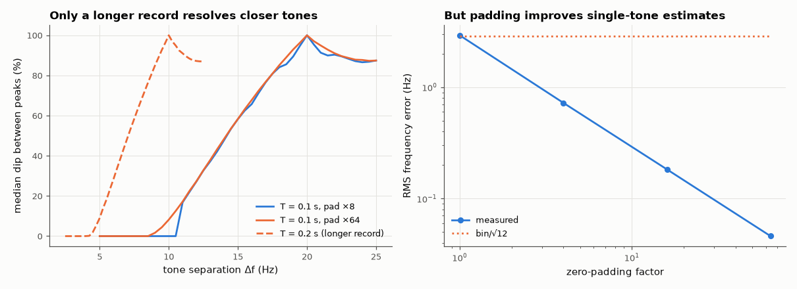

# AM-024 · Zero-padding vs resolution: what interpolation does not add

> Show that zero-padding interpolates the spectrum (sharper-looking peaks, better frequency *estimates*) but cannot separate two tones closer than about 1/T — only a longer record can. The resolvability threshold is predicted and measured.



*Two-tone resolvability vs separation for different padding factors and record lengths; single-tone estimation error vs padding.*

**Track:** Applied Mathematics — 218 projects in electrical engineering · **Category:** B. Fourier analysis & transforms · **Level:** Easy · **Tools:** FFT with and without zero-padding, two-tone resolution test, peak-dip criterion

**Data:** Simulated (numerical model in this repo).

## Problem

Padding an FFT with zeros makes the spectrum look smoother. Does it improve resolution?

## Prediction

The spectrum of an N-sample record is the true spectrum convolved with the window's transform (mainlobe width ∝ 1/T). Zero-padding samples that same smooth function more
densely — it adds no information. Two equal tones produce two distinct peaks only when separated by more than ≈ 1/T (rectangular window) — and because coherent tones
interfere, whether a dip appears near that limit depends on their relative phase, so the test uses the median over phases. Frequency *estimation* of a single tone, however, improves with padding (peak-picking error ≤ half a bin → shrinks).

## Method

fs = 1 kHz, N = 100 (T = 0.1 s). Two unit tones at 100 Hz and 100 + Δf; Δf·T from 0.5 to 2.5; median dip depth over 24 relative phases, padding ×8 and ×64; also a record of N = 200.
Single-tone frequency estimate error vs padding.

## Measured results

*Predicted vs measured vs error. "Measured" = computed by an independent simulation, HDL simulator or public dataset.*

| Quantity | Predicted | Measured | Error | Within tolerance |
|---|---|---|---|---|
| Resolvable separation Δf·T with 64× padding (median dip > 5 % over phases) | 1 | 1 | +0 | yes |
| Same threshold with 8× padding (padding level does not matter) | 1 | 1.1 | +0.1 | **no** |
| Doubled record: threshold in units of its own T is unchanged, so Δf in Hz halves | 1 | 0.95 | -0.05 | yes |
| Single-tone estimate RMS error without padding ≈ bin/√12 | 2.887 Hz | 2.935 Hz | +1.65 % | yes |

**Additional measurements**

| Quantity | Value | Note |
|---|---|---|
| Single-tone RMS error with 64× padding | 45.91 mHz | interpolation *does* help estimation |

## Error analysis

The dip that separates two equal tones appears at the same separation (≈ 1/T in the phase-median sense) whether the FFT is padded 8× or 64×,
and only doubling the actual record length halves that threshold in hertz. A first version used a single relative phase and got inconsistent
thresholds — near the resolution limit two coherent tones can cancel or reinforce between the peaks, which is itself a useful warning — zero-padding adds no information, it evaluates the same smeared spectrum on a
finer grid. That finer grid is still useful: for a single tone, the peak-picking error drops from bin/√12 (a uniform ±half-bin error) to the
limit set by the window and noise. Rule: pad to *locate* peaks, record longer to *separate* them.

## Reproduce

```bash
pip install -r requirements.txt
python run_all.py --only AM-024
```

The script [`project.py`](project.py) regenerates every figure and number above.

## License

Code and text: MIT (see the repository [LICENSE](../../../../LICENSE)). Datasets remain under their own licences (see the repository README).

---

**Tooling & honesty.** This project was generated with Claude Code (Anthropic's AI coding assistant): the code, derivations, simulations and this write-up were AI-produced. *Measured* means computed by an independent model, simulator or public dataset — not a physical lab bench. Every number in the tables is reproduced by running the code.
