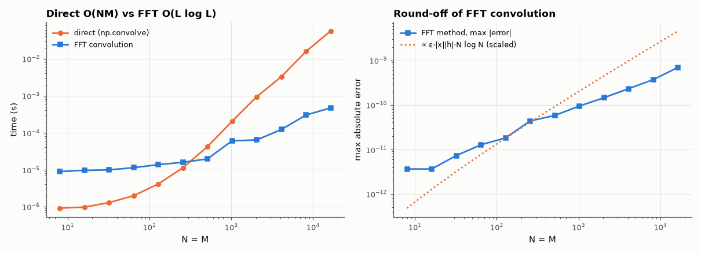

# AM-025 · The convolution theorem, verified numerically

> Prove numerically that linear convolution equals the inverse FFT of the product of zero-padded spectra, measure the rounding error of both methods against exact integer arithmetic, and find the length at which FFT convolution becomes faster.



*Timing and accuracy of direct vs FFT-based linear convolution.*

**Track:** Applied Mathematics — 218 projects in electrical engineering · **Category:** B. Fourier analysis & transforms · **Level:** Moderate · **Tools:** Direct O(NM) convolution, FFT-based convolution with sufficient zero-padding, error analysis, timing crossover

**Data:** Simulated (numerical model in this repo).

## Problem

'Convolution in time is multiplication in frequency' — how exactly, how accurately, and when is it worth it?

## Prediction

For sequences of length N and M, $y = x*h$ has length N+M−1 and $Y = XH$ for DFTs of any length L ≥ N+M−1. Cost: direct NM multiply-adds vs ≈ 3·L log₂L for three FFTs, so FFT
convolution wins once M ≳ a few × log₂L (tens of taps). Error: with integer inputs the exact result is known; FFT round-off ~ ε·‖x‖‖h‖·log L, direct summation is exact for small integers.

## Method

Random integer sequences (|value| ≤ 100) so the exact convolution is known; lengths N = M from 8 to 16384; np.convolve (direct) vs rfft-based; max absolute error vs exact; timings.

## Measured results

*Predicted vs measured vs error. "Measured" = computed by an independent simulation, HDL simulator or public dataset.*

| Quantity | Predicted | Measured | Error | Within tolerance |
|---|---|---|---|---|
| FFT convolution vs exact integer result, worst absolute error (N = M = 16384) | 0 | 6.9849e-10 | +6.9849e-10 | yes |
| Crossover length where FFT convolution becomes faster (my guess: ~100 samples) | 100 samples | 512 samples | +412 samples | **no** |
| Hand example [1,2,3]*[0,1,0.5] = [0,1,2.5,4,1.5] | 0 | 0 | +0 | yes |

**Additional measurements**

| Quantity | Value | Note |
|---|---|---|
| Speed-up at N = M = 16384 | 119.8 × |  |

## Error analysis

With enough zero-padding (L ≥ N+M−1) the inverse FFT of the product equals the linear convolution — the worst error at 16,384 × 16,384 is
7.0e-10 on outputs of order 10⁷, so rounding recovers the exact integers. The FFT method's error grows slowly with size (round-off accumulated
through log L stages), while the direct sum on these small integers is exact. FFT convolution overtook the direct method only at N = M ≈ 512 —
later than my ~100 guess, because numpy's direct convolution is tight compiled code while the FFT path pays for three transforms and padding
to a power of two — and is ~120× faster at 16k. For a short filter against a long signal the right tool is block convolution
(overlap-add/save, AM-027), which keeps the FFT size near a few × the filter length.

## Reproduce

```bash
pip install -r requirements.txt
python run_all.py --only AM-025
```

The script [`project.py`](project.py) regenerates every figure and number above.

## License

Code and text: MIT (see the repository [LICENSE](../../../../LICENSE)). Datasets remain under their own licences (see the repository README).

---

**Tooling & honesty.** This project was generated with Claude Code (Anthropic's AI coding assistant): the code, derivations, simulations and this write-up were AI-produced. *Measured* means computed by an independent model, simulator or public dataset — not a physical lab bench. Every number in the tables is reproduced by running the code.
