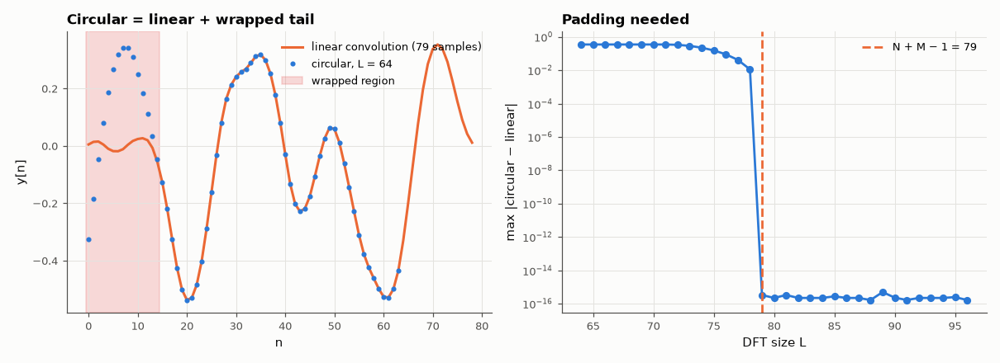

# AM-026 · Circular vs linear convolution: the wrap-around error

> Show that multiplying DFTs without enough padding computes a circular convolution, predict exactly which output samples are corrupted and by how much (the tail wraps onto the head), and find the minimum FFT size that eliminates the error.



*The circular result, the corrupted head samples, and the error vs DFT size.*

**Track:** Applied Mathematics — 218 projects in electrical engineering · **Category:** B. Fourier analysis & transforms · **Level:** Moderate · **Tools:** DFT-domain multiplication without padding, time-domain aliasing analysis, padding sweep

**Data:** Simulated (numerical model in this repo).

## Problem

An FFT-based filter output looks wrong at the start of each block. Why, and how much padding is enough?

## Prediction

With DFT size L, $\mathrm{IDFT}(X_LH_L)[n]=\sum_k y_{lin}[n+kL]$ — the linear result aliased in time with period L. For lengths N and M, samples $n < N+M-1-L$ receive the wrapped tail; the
error there equals exactly $y_{lin}[n+L]$. Error vanishes iff L ≥ N+M−1.

## Method

x = 64 random samples, h = 16-tap smoothing filter (N+M−1 = 79). L from 64 to 96. Error of the circular result vs the linear one, compared sample-by-sample with the predicted wrapped tail.

## Measured results

*Predicted vs measured vs error. "Measured" = computed by an independent simulation, HDL simulator or public dataset.*

| Quantity | Predicted | Measured | Error | Within tolerance |
|---|---|---|---|---|
| Error equals the wrapped tail y_lin[n+L], worst mismatch over all L | 0 | 4.9960e-16 | +4.9960e-16 | yes |
| Smallest L with zero wrap-around error = N+M−1 | 79 | 79 | +0 |  |
| Corrupted samples at L = 64 (predicted: n < N+M−1−L = 15) | 15 | 15 | +0 |  |

## Error analysis

The discrepancy between circular and linear convolution is not noise but a precisely predictable object: the samples of the linear result
beyond index L fold back onto the start, matching the wrapped tail to rounding error. With L = 64 exactly the first 15 samples are corrupted,
and the error disappears at L = 79 = N+M−1 and stays zero beyond. This is the whole theory behind overlap-add and overlap-save: overlap-add pads
each block so nothing wraps, overlap-save lets it wrap and discards exactly the M−1 contaminated samples.

## Reproduce

```bash
pip install -r requirements.txt
python run_all.py --only AM-026
```

The script [`project.py`](project.py) regenerates every figure and number above.

## License

Code and text: MIT (see the repository [LICENSE](../../../../LICENSE)). Datasets remain under their own licences (see the repository README).

---

**Tooling & honesty.** This project was generated with Claude Code (Anthropic's AI coding assistant): the code, derivations, simulations and this write-up were AI-produced. *Measured* means computed by an independent model, simulator or public dataset — not a physical lab bench. Every number in the tables is reproduced by running the code.
