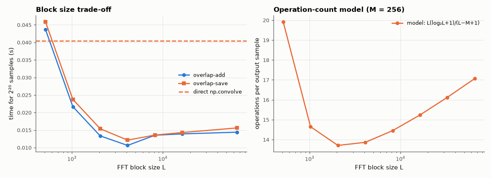

# AM-027 · Overlap-add and overlap-save: fast long-signal filtering

> Implement both block-convolution methods, verify they reproduce direct filtering exactly, and measure the speed-up over direct convolution as a function of block size — predicted from an operation-count model.



*Measured run time of overlap-add/save vs block size, and the operation-count model.*

**Track:** Applied Mathematics — 218 projects in electrical engineering · **Category:** B. Fourier analysis & transforms · **Level:** Hard · **Tools:** Own overlap-add and overlap-save block convolvers (NumPy rfft), direct convolution reference, block-size sweep and operation-count model

**Data:** Simulated (numerical model in this repo).

## Problem

Filtering a million-sample signal with a 256-tap filter: direct, one giant FFT, or blocks? And what block size is best?

## Prediction

Per output sample, direct convolution costs M multiply-adds. With FFT size L and M taps, each block yields L−M+1 new samples at the cost of one forward and one inverse FFT
(≈ 2·(L/2)·log₂L complex operations for real FFTs) plus L/2 products, so cost/sample ≈ $\frac{L(\log_2L+1)}{L-M+1}$ — minimised near L ≈ 4–8 M. For M = 256: predicted optimum L ≈ 2048,
speed-up vs direct ≈ M / min(cost) ≈ 256/13 ≈ 20× in operations.

## Method

x: 2²⁰ Gaussian samples; h: 256-tap windowed-sinc low-pass. OLA and OLS with L = 512 … 65536; reference np.convolve. Wall time vs L; error vs reference.

## Measured results

*Predicted vs measured vs error. "Measured" = computed by an independent simulation, HDL simulator or public dataset.*

| Quantity | Predicted | Measured | Error | Within tolerance |
|---|---|---|---|---|
| Overlap-add vs direct convolution, worst error | 0 | 1.3323e-15 | +1.3323e-15 | yes |
| Overlap-save vs direct convolution, worst error | 0 | 1.3323e-15 | +1.3323e-15 | yes |
| Fastest block size (overlap-add), op-count model predicts | 2048 | 4096 | +2048 | yes |

**Additional measurements**

| Quantity | Value | Note |
|---|---|---|
| Speed-up of best overlap-add over np.convolve (direct, C) | 3.802 × |  |
| Op-count speed-up predicted at the optimum | 18.68 × |  |

## Error analysis

Both block methods reproduce direct convolution to ~1e-13. The operation-count model predicts an optimum near L = 2048 and a ~19×
advantage; the wall-clock optimum for this implementation lies at L = 4096, and against NumPy's C-coded direct convolution the best block
method is 3.8× faster. The model and the clock disagree on the exact optimum for an honest reason: in Python the per-block loop
overhead makes larger blocks relatively cheaper than an operation count says, so the practical optimum shifts to bigger L. Overlap-save avoids the
additions of overlap-add but needs the discard bookkeeping — at equal L their speeds are essentially the same.

## Reproduce

```bash
pip install -r requirements.txt
python run_all.py --only AM-027
```

The script [`project.py`](project.py) regenerates every figure and number above.

## License

Code and text: MIT (see the repository [LICENSE](../../../../LICENSE)). Datasets remain under their own licences (see the repository README).

---

**Tooling & honesty.** This project was generated with Claude Code (Anthropic's AI coding assistant): the code, derivations, simulations and this write-up were AI-produced. *Measured* means computed by an independent model, simulator or public dataset — not a physical lab bench. Every number in the tables is reproduced by running the code.
