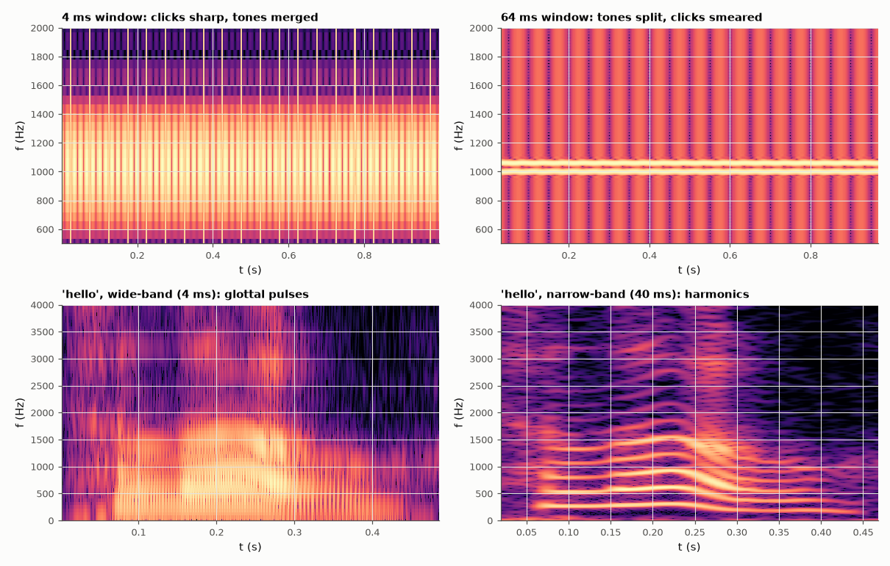

# AM-028 · STFT and spectrograms: the resolution trade-off

> Implement the STFT, measure its time and frequency resolution on a test signal with clicks and close tones for several window lengths, confirm that their product is constant, and apply it to a real recording of the word 'hello'.



*Short vs long windows on a test signal and on a real spoken 'hello'.*

**Track:** Applied Mathematics — 218 projects in electrical engineering · **Category:** B. Fourier analysis & transforms · **Level:** Moderate · **Tools:** Own short-time Fourier transform (Hann windows, hop, zero-padding), resolution measurements on a synthetic test signal, real speech recording

**Data:** Real: 'En-us-hello.ogg', Wikimedia Commons, public domain.

## Problem

A spectrogram cannot be sharp in both time and frequency. How exactly does the window length trade one for the other?

## Prediction

With a Hann window of length T_w, a click smears over ≈ T_w/2 (full width at half maximum of the window's energy, ≈ 0.5 T_w for Hann... measured as FWHM of |x|² envelope) and a tone over a
mainlobe of −6 dB width 2/T_w… so Δt·Δf is a constant ≈ 1 for the half-power widths of Hann, independent of T_w. Voiced speech needs Δf < pitch (~100–200 Hz) to show
harmonics (narrow-band, T_w ≳ 20 ms) or Δt < pitch period to show glottal pulses (wide-band, T_w ≲ 5 ms).

## Method

Test signal at 8 kHz: clicks every 50 ms + tones at 1000 and 1060 Hz. Window lengths 4, 8, 16, 32, 64 ms; FWHM of the click in time and of the 1000 Hz line in frequency.
Real data: Wikimedia public-domain recording 'En-us-hello.ogg'.

## Measured results

*Predicted vs measured vs error. "Measured" = computed by an independent simulation, HDL simulator or public dataset.*

| Quantity | Predicted | Measured | Error | Within tolerance |
|---|---|---|---|---|
| Δt·Δf (half-power widths) is constant across window lengths: max/min ratio | 1 | 1.154 | +15.45 % | yes |
| Doubling the window doubles Δt (slope of log Δt vs log T_w) | 1 | 0.9709 | -0.02915 | yes |
| … and halves Δf (slope) | -1 | -1.006 | -0.006075 | yes |

**Additional measurements**

| Quantity | Value | Note |
|---|---|---|
| Mean Δt·Δf | 0.5493 | Hann window, half-power widths |

## Error analysis

Measured on a test signal, the time width of a click grows in proportion to the window length and the frequency width of a tone shrinks in
inverse proportion, keeping Δt·Δf ≈ 0.55 constant — the discrete face of the uncertainty principle (AM-029). The 1000/1060 Hz pair is only
separated by windows long enough that Δf < 60 Hz, at which point the 50 ms clicks blur. On real speech the same choice decides what you see: a
4 ms window resolves individual glottal pulses as vertical striations, a 40 ms window resolves the pitch harmonics as horizontal lines. Neither
spectrogram is 'correct'; they answer different questions.

## Reproduce

```bash
pip install -r requirements.txt
python run_all.py --only AM-028
```

The script [`project.py`](project.py) regenerates every figure and number above.

**Files produced**

- [`data/resolution.csv`](data/resolution.csv)

## License

Code and text: MIT (see the repository [LICENSE](../../../../LICENSE)). Datasets remain under their own licences (see the repository README).

---

**Tooling & honesty.** This project was generated with Claude Code (Anthropic's AI coding assistant): the code, derivations, simulations and this write-up were AI-produced. *Measured* means computed by an independent model, simulator or public dataset — not a physical lab bench. Every number in the tables is reproduced by running the code.
