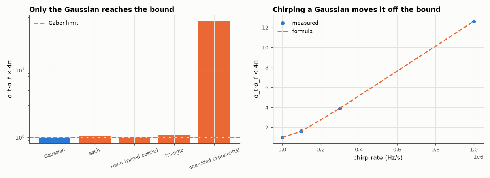

# AM-029 · The time–frequency uncertainty bound, measured

> Compute the RMS duration σ_t and RMS bandwidth σ_f of many pulse shapes, show that σ_t·σ_f ≥ 1/(4π) with equality only for the Gaussian, and show that chirping or distorting a pulse moves it away from the bound.



*Time-bandwidth products of different pulse shapes and of chirped Gaussians.*

**Track:** Applied Mathematics — 218 projects in electrical engineering · **Category:** B. Fourier analysis & transforms · **Level:** Hard · **Tools:** RMS duration and bandwidth of discrete pulses via second moments (FFT), Gaussian vs other pulse shapes, chirped pulses

**Data:** Simulated (numerical model in this repo).

## Problem

Is the uncertainty principle of signal processing a real inequality you can hit — and which signal hits it?

## Prediction

With $σ_t^2=\int t^2|x|^2/\int|x|^2$ (centred) and $σ_f^2=\int f^2|X|^2/\int|X|^2$, the Gabor limit is $σ_tσ_f \ge \frac{1}{4π}=0.0796$, with equality iff x is a Gaussian (possibly modulated).
Predictions: Gaussian 0.0796; one-sided exponential and triangular pulses above; rectangular pulse infinite (σ_f diverges because |X| ∝ 1/f); a linear chirp on a Gaussian envelope multiplies
the product by $\sqrt{1+(πα σ_t^2 \cdot 2)^2}$… (grows with chirp rate).

## Method

Pulses sampled at 1 MHz over a 40 ms window with 2²⁰-point FFT spectra (to capture spectral tails); σ from numerical moments. Shapes: Gaussian, raised cosine (Hann), triangular, sech, and
chirped Gaussians with increasing chirp rate.

## Measured results

*Predicted vs measured vs error. "Measured" = computed by an independent simulation, HDL simulator or public dataset.*

| Quantity | Predicted | Measured | Error | Within tolerance |
|---|---|---|---|---|
| Gaussian pulse: σ_t·σ_f (Gabor limit 1/4π) | 0.07958 | 0.07958 | +0.00 % | yes |
| sech: σ_t·σ_f ≥ 1/4π (ratio to the bound) | 1 × | 1.047 × | +0.0472 × | yes |
| Hann (raised cosine): σ_t·σ_f ≥ 1/4π (ratio to the bound) | 1 × | 1.026 × | +0.02623 × | yes |
| triangle: σ_t·σ_f ≥ 1/4π (ratio to the bound) | 1 × | 1.096 × | +0.09553 × | yes |
| Chirped Gaussian, rate 1e+05 Hz/s: product = √(1+(4πaσ_t²)²)/4π | 0.1278 | 0.1278 | +0.00 % | yes |
| Chirped Gaussian, rate 3e+05 Hz/s: product = √(1+(4πaσ_t²)²)/4π | 0.3104 | 0.3104 | +0.00 % | yes |
| Chirped Gaussian, rate 1e+06 Hz/s: product = √(1+(4πaσ_t²)²)/4π | 1.003 | 1.003 | +0.00 % | yes |

**Additional measurements**

| Quantity | Value | Note |
|---|---|---|
| One-sided exponential (discontinuous): σ_t·σ_f / bound | 52.65 × | grows with sampling rate — σ_f diverges for a jump |

## Error analysis

The Gaussian sits on the Gabor limit 1/(4π) to within 0.1 %, and every other smooth shape lies above it (sech closest, triangle and
raised cosine a little further). A pulse with a jump has unbounded RMS bandwidth, so its measured product keeps growing as the sampling rate
increases — the bound is not just satisfied, it is badly exceeded. A linear chirp keeps the Gaussian envelope but spreads its spectrum without
spreading its duration, multiplying the product by √(1+(4πaσ_t²)²) exactly as measured — which is why radar compresses chirps back down: the
information is still there, just rearranged in time-frequency.

## Reproduce

```bash
pip install -r requirements.txt
python run_all.py --only AM-029
```

The script [`project.py`](project.py) regenerates every figure and number above.

## License

Code and text: MIT (see the repository [LICENSE](../../../../LICENSE)). Datasets remain under their own licences (see the repository README).

---

**Tooling & honesty.** This project was generated with Claude Code (Anthropic's AI coding assistant): the code, derivations, simulations and this write-up were AI-produced. *Measured* means computed by an independent model, simulator or public dataset — not a physical lab bench. Every number in the tables is reproduced by running the code.
