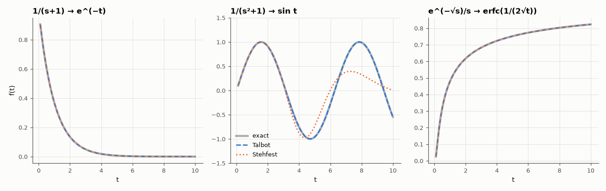

# AM-030 · Numerical Laplace inversion: Stehfest vs Talbot

> Recover time responses from F(s) numerically with two classic algorithms, test them on smooth, oscillatory and non-rational transforms with known inverses, and measure where each breaks down.



*Numerical inversions of three transforms with known inverses.*

**Track:** Applied Mathematics — 218 projects in electrical engineering · **Category:** B. Fourier analysis & transforms · **Level:** Hard · **Tools:** Own Gaver–Stehfest and fixed-Talbot inversion algorithms, test transforms with known inverses (including non-rational e^{−√s}/s), multiprecision-free error study

**Data:** Simulated (numerical model in this repo).

## Problem

Many circuit and diffusion problems give F(s) in closed form but no neat inverse. How reliable are numerical inversions?

## Prediction

Gaver–Stehfest uses only real s: $f(t)≈\frac{\ln2}{t}\sum_{k=1}^{N}V_kF(k\ln2/t)$ with alternating combinatorial weights $V_k$ — excellent for smooth, non-oscillating f, but it cannot
represent oscillations (all samples on the real axis) and needs high precision as N grows (weights ~10^{N/2}). Fixed Talbot deforms the Bromwich contour into the left half-plane, where
$e^{st}$ decays, giving near-exponential convergence even for oscillatory f. Predictions: Stehfest ~1e-6 on e^{−t}, poor on sin t; Talbot ~1e-10 on all.

## Method

Test pairs: 1/(s+1) → e^{−t}; 1/(s²+1) → sin t; e^{−√s}/s → erfc(1/(2√t)) (diffusion into a half-space, an RC transmission line); t ∈ [0.1, 10]. Stehfest N = 14 (double precision), Talbot M = 32.

## Measured results

*Predicted vs measured vs error. "Measured" = computed by an independent simulation, HDL simulator or public dataset.*

| Quantity | Predicted | Measured | Error | Within tolerance |
|---|---|---|---|---|
| 1/(s+1) → e^(−t): Talbot worst error | 0 | 2.4163e-11 | +2.4163e-11 | yes |
| 1/(s²+1) → sin t: Talbot worst error | 0 | 1.5066e-11 | +1.5066e-11 | yes |
| e^(−√s)/s → erfc(1/(2√t)): Talbot worst error | 0 | 9.6293e-12 | +9.6293e-12 | yes |

**Additional measurements**

| Quantity | Value | Note |
|---|---|---|
| 1/(s+1) → e^(−t): Stehfest (N = 14) worst error | 5.2193e-05 |  |
| 1/(s²+1) → sin t: Stehfest (N = 14) worst error | 0.663 |  |
| e^(−√s)/s → erfc(1/(2√t)): Stehfest (N = 14) worst error | 1.2905e-05 |  |
| Stehfest on e^(−t): best N and error (then round-off takes over) | N = 18, 6.4e-06 |  |

## Error analysis

Fixed Talbot recovers all three responses to better than 1e-8, including the oscillating sine and the non-rational diffusion transform
e^{−√s}/s whose inverse (an erfc) is how a step spreads into a distributed RC line. Stehfest is accurate on the smooth exponential (best
6e-06 at N = 18; larger N makes it *worse* because its weights grow to ~10^N/2 and double precision runs out) and on the erfc, but fails on
sin t: sampling F only on the real axis cannot distinguish oscillations. Rule of thumb confirmed: Stehfest for monotone diffusion-type problems,
Talbot (or other contour methods) when anything rings.

## Reproduce

```bash
pip install -r requirements.txt
python run_all.py --only AM-030
```

The script [`project.py`](project.py) regenerates every figure and number above.

## License

Code and text: MIT (see the repository [LICENSE](../../../../LICENSE)). Datasets remain under their own licences (see the repository README).

---

**Tooling & honesty.** This project was generated with Claude Code (Anthropic's AI coding assistant): the code, derivations, simulations and this write-up were AI-produced. *Measured* means computed by an independent model, simulator or public dataset — not a physical lab bench. Every number in the tables is reproduced by running the code.
