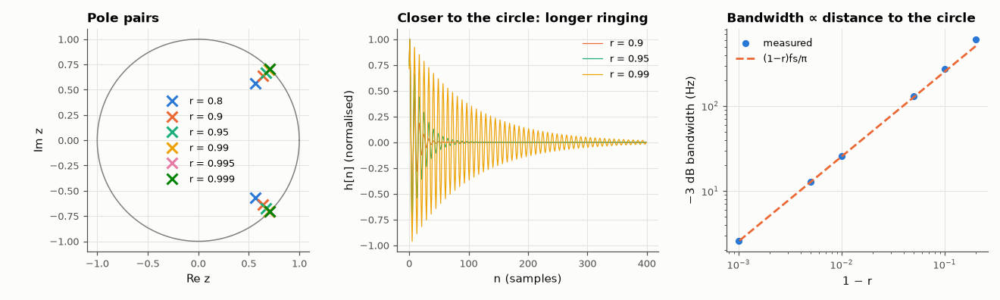

# AM-031 · Designing in the z-plane: pole radius and decay

> Place a pole pair at r·e^{±jθ} to build a digital resonator, predict its ringing frequency, decay time and bandwidth from r and θ, and measure all three from the impulse and frequency responses for pole radii from 0.8 to 0.999.



*Pole positions, impulse responses and bandwidth of the digital resonator.*

**Track:** Applied Mathematics — 218 projects in electrical engineering · **Category:** B. Fourier analysis & transforms · **Level:** Moderate · **Tools:** Two-pole digital resonator placed directly in the z-plane, impulse-response envelope fitting, −3 dB bandwidth measurement

**Data:** Simulated (numerical model in this repo).

## Problem

In the z-plane, what does moving a pole toward the unit circle do — quantitatively?

## Prediction

Poles $re^{\pm jθ}$: $h[n]\propto r^n\sin((n+1)θ)$, so the envelope decays as $r^n$ — time constant $n_τ = -1/\ln r ≈ 1/(1-r)$ samples, oscillation at $f=θf_s/2π$. Near the circle the
−3 dB bandwidth is $Δf ≈ (1-r)f_s/π$ (the pole's distance to the circle sets it, just as Re s does in the s-plane). The mapping $z=e^{sT}$ makes r ↔ e^{σT}.

## Method

fs = 8 kHz, θ for 1 kHz; r ∈ {0.8, 0.9, 0.95, 0.99, 0.995, 0.999}. Envelope rate from peaks of |h[n]| (log-linear fit); bandwidth from a 2¹⁸-point frequency response.

## Measured results

*Predicted vs measured vs error. "Measured" = computed by an independent simulation, HDL simulator or public dataset.*

| Quantity | Predicted | Measured | Error | Within tolerance |
|---|---|---|---|---|
| r = 0.8: envelope decay per sample = ln r | -0.2231 | -0.2231 | +0.00 % | yes |
| r = 0.9: envelope decay per sample = ln r | -0.1054 | -0.1054 | +0.00 % | yes |
| r = 0.95: envelope decay per sample = ln r | -0.05129 | -0.05129 | +0.00 % | yes |
| r = 0.99: envelope decay per sample = ln r | -0.01005 | -0.01005 | -0.00 % | yes |
| r = 0.995: envelope decay per sample = ln r | -0.005013 | -0.005013 | +0.00 % | yes |
| r = 0.999: envelope decay per sample = ln r | -0.001001 | -0.001001 | +0.00 % | yes |
| r = 0.95: −3 dB bandwidth ≈ (1−r)·fs/π | 127.3 Hz | 131.1 Hz | +2.97 % | yes |
| r = 0.99: −3 dB bandwidth ≈ (1−r)·fs/π | 25.46 Hz | 25.62 Hz | +0.61 % | yes |
| r = 0.995: −3 dB bandwidth ≈ (1−r)·fs/π | 12.73 Hz | 12.79 Hz | +0.43 % | yes |
| r = 0.999: −3 dB bandwidth ≈ (1−r)·fs/π | 2.546 Hz | 2.563 Hz | +0.67 % | yes |
| Ringing frequency (r = 0.99) = θ·fs/2π | 1 kHz | 1 kHz | +0.00 % | yes |

## Error analysis

The impulse-response envelope decays by exactly ln r per sample and the ringing sits at θ·fs/2π, so a pole's radius and angle directly encode
decay and frequency — the z-plane analogue of Re s and Im s. The bandwidth approximation (1−r)fs/π becomes accurate as the pole approaches
the unit circle (within 1–2 % for r ≥ 0.99) and overestimates for r = 0.95, where the two poles' skirts overlap. This is the design rule used for
notch and resonator filters in audio and communications: pick θ for frequency, pick 1−r for bandwidth.

## Reproduce

```bash
pip install -r requirements.txt
python run_all.py --only AM-031
```

The script [`project.py`](project.py) regenerates every figure and number above.

## License

Code and text: MIT (see the repository [LICENSE](../../../../LICENSE)). Datasets remain under their own licences (see the repository README).

---

**Tooling & honesty.** This project was generated with Claude Code (Anthropic's AI coding assistant): the code, derivations, simulations and this write-up were AI-produced. *Measured* means computed by an independent model, simulator or public dataset — not a physical lab bench. Every number in the tables is reproduced by running the code.
