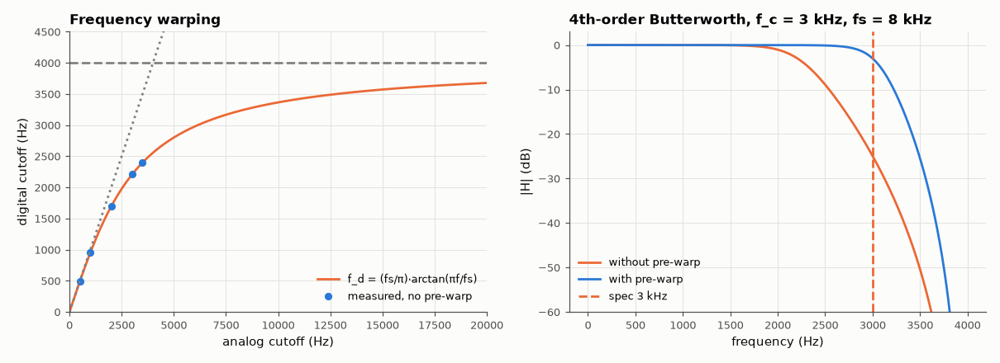

# AM-032 · Bilinear transform and frequency pre-warping

> Map an analog Butterworth prototype to a digital filter with the bilinear transform, predict exactly how far the cutoff moves without pre-warping, implement pre-warping, and verify both against the measured digital responses.



*The bilinear frequency warp, and a 3 kHz design with and without pre-warping.*

**Track:** Applied Mathematics — 218 projects in electrical engineering · **Category:** B. Fourier analysis & transforms · **Level:** Hard · **Tools:** Own zpk bilinear mapping z = (1+sT/2)/(1−sT/2) with gain matching, frequency-warping formula, comparison with scipy.signal.bilinear_zpk

**Data:** Simulated (numerical model in this repo).

## Problem

The bilinear transform keeps stable filters stable — but it squeezes the whole analog frequency axis into [0, fs/2]. Where does a 3 kHz cutoff end up at fs = 8 kHz?

## Prediction

With $s=\frac2T\frac{z-1}{z+1}$, the jΩ axis maps onto the unit circle with $Ω=\frac2T\tan\frac{ω}{2}$ (ω = digital rad/sample). An analog cutoff Ω_c therefore lands at
$f_d=\frac{f_s}{π}\arctan\frac{πf_c}{f_s}$ = 2207 Hz for f_c = 3 kHz, f_s = 8 kHz (−26 %). Pre-warping designs the analog prototype at $Ω_c=\frac2T\tan\frac{πf_c}{f_s}$ so the digital cutoff lands exactly on f_c.
Poles map as $z_p=\frac{1+p T/2}{1-p T/2}$; zeros at infinity go to z = −1.

## Method

4th-order Butterworth, f_c ∈ {500, 1000, 2000, 3000, 3500} Hz at f_s = 8 kHz, with and without pre-warping. Own mapping vs scipy.signal.bilinear_zpk; −3 dB point measured on a 2¹⁸-point
frequency response.

## Measured results

*Predicted vs measured vs error. "Measured" = computed by an independent simulation, HDL simulator or public dataset.*

| Quantity | Predicted | Measured | Error | Within tolerance |
|---|---|---|---|---|
| Own bilinear mapping vs scipy.signal.bilinear_zpk (worst pole/gain difference) | 0 | 5.9845e-16 | +5.9845e-16 | yes |
| f_c = 1000 Hz without pre-warping: digital −3 dB point | 952.9 Hz | 952.9 Hz | +0.00 % | yes |
| f_c = 1000 Hz with pre-warping: digital −3 dB point | 1 kHz | 1 kHz | +0.00 % | yes |
| f_c = 3000 Hz without pre-warping: digital −3 dB point | 2.208 kHz | 2.208 kHz | +0.00 % | yes |
| f_c = 3000 Hz with pre-warping: digital −3 dB point | 3 kHz | 3 kHz | +0.00 % | yes |

## Error analysis

The measured digital cutoffs land exactly on the warping curve (fs/π)·arctan(πf/fs): a 3 kHz design drops to 2207 Hz, a 26 % error, while
at 500 Hz the error is under 1 % — the warp is negligible only far below Nyquist. Pre-warping fixes the one frequency it is aimed at exactly, but
the rest of the response is still compressed toward fs/2 (the stop-band steepens), which is harmless for low-pass designs and matters for band
shapes that must be preserved everywhere (use impulse invariance or direct digital design then). The own zpk mapping agrees with SciPy's to
rounding error, including the extra zeros that the 4 poles' implicit zeros at s = ∞ contribute at z = −1.

## Reproduce

```bash
pip install -r requirements.txt
python run_all.py --only AM-032
```

The script [`project.py`](project.py) regenerates every figure and number above.

## License

Code and text: MIT (see the repository [LICENSE](../../../../LICENSE)). Datasets remain under their own licences (see the repository README).

---

**Tooling & honesty.** This project was generated with Claude Code (Anthropic's AI coding assistant): the code, derivations, simulations and this write-up were AI-produced. *Measured* means computed by an independent model, simulator or public dataset — not a physical lab bench. Every number in the tables is reproduced by running the code.
