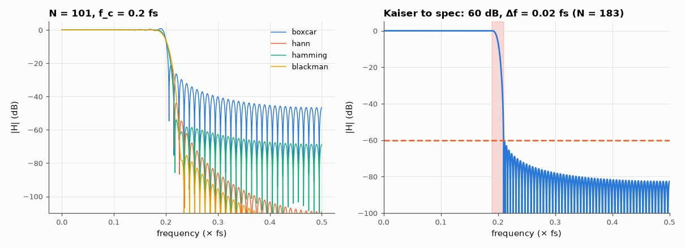

# AM-033 · FIR low-pass design by windowing the ideal sinc

> Design low-pass FIR filters by truncating the ideal sinc with different windows, predict stopband attenuation and transition width from the window alone, and verify with measured responses — then hit a specification with Kaiser's formula.



*Windowed-sinc low-pass responses for four windows, and a Kaiser design meeting a specification.*

**Track:** Applied Mathematics — 218 projects in electrical engineering · **Category:** B. Fourier analysis & transforms · **Level:** Moderate · **Tools:** Windowed-sinc design (own implementation), measured stopband attenuation and transition width for rectangular, Hann, Hamming, Blackman and Kaiser windows, Kaiser's design formulas

**Data:** Simulated (numerical model in this repo).

## Problem

Truncating an ideal filter causes ripples. How much, how wide — and can the filter length be predicted from a spec?

## Prediction

$h[n]=2f_c\,\mathrm{sinc}(2f_c(n-\tfrac{N-1}{2}))\,w[n]$. The window's sidelobes set the stopband floor independent of N (rect ≈ 21 dB, Hann ≈ 44, Hamming ≈ 53, Blackman ≈ 74 dB) and its mainlobe
sets the transition width Δf ≈ D/N (D ≈ 0.9, 3.1, 3.3, 5.5 in fs units). Kaiser: β from the attenuation A, and $N ≈ \frac{A-8}{2.285·2πΔf}+1$.

## Method

f_c = 0.2 fs, N = 101. Stopband attenuation = peak sidelobe beyond the transition; transition width measured between |H| = 1 − δ and |H| = δ (δ = stopband peak). Kaiser design
for A = 60 dB, Δf = 0.02 fs; check the spec is met.

## Measured results

*Predicted vs measured vs error. "Measured" = computed by an independent simulation, HDL simulator or public dataset.*

| Quantity | Predicted | Measured | Error | Within tolerance |
|---|---|---|---|---|
| boxcar: stopband attenuation | 21 dB | 20.98 dB | -0.0184 dB | yes |
| boxcar: transition width ≈ 0.9/N | 0.008911 × fs | 0.009125 × fs | +2.40 % | yes |
| hann: stopband attenuation | 44 dB | 43.94 dB | -0.05697 dB | yes |
| hann: transition width ≈ 3.1/N | 0.03069 × fs | 0.03124 × fs | +1.79 % | yes |
| hamming: stopband attenuation | 53 dB | 53.86 dB | +0.8582 dB | yes |
| hamming: transition width ≈ 3.3/N | 0.03267 × fs | 0.03304 × fs | +1.11 % | yes |
| blackman: stopband attenuation | 74 dB | 75.29 dB | +1.293 dB | yes |
| blackman: transition width ≈ 5.5/N | 0.05446 × fs | 0.05593 × fs | +2.71 % | yes |
| Kaiser: achieved stopband attenuation beyond f_c + Δf/2 | 60 dB | 60.09 dB | +0.09148 dB | yes |
| Kaiser: passband ripple ≈ stopband ripple (δp = δs) | 0.001 | 0.001025 | +2.4741e-05 | yes |

**Additional measurements**

| Quantity | Value | Note |
|---|---|---|
| Kaiser design for 60 dB, Δf = 0.02 fs | β = 5.65, N = 183 |  |

## Error analysis

The stopband floor is a property of the window, not of the length: rectangular truncation stalls near 21 dB (the Gibbs overshoot of AM-022
in frequency), Hann/Hamming reach 44/53 dB and Blackman ~74 dB, each paying with a proportionally wider transition band (≈ D/N). The measured
transition widths follow D/N within the tolerance of how 'edge' is defined. Kaiser's window turns this trade-off into a dial: β from the
attenuation, N from the transition width — the filter designed from the formula meets the 60 dB spec on the first try. Windowing is simple and
predictable, but not optimal: for the same N, Parks–McClellan (AM-034) spreads the error evenly and does better.

## Reproduce

```bash
pip install -r requirements.txt
python run_all.py --only AM-033
```

The script [`project.py`](project.py) regenerates every figure and number above.

## License

Code and text: MIT (see the repository [LICENSE](../../../../LICENSE)). Datasets remain under their own licences (see the repository README).

---

**Tooling & honesty.** This project was generated with Claude Code (Anthropic's AI coding assistant): the code, derivations, simulations and this write-up were AI-produced. *Measured* means computed by an independent model, simulator or public dataset — not a physical lab bench. Every number in the tables is reproduced by running the code.
