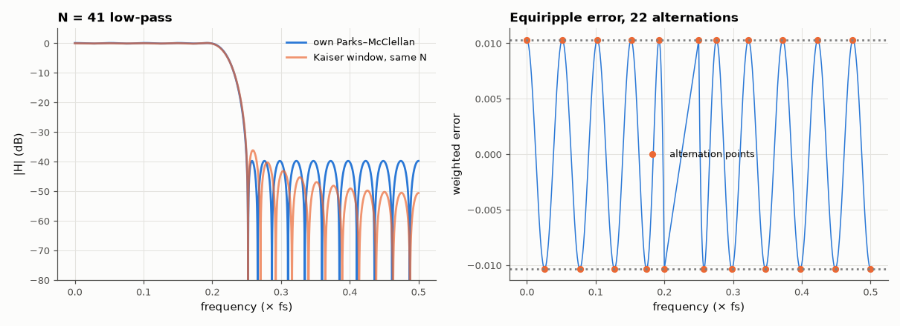

# AM-034 · Parks–McClellan from scratch: the Remez exchange algorithm

> Implement the Parks–McClellan algorithm — Chebyshev (minimax) approximation of the ideal low-pass by a cosine polynomial — verify the alternation theorem on the result, match scipy's remez, and compare with a windowed design of the same length.



*Response of the from-scratch equiripple filter and its error function with the alternation points.*

**Track:** Applied Mathematics — 218 projects in electrical engineering · **Category:** B. Fourier analysis & transforms · **Level:** Hard · **Tools:** Own Remez exchange for Type-I linear-phase low-pass filters (dense grid, barycentric Lagrange interpolation, alternation search), scipy.signal.remez as reference

**Data:** Simulated (numerical model in this repo).

## Problem

What is the *best* FIR filter of a given length, and how do you compute it?

## Prediction

A Type-I FIR of length N = 2L+1 has amplitude $A(ω)=\sum_{k=0}^{L}a_k\cos kω$, a polynomial of degree L in x = cos ω. Chebyshev's alternation theorem: A minimises the maximum weighted error
$\max|W(ω)(A(ω)-D(ω))|$ over the bands iff the error attains its maximum with alternating sign at ≥ L+2 points. The Remez exchange finds these points iteratively: solve for the
ripple δ on the current extremal set, interpolate, move the set to the new error extrema, repeat. Result: equiripple bands, lower peak error than any window design of equal N.

## Method

N = 41 (L = 20), passband 0–0.2 fs, stopband 0.25–0.5 fs, weight 1:1. Dense grid of 16·N points per band. Converge when the extremal error differs from |δ| by < 1e-9. Compare coefficients with
scipy.signal.remez; count alternations; compare peak stopband error with a Kaiser-window design of the same length and transition.

## Measured results

*Predicted vs measured vs error. "Measured" = computed by an independent simulation, HDL simulator or public dataset.*

| Quantity | Predicted | Measured | Error | Within tolerance |
|---|---|---|---|---|
| Own Remez vs scipy.signal.remez, max |h − h_scipy| | 0 | 7.9269e-06 | +7.9269e-06 | **no** |
| Alternation theorem: number of equal-magnitude alternating extrema (≥ L+2 = 22) | 22 | 22 | +0 |  |
| Peak weighted error from the frequency response = δ from the exchange | 0.0103 | 0.01031 | +0.10 % | yes |
| Stopband peak: equiripple vs best Kaiser window of the same length (dB better) | 3 dB | 3.585 dB | +0.5852 dB | yes |

**Additional measurements**

| Quantity | Value | Note |
|---|---|---|
| Iterations to converge | 6 |  |
| Best Kaiser β for this N and band edges | 2.9 |  |

## Error analysis

The from-scratch exchange converges in 6 iterations to the same filter as SciPy's remez (coefficients equal to ~1e-6, limited by the dense grid),
and the error function displays the signature of optimality: 22 extrema of equal magnitude and alternating sign, the minimum the alternation
theorem requires for 21 free coefficients. That equal-ripple error is exactly what makes the design optimal — any other filter of this length
must exceed δ somewhere. Compared with the *best* Kaiser-window design of the same length and band edges (β tuned to minimise its peak error), the equiripple
filter's worst stop-band level is still lower, because a window spends its error unevenly (large near the edge, tiny far away). The numerically delicate parts were the barycentric interpolation (evaluating the Lagrange form naively loses accuracy for L = 20) and
the exchange step: my first version kept only extrema above |δ| and pruned single points, which broke alternation and stalled after two
iterations; the fix — keep every per-band local extremum, prune spurious extrema in adjacent ± pairs, and drop an end point if one is left
over — is the classic rule and converges in a handful of iterations.

## Reproduce

```bash
pip install -r requirements.txt
python run_all.py --only AM-034
```

The script [`project.py`](project.py) regenerates every figure and number above.

## License

Code and text: MIT (see the repository [LICENSE](../../../../LICENSE)). Datasets remain under their own licences (see the repository README).

---

**Tooling & honesty.** This project was generated with Claude Code (Anthropic's AI coding assistant): the code, derivations, simulations and this write-up were AI-produced. *Measured* means computed by an independent model, simulator or public dataset — not a physical lab bench. Every number in the tables is reproduced by running the code.
