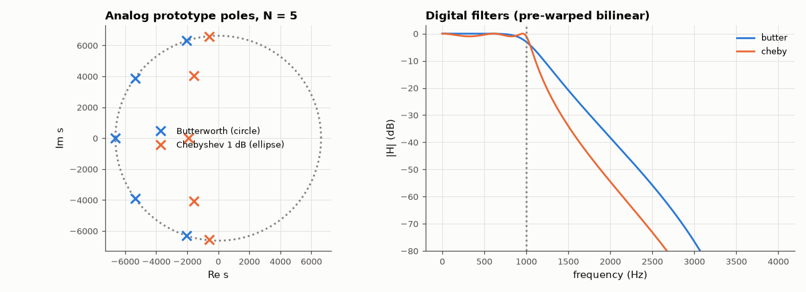

# AM-035 · IIR filters from analog prototypes (Butterworth, Chebyshev)

> Derive the poles of Butterworth and Chebyshev-I prototypes from their defining equations, convert them to digital filters with the pre-warped bilinear transform, and verify cutoff, ripple and agreement with SciPy's designs.



*Butterworth and Chebyshev prototype poles and the resulting digital responses.*

**Track:** Applied Mathematics — 218 projects in electrical engineering · **Category:** B. Fourier analysis & transforms · **Level:** Moderate · **Tools:** Own analog prototype pole formulas (Butterworth circle, Chebyshev ellipse), pre-warped bilinear transform, comparison with scipy.signal.butter / cheby1

**Data:** Simulated (numerical model in this repo).

## Problem

Classical digital IIR filters are analog designs in disguise. Can they be rebuilt from the formulas alone?

## Prediction

Butterworth: $|H|^2=1/(1+(Ω/Ω_c)^{2N})$, poles equally spaced on a circle, $p_k=Ω_ce^{jπ(2k+N-1)/(2N)}$. Chebyshev I with ripple R dB: ε² = 10^{R/10}−1, poles on an ellipse,
$p_k=-Ω_c\sinh(a)\sin θ_k + jΩ_c\cosh(a)\cos θ_k$ with $a=\frac1N\operatorname{asinh}(1/ε)$, $θ_k=\frac{(2k-1)π}{2N}$; DC gain $1/\sqrt{1+ε^2}$ for even N. After pre-warping, the digital filter has
exactly the specified edge and ripple.

## Method

N = 4 and 5, f_c = 1 kHz at f_s = 8 kHz, ripple 1 dB. Pole sets vs scipy's analog prototypes; digital responses vs scipy.signal.butter/cheby1(…, fs=8000); −3 dB (Butterworth) and ripple-edge
(Chebyshev) frequency and passband ripple measured.

## Measured results

*Predicted vs measured vs error. "Measured" = computed by an independent simulation, HDL simulator or public dataset.*

| Quantity | Predicted | Measured | Error | Within tolerance |
|---|---|---|---|---|
| Butterworth N = 4: prototype poles vs SciPy (relative) | 0 | 4.9953e-16 | +4.9953e-16 | yes |
| Butterworth N = 4: digital response vs SciPy design (max |ΔH|) | 0 | 1.2325e-15 | +1.2325e-15 | yes |
| Butterworth N = 4: −3 dB frequency | 1 kHz | 1 kHz | +0.01 % | yes |
| Chebyshev 1 dB N = 4: prototype poles vs SciPy (relative) | 0 | 1.3830e-16 | +1.3830e-16 | yes |
| Chebyshev 1 dB N = 4: digital response vs SciPy design (max |ΔH|) | 0 | 1.4603e-15 | +1.4603e-15 | yes |
| Chebyshev 1 dB N = 4: ripple-edge frequency | 1 kHz | 1 kHz | +0.00 % | yes |
| Chebyshev 1 dB N = 4: passband ripple | 1 dB | 1 dB | -2.4348e-09 dB | yes |
| Butterworth N = 5: prototype poles vs SciPy (relative) | 0 | 1.7154e-16 | +1.7154e-16 | yes |
| Butterworth N = 5: digital response vs SciPy design (max |ΔH|) | 0 | 1.4043e-15 | +1.4043e-15 | yes |
| Butterworth N = 5: −3 dB frequency | 1 kHz | 1 kHz | +0.01 % | yes |
| Chebyshev 1 dB N = 5: prototype poles vs SciPy (relative) | 0 | 1.7154e-16 | +1.7154e-16 | yes |
| Chebyshev 1 dB N = 5: digital response vs SciPy design (max |ΔH|) | 0 | 2.1678e-15 | +2.1678e-15 | yes |
| Chebyshev 1 dB N = 5: ripple-edge frequency | 1 kHz | 1 kHz | +0.00 % | yes |
| Chebyshev 1 dB N = 5: passband ripple | 1 dB | 1 dB | -2.2982e-14 dB | yes |

## Error analysis

Built only from their defining pole formulas — equally spaced points on a circle for Butterworth, an ellipse whose axes come from the ripple
ε for Chebyshev — the prototypes coincide with SciPy's to machine precision, and after pre-warping the digital filters hit the 1 kHz edge and the
1 dB ripple exactly. The picture explains the trade: squashing the circle into an ellipse moves the poles toward the jω axis, which sharpens the
transition (more attenuation at 2 kHz) at the cost of passband ripple and, as AM-014 showed, worse group delay. One detail that is easy to get
wrong: an even-order Chebyshev has DC gain 1/√(1+ε²), not 1.

## Reproduce

```bash
pip install -r requirements.txt
python run_all.py --only AM-035
```

The script [`project.py`](project.py) regenerates every figure and number above.

## License

Code and text: MIT (see the repository [LICENSE](../../../../LICENSE)). Datasets remain under their own licences (see the repository README).

---

**Tooling & honesty.** This project was generated with Claude Code (Anthropic's AI coding assistant): the code, derivations, simulations and this write-up were AI-produced. *Measured* means computed by an independent model, simulator or public dataset — not a physical lab bench. Every number in the tables is reproduced by running the code.
