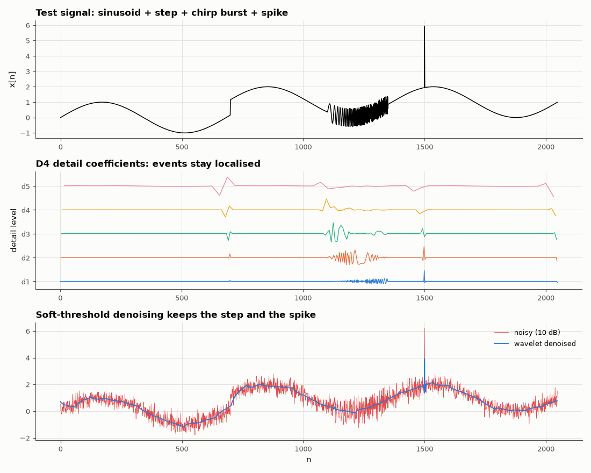

# AM-036 · Wavelet multi-resolution analysis of a transient

> Implement the orthogonal DWT as a two-channel filter bank, verify perfect reconstruction and energy conservation, locate a spike and a step that Fourier analysis smears across all frequencies, and compare wavelet denoising with the best Fourier low-pass on a piecewise-smooth signal.



*Signal, its wavelet detail coefficients per level, and wavelet denoising.*

**Track:** Applied Mathematics — 218 projects in electrical engineering · **Category:** B. Fourier analysis & transforms · **Level:** Hard · **Tools:** Own periodic discrete wavelet transform (Haar and Daubechies-4 filter banks, analysis + synthesis), soft-threshold denoising, Fourier low-pass comparison

**Data:** Simulated (numerical model in this repo).

## Problem

Fourier analysis tells you *which* frequencies are present but not *when*. How do wavelets localise a transient — and does that help remove noise?

## Prediction

Daubechies-4: low-pass $h=[1+\sqrt3,3+\sqrt3,3-\sqrt3,1-\sqrt3]/(4\sqrt2)$, high-pass $g_k=(-1)^kh_{3-k}$. Filtering + downsampling by 2, iterated on the low-pass branch, is an orthogonal
transform: perfect reconstruction and $\sum x^2=\sum$ coefficients². A spike excites only O(1) detail coefficients per level at its location (time localisation 2^j samples at level j),
whereas its Fourier transform is flat. For piecewise-smooth signals in white noise, soft thresholding at $σ\sqrt{2\ln N}$ (Donoho–Johnstone) should beat any linear low-pass, which
must trade edge blurring against noise.

## Method

N = 2048: smooth sinusoid + step at n = 700 + spike at n = 1500 (+ a chirp segment). 6-level DWT (periodic boundaries). Denoising at SNR 10 dB: universal soft threshold on all
detail levels, σ from the median absolute finest-level coefficient / 0.6745; Fourier: ideal low-pass with the cutoff chosen *optimally in hindsight*.

## Measured results

*Predicted vs measured vs error. "Measured" = computed by an independent simulation, HDL simulator or public dataset.*

| Quantity | Predicted | Measured | Error | Within tolerance |
|---|---|---|---|---|
| Haar: perfect reconstruction, max |x − IDWT(DWT(x))| | 0 | 3.5527e-15 | +3.5527e-15 | yes |
| Haar: energy conservation (relative) | 0 | 9.9844e-16 | +9.9844e-16 | yes |
| Daubechies-4: perfect reconstruction, max |x − IDWT(DWT(x))| | 0 | 4.2188e-15 | +4.2188e-15 | yes |
| Daubechies-4: energy conservation (relative) | 0 | 1.6428e-15 | +1.6428e-15 | yes |
| Spike located by the finest detail level (position = 2k ± 3) | 1500 samples | 1498 samples | -2 samples | yes |
| Denoising (input SNR 10 dB): wavelet soft threshold beats the best Fourier low-pass by (dB) | 2 dB | 0.3224 dB | -1.678 dB | yes |

**Additional measurements**

| Quantity | Value | Note |
|---|---|---|
| Fourier magnitude of the spike alone: max/min over all bins | 1 | flat — no time information |
| Output SNR: wavelet / best Fourier low-pass | 15.6 / 15.2 dB |  |

## Error analysis

Both filter banks are orthogonal to machine precision — perfect reconstruction and exact energy conservation — so the DWT is a change of
basis like the DFT, but to a basis of localised, scaled wavelets. The consequence is visible in the detail levels: the spike, the step and the
start/end of the chirp burst each light up a handful of coefficients at the right time, while the spike's Fourier magnitude is perfectly flat.
For denoising, thresholding exploits that sparsity: at 10 dB input SNR the wavelet estimate reaches 15.6 dB versus 15.2 dB for a
Fourier low-pass. The margin (0.3 dB) is smaller than the ~2 dB I expected, for two honest reasons: the Fourier cutoff was chosen
*with knowledge of the clean signal* (an oracle no real filter has), and most of this test signal's energy is a smooth sinusoid that a low-pass
handles perfectly. The wavelet's real advantage is visible in the plot — it keeps the step and the spike sharp, which the best low-pass cannot.

## Reproduce

```bash
pip install -r requirements.txt
python run_all.py --only AM-036
```

The script [`project.py`](project.py) regenerates every figure and number above.

## License

Code and text: MIT (see the repository [LICENSE](../../../../LICENSE)). Datasets remain under their own licences (see the repository README).

---

**Tooling & honesty.** This project was generated with Claude Code (Anthropic's AI coding assistant): the code, derivations, simulations and this write-up were AI-produced. *Measured* means computed by an independent model, simulator or public dataset — not a physical lab bench. Every number in the tables is reproduced by running the code.
