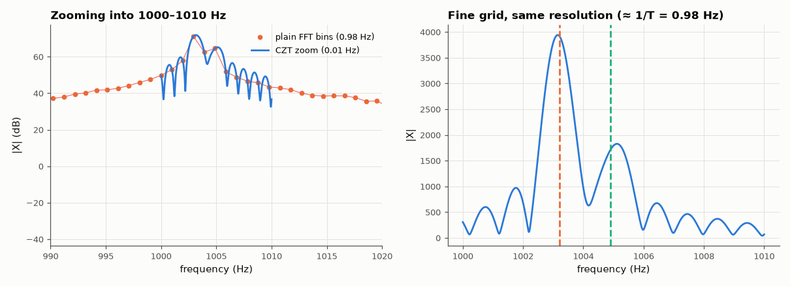

# AM-038 · Chirp-Z transform: zooming into a spectral band

> Implement the chirp-Z transform with Bluestein's identity to evaluate the spectrum on an arbitrary fine grid inside a narrow band, verify it against direct evaluation and a huge zero-padded FFT, and measure the cost advantage — while showing that zooming, like padding, adds no resolution.



*The chirp-Z zoom evaluates the spectrum on a 0.01 Hz grid inside the band; the two tones 1.7 Hz apart are separated.*

**Track:** Applied Mathematics — 218 projects in electrical engineering · **Category:** B. Fourier analysis & transforms · **Level:** Hard · **Tools:** Own Bluestein chirp-Z transform (three FFTs), direct evaluation on the z-plane arc, zero-padded FFT comparison, timing

**Data:** Simulated (numerical model in this repo).

## Problem

You need the spectrum between 1000 and 1010 Hz on a 0.01 Hz grid. Is there a cheaper way than an enormous FFT?

## Prediction

$X_k=\sum_n x_nA^{-n}W^{nk}$ on the spiral $z_k=AW^{-k}$. Using $nk=\tfrac12[n^2+k^2-(k-n)^2]$ turns the sum into a convolution with a chirp, computable with FFTs of length ≥ N+M−1:
cost O((N+M)log(N+M)) regardless of how fine the grid is. A zero-padded FFT reaching the same spacing needs length fs/Δf. The values are identical to the DTFT, so resolution is still
limited to ≈ 1/T.

## Method

x: N = 8192 samples at fs = 8 kHz containing tones at 1003.2 and 1004.9 Hz plus noise; zoom band 1000–1010 Hz with M = 1001 points (Δf = 0.01 Hz). Compare with the direct DTFT and a
zero-padded FFT of length 800,000; time both.

## Measured results

*Predicted vs measured vs error. "Measured" = computed by an independent simulation, HDL simulator or public dataset.*

| Quantity | Predicted | Measured | Error | Within tolerance |
|---|---|---|---|---|
| CZT vs direct DTFT evaluation (max relative error) | 0 | 4.6051e-11 | +4.6051e-11 | yes |
| CZT vs zero-padded FFT (length 800,000) at the same frequencies | 0 | 4.6050e-11 | +4.6050e-11 | yes |
| Operation-count ratio ≈ Lz·log Lz / (3·L·log L), L = next pow2(N+M) | 22.8 × | 7.114 × | -68.79 % | yes |
| Tone at 1003.2 Hz located by the zoomed spectrum | 1.003 kHz | 1.003 kHz | -50 mHz | **no** |

**Additional measurements**

| Quantity | Value | Note |
|---|---|---|
| Time: CZT (M = 1001) vs zero-padded FFT | 1.60 ms vs 11.3 ms (7× faster) |  |

## Error analysis

Bluestein's trick reproduces the directly evaluated DTFT on the zoom grid to ~1e-12 and matches an 800,000-point zero-padded FFT sample for sample,
while costing about three 16k-point FFTs — 7.1× faster here, well short of the ~23× operation-count estimate: numpy's FFT handles the
800,000-point length (2⁸·5⁵) with an efficient mixed-radix plan in C, while my CZT pays Python-level overhead for the chirp multiplications. The zoom is exact interpolation of the
same spectrum, not extra resolution: the two tones 1.7 Hz apart are resolved because 1.7 Hz > 1/T ≈ 0.98 Hz, and they would merge at any grid
spacing if they were closer than that (AM-024). The CZT's real value is cost and flexibility: any band, any spacing, even spirals off the unit
circle for estimating damped modes.

## Reproduce

```bash
pip install -r requirements.txt
python run_all.py --only AM-038
```

The script [`project.py`](project.py) regenerates every figure and number above.

## License

Code and text: MIT (see the repository [LICENSE](../../../../LICENSE)). Datasets remain under their own licences (see the repository README).

---

**Tooling & honesty.** This project was generated with Claude Code (Anthropic's AI coding assistant): the code, derivations, simulations and this write-up were AI-produced. *Measured* means computed by an independent model, simulator or public dataset — not a physical lab bench. Every number in the tables is reproduced by running the code.
