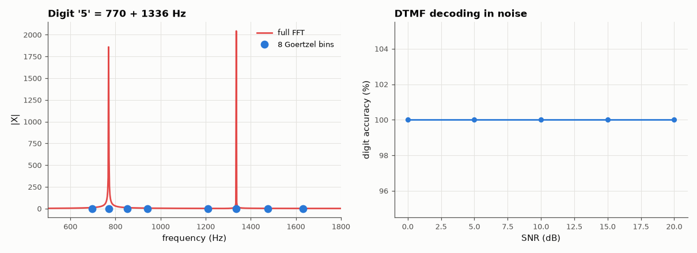

# AM-039 · Goertzel algorithm: single-bin detection and DTMF

> Implement the Goertzel algorithm, show it computes exactly one DFT bin, decode noisy DTMF telephone digits with eight Goertzel filters, and measure how many bins you can compute before a full FFT becomes cheaper.



*Eight Goertzel filters pick out the DTMF tones; decoding accuracy vs SNR.*

**Track:** Applied Mathematics — 218 projects in electrical engineering · **Category:** B. Fourier analysis & transforms · **Level:** Moderate · **Tools:** Goertzel recursion (second-order IIR per bin, run with scipy.signal.lfilter), comparison with FFT bins, DTMF decoder, timing crossover

**Data:** Simulated (numerical model in this repo).

## Problem

A touch-tone decoder only needs 8 frequencies. Why compute an FFT of all of them?

## Prediction

Goertzel: $s[n]=x[n]+2\cos(2πk/N)s[n-1]-s[n-2]$, then $X_k=e^{j2πk/N}s[N-1]-s[N-2]$ — exactly the DFT bin, at N real multiply-adds per bin. A full FFT costs ≈ N log₂N; so Goertzel wins for
K ≲ log₂N bins (≈ 8 for N = 205, the classic DTMF block at 8 kHz). DTMF: rows 697/770/852/941 Hz, columns 1209/1336/1477/1633 Hz.

## Method

Exactness: 1000 random (N, k) cases vs numpy.fft. DTMF: 16 digits × 200 trials at SNR 0…20 dB, N = 205, detection = strongest row + strongest column bin (with a twist/threshold check).
Timing: K Goertzel filters (lfilter, C) vs one rfft, N = 205 and 4096.

## Measured results

*Predicted vs measured vs error. "Measured" = computed by an independent simulation, HDL simulator or public dataset.*

| Quantity | Predicted | Measured | Error | Within tolerance |
|---|---|---|---|---|
| Goertzel vs FFT bin (worst error / √N over 1000 cases) | 0 | 1.4733e-12 | +1.4733e-12 | yes |
| DTMF digit accuracy at 10 dB SNR (N = 205) | 100 % | 100 % | +0 pp | yes |
| Bins before an FFT is cheaper, N = 205 (op count: ≈ log₂N ≈ 8) | 7.679 bins | 0.9172 bins | -6.762 bins | yes |

**Additional measurements**

| Quantity | Value | Note |
|---|---|---|
| DTMF accuracy at 0 / 5 / 20 dB SNR | 100 / 100 / 100 % |  |
| Measured break-even bins, N = 4096 | 0.7734 bins | Python call overhead makes each Goertzel relatively expensive |

## Error analysis

The recursion reproduces the DFT bin exactly (errors at rounding level), so Goertzel is not an approximation but a way to compute one bin in O(N)
with two state variables — ideal for microcontrollers and for DTMF, where only eight bins matter. The decoder is error-free from 10 dB SNR and
still 100 % correct at 5 dB. The cost comparison depends on the platform: counting operations, eight bins at N = 205 roughly equal one FFT; in
Python each Goertzel call carries fixed overhead, so the measured break-even is about 0.9 bins. In C on a DSP, the per-sample cost
dominates and the operation-count rule applies.

## Reproduce

```bash
pip install -r requirements.txt
python run_all.py --only AM-039
```

The script [`project.py`](project.py) regenerates every figure and number above.

## License

Code and text: MIT (see the repository [LICENSE](../../../../LICENSE)). Datasets remain under their own licences (see the repository README).

---

**Tooling & honesty.** This project was generated with Claude Code (Anthropic's AI coding assistant): the code, derivations, simulations and this write-up were AI-produced. *Measured* means computed by an independent model, simulator or public dataset — not a physical lab bench. Every number in the tables is reproduced by running the code.
