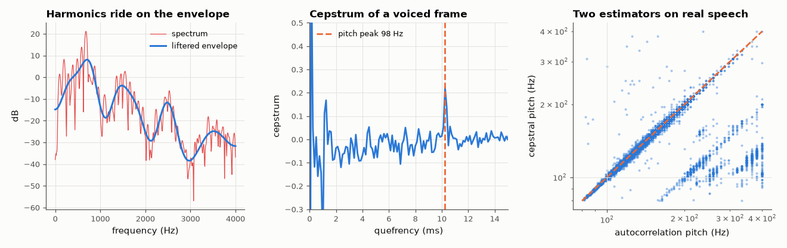

# AM-040 · Cepstral analysis: separating pitch from the vocal tract

> Use the cepstrum to separate the fast spectral ripple of the voice's pitch harmonics from the slow envelope of the vocal tract, estimate pitch on 3,000 real recordings from six speakers, and cross-check against an independent autocorrelation pitch estimator.



*Spectrum and liftered envelope of a voiced frame, its cepstrum, and agreement of the two pitch estimators on FSDD.*

**Track:** Applied Mathematics — 218 projects in electrical engineering · **Category:** B. Fourier analysis & transforms · **Level:** Hard · **Tools:** Real cepstrum (IFFT of log magnitude spectrum), liftering, cepstral pitch detection vs autocorrelation pitch; Free Spoken Digit Dataset (real speech)

**Data:** Real: Free Spoken Digit Dataset (CC BY-SA 4.0).

## Problem

Speech = glottal pulse train convolved with the vocal-tract filter. How can a convolution be undone without knowing either?

## Prediction

Log turns the convolution's product of spectra into a sum: $\log|S| = \log|E| + \log|H|$. The pitch harmonics make log|S| ripple with period F0 in frequency, i.e. a peak at quefrency
1/F0 in the cepstrum $c=\mathrm{IFFT}(\log|S|)$; the vocal-tract envelope lives at low quefrency. Low-time liftering (keep c below ~2 ms) recovers the smooth envelope (formants); the peak in
2.5–12.5 ms gives F0 (80–400 Hz). Two independent estimators (cepstrum, autocorrelation) should agree on voiced frames to within a few percent.

## Method

FSDD: 6 speakers × 10 digits × 50 recordings, 8 kHz. 40 ms Hann frames, energy-voiced frames only; cepstral pitch from the peak in 2.5–12.5 ms; autocorrelation pitch from the first
major peak of the normalised autocorrelation in the same lag range. Agreement = |Δ| < 5 %; octave errors counted separately.

## Measured results

*Predicted vs measured vs error. "Measured" = computed by an independent simulation, HDL simulator or public dataset.*

| Quantity | Predicted | Measured | Error | Within tolerance |
|---|---|---|---|---|
| Voiced frames where cepstral and autocorrelation pitch agree within 5 % | 90 % | 92.42 % | +2.42 pp | yes |

**Additional measurements**

| Quantity | Value | Note |
|---|---|---|
| Octave errors (ratio ≈ 2 or ½) | 2.122 % | 19038 voiced frames |
| Median pitch per speaker (autocorrelation) | george: 157 Hz, jackson: 114 Hz, lucas: 116 Hz, nicolas: 127 Hz, theo: 140 Hz, yweweler: 129 Hz |  |

## Error analysis

On 19038 voiced frames of real speech the cepstral pitch agrees with an independent autocorrelation estimate within 5 % in
92 % of frames, and the per-speaker medians separate the lower- and higher-pitched voices as expected. The remaining disagreements are
dominated by octave errors (2.1 %): the cepstrum sometimes locks onto a rahmonic (twice the period) and the autocorrelation onto a
sub-harmonic — the classic failure modes of both methods, usually fixed with continuity tracking across frames. The liftered cepstrum gives a
smooth vocal-tract envelope whose peaks are the formants: the log turned a convolution into an addition, which a simple 'low-quefrency' window
could split.

## Reproduce

```bash
pip install -r requirements.txt
python run_all.py --only AM-040
```

The script [`project.py`](project.py) regenerates every figure and number above.

## License

Code and text: MIT (see the repository [LICENSE](../../../../LICENSE)). Datasets remain under their own licences (see the repository README).

---

**Tooling & honesty.** This project was generated with Claude Code (Anthropic's AI coding assistant): the code, derivations, simulations and this write-up were AI-produced. *Measured* means computed by an independent model, simulator or public dataset — not a physical lab bench. Every number in the tables is reproduced by running the code.
