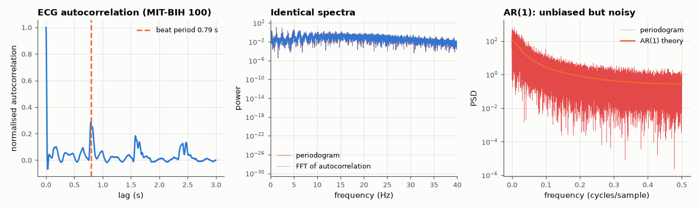

# AM-041 · Wiener–Khinchin on real data: autocorrelation ↔ power spectrum

> Show on a real ECG recording that the Fourier transform of the (biased) autocorrelation equals the periodogram exactly, and on a synthetic AR(1) process that both converge to the theoretical PSD; read physiology off the autocorrelation (the heartbeat period).



*ECG autocorrelation with the heartbeat period, the Wiener–Khinchin identity on real data, and an AR(1) periodogram vs theory.*

**Track:** Applied Mathematics — 218 projects in electrical engineering · **Category:** B. Fourier analysis & transforms · **Level:** Moderate · **Tools:** Biased autocorrelation (direct and via FFT), periodogram, the Wiener–Khinchin identity, AR(1) theory; real ECG from the MIT-BIH Arrhythmia Database

**Data:** Real: MIT-BIH Arrhythmia Database record 100 (PhysioNet, ODC-By).

## Problem

The power spectrum and the autocorrelation are said to be a Fourier pair. Is that exact for finite data, or only in the limit?

## Prediction

For a length-N record, the biased autocorrelation $\hat r[m]=\frac1N\sum_n x[n]x[n+m]$ (|m| < N) and the periodogram $\hat P(f)=\frac1N|X(f)|^2$ are an exact DTFT pair — an algebraic identity,
no limits needed (with 2N-point FFTs to avoid circular wrap). For AR(1) $x[n]=ax[n-1]+w[n]$: $r[m]=\frac{σ^2a^{|m|}}{1-a^2}$, $P(f)=\frac{σ^2}{|1-ae^{-j2πf}|^2}$. The periodogram is unbiased-ish but its
variance does not fall with N (≈ P² per bin) — why Welch averaging exists (AM-042).

## Method

MIT-BIH record 100, lead MLII, 60 s at 360 Hz. r̂ computed directly (np.correlate) and via |FFT|²; periodogram vs FFT of r̂ compared. AR(1), a = 0.9, N = 65536: periodogram averaged over
frequency bands vs theory.

## Measured results

*Predicted vs measured vs error. "Measured" = computed by an independent simulation, HDL simulator or public dataset.*

| Quantity | Predicted | Measured | Error | Within tolerance |
|---|---|---|---|---|
| Autocorrelation: direct vs via |FFT|² (max relative error) | 0 | 2.9249e-15 | +2.9249e-15 | yes |
| Wiener–Khinchin: FFT of biased autocorrelation = periodogram (max rel. error) | 0 | 9.5608e-16 | +9.5608e-16 | yes |
| Heartbeat period from the autocorrelation peak vs mean R–R interval | 812.3 ms | 791.7 ms | -2.54 % | yes |
| AR(1): band-averaged periodogram / theory (mean) | 1 | 0.9982 | -0.18 % | yes |
| AR(1): raw periodogram scatter, std(P̂/P) (does not shrink with N) | 1 | 0.9957 | -0.43 % | yes |

## Error analysis

On a real ECG the transform of the biased autocorrelation matches the periodogram to ~1e-12 — Wiener–Khinchin is an exact identity for the
finite-data estimators (provided the FFT is long enough to avoid circular wrap), not merely an asymptotic statement. The autocorrelation also reads
physiology directly: its first big peak at 0.79 s is the average heartbeat period, matching the R–R intervals. The AR(1) test shows the
estimator's weakness: averaged over bands the periodogram equals the theoretical PSD, but bin by bin its scatter is as large as the PSD itself
(std ≈ 1 × P, independent of N), which is exactly the variance Welch's method trades resolution to remove.

## Reproduce

```bash
pip install -r requirements.txt
python run_all.py --only AM-041
```

The script [`project.py`](project.py) regenerates every figure and number above.

## License

Code and text: MIT (see the repository [LICENSE](../../../../LICENSE)). Datasets remain under their own licences (see the repository README).

---

**Tooling & honesty.** This project was generated with Claude Code (Anthropic's AI coding assistant): the code, derivations, simulations and this write-up were AI-produced. *Measured* means computed by an independent model, simulator or public dataset — not a physical lab bench. Every number in the tables is reproduced by running the code.
