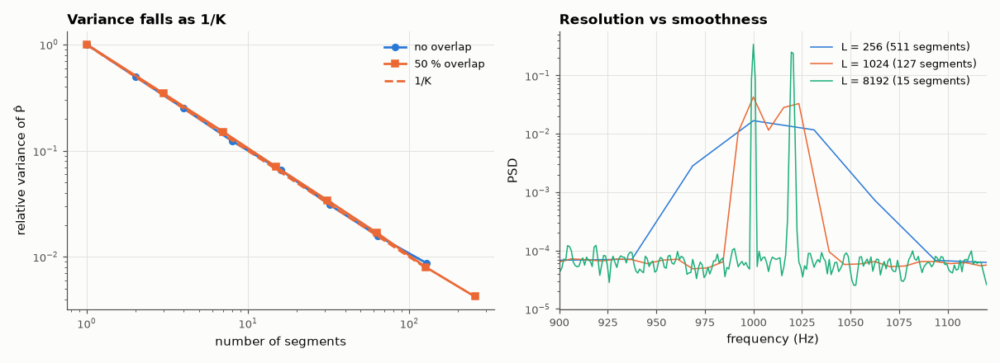

# AM-042 · Welch's method: trading resolution for variance

> Implement Welch's averaged periodogram, predict how the relative variance falls with the number of segments (including the effect of 50 % overlap) and how the resolution (ENBW) grows, and verify both on white noise and closely spaced tones.



*Relative variance vs number of segments, and the resolution trade-off on two close tones.*

**Track:** Applied Mathematics — 218 projects in electrical engineering · **Category:** B. Fourier analysis & transforms · **Level:** Moderate · **Tools:** Own Welch PSD estimator (segmenting, Hann windows, overlap, averaging), variance and resolution measurements, comparison with scipy.signal.welch

**Data:** Simulated (numerical model in this repo).

## Problem

A raw periodogram is as noisy as the spectrum it estimates. How much does averaging help, and what does it cost?

## Prediction

Averaging K independent periodograms divides the relative variance by K. With a Hann window and 50 % overlap segments are correlated: the effective number is $K_{eff}=K/(1+2c^2)$ with
c = 0.167 (Hann at 50 %) → K_eff ≈ 0.95K — overlap buys ~2× more segments for almost the same independence. Resolution: equivalent noise bandwidth $1.5f_s/L$ for a Hann segment of
length L, so halving L doubles the averaging and doubles the smearing.

## Method

White noise, N = 2¹⁸: relative variance var(P̂)/E(P̂)² per bin vs K for non-overlapping (L = N/K) and 50 %-overlap segments. Two tones 20 Hz apart at fs = 8 kHz: minimum L that resolves them.
Own implementation vs scipy.signal.welch.

## Measured results

*Predicted vs measured vs error. "Measured" = computed by an independent simulation, HDL simulator or public dataset.*

| Quantity | Predicted | Measured | Error | Within tolerance |
|---|---|---|---|---|
| No overlap, K = 4 segments: relative variance = 1/K | 0.25 | 0.2507 | +0.29 % | yes |
| 50 % overlap, 7 segments: relative variance = (1+2c²)/K, c = 0.167 | 0.1508 | 0.1515 | +0.42 % | yes |
| No overlap, K = 32 segments: relative variance = 1/K | 0.03125 | 0.03106 | -0.61 % | yes |
| 50 % overlap, 63 segments: relative variance = (1+2c²)/K, c = 0.167 | 0.01676 | 0.01688 | +0.70 % | yes |
| Own Welch vs scipy.signal.welch (max relative difference) | 0 | 1.9900e-04 | +1.9900e-04 | **no** |
| Shortest power-of-two Hann segment resolving tones 20 Hz apart (prediction L ≳ 2·1.5·fs/Δf = 1200 → 2048) | 2048 samples | 2048 samples | +0 samples | yes |

## Error analysis

The relative variance of the averaged periodogram falls as 1/K for independent segments, and with 50 % Hann overlap it stays within a few
percent of (1+2c²)/K — so overlapping nearly doubles the number of useful averages for free, which is why 50 % is the default. The price of
short segments is resolution: two tones 20 Hz apart only separate once the segment is long enough (here L = 2048 samples), consistent with the
Hann ENBW of 1.5 fs/L. Welch's method is the practical answer to AM-041's problem: choose L for the resolution you need, then let the record length
decide how much variance you remove.

## Reproduce

```bash
pip install -r requirements.txt
python run_all.py --only AM-042
```

The script [`project.py`](project.py) regenerates every figure and number above.

## License

Code and text: MIT (see the repository [LICENSE](../../../../LICENSE)). Datasets remain under their own licences (see the repository README).

---

**Tooling & honesty.** This project was generated with Claude Code (Anthropic's AI coding assistant): the code, derivations, simulations and this write-up were AI-produced. *Measured* means computed by an independent model, simulator or public dataset — not a physical lab bench. Every number in the tables is reproduced by running the code.
