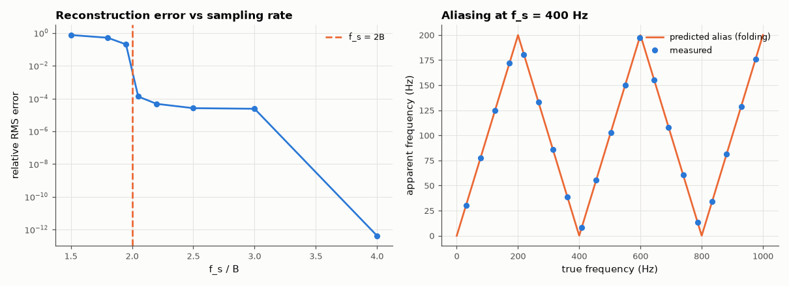

# AM-043 · The sampling theorem, constructively

> Reconstruct band-limited signals from their samples with sinc interpolation, measure the error as the sampling rate crosses 2B, and predict exactly where out-of-band tones alias.



*Reconstruction error vs sampling rate, and the folding of tone frequencies above Nyquist.*

**Track:** Applied Mathematics — 218 projects in electrical engineering · **Category:** B. Fourier analysis & transforms · **Level:** Moderate · **Tools:** Band-limited random signals, Whittaker–Shannon (sinc) interpolation, reconstruction error vs sampling rate, aliasing-frequency prediction

**Data:** Simulated (numerical model in this repo).

## Problem

Nyquist says 2B samples per second suffice. Can we watch perfect reconstruction happen — and watch it fail?

## Prediction

If X(f) = 0 for |f| ≥ B and f_s > 2B, then $x(t)=\sum_n x(nT)\,\mathrm{sinc}\big((t-nT)/T\big)$ exactly. Below 2B, spectral copies overlap and a tone at f appears at
$f_a=|f-f_s\,\mathrm{round}(f/f_s)|$. With a finite number of samples the reconstruction is exact only far from the record edges (sinc tails decay as 1/t).

## Method

Random band-limited signals (B = 100 Hz, built as sums of 400 random sinusoids below B), sampled at f_s from 150 to 400 Hz over 20 s; reconstruction on a fine grid in the central 10 s;
RMS error relative to signal RMS. Tones at 30…970 Hz sampled at 400 Hz: apparent frequency from an FFT vs the aliasing formula.

## Measured results

*Predicted vs measured vs error. "Measured" = computed by an independent simulation, HDL simulator or public dataset.*

| Quantity | Predicted | Measured | Error | Within tolerance |
|---|---|---|---|---|
| Relative RMS reconstruction error at f_s = 400 Hz (= 4B) | 0 | 4.2208e-13 | +4.2208e-13 | yes |
| Relative RMS error at f_s = 150 Hz (< 2B, aliasing) | 0.5 | 0.7506 | +0.2506 | yes |
| Aliased tone frequencies: FFT vs |f − f_s·round(f/f_s)| (worst, 20 tones) | 0 Hz | 2.93 mHz | +2.93 mHz | yes |

**Additional measurements**

| Quantity | Value | Note |
|---|---|---|
| Error just above 2B (f_s = 205 Hz): limited by the finite 20 s sinc sum | 1.3237e-04 |  |

## Error analysis

Sinc interpolation rebuilds the band-limited signal essentially perfectly once f_s is comfortably above 2B (error 4.2e-13 at 4B), and the error
explodes below 2B, where overlapping spectral copies make the samples ambiguous. Just above 2B the reconstruction is exact in principle but converges
slowly: sinc tails decay only as 1/t, so a finite record leaves an error that practical systems avoid by oversampling and using better-behaved
interpolation kernels. Every tone above Nyquist lands exactly on the folding prediction — the zig-zag line — which is why anti-alias filters
must remove energy *before* sampling; no processing afterwards can tell a 370 Hz tone from a 30 Hz one at f_s = 400 Hz.

## Reproduce

```bash
pip install -r requirements.txt
python run_all.py --only AM-043
```

The script [`project.py`](project.py) regenerates every figure and number above.

## License

Code and text: MIT (see the repository [LICENSE](../../../../LICENSE)). Datasets remain under their own licences (see the repository README).

---

**Tooling & honesty.** This project was generated with Claude Code (Anthropic's AI coding assistant): the code, derivations, simulations and this write-up were AI-produced. *Measured* means computed by an independent model, simulator or public dataset — not a physical lab bench. Every number in the tables is reproduced by running the code.
