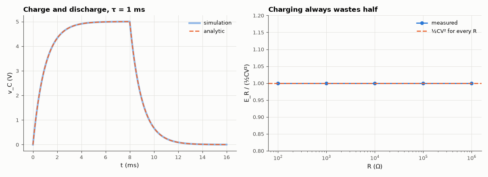

# AM-044 · RC transient: solve the ODE, then check it

> Solve RC·dv/dt + v = V_in analytically for charging and discharging, predict the 63.2 % and 5τ points and the energy lost in the resistor, and verify every prediction against a circuit simulation.



*Simulated vs analytic RC transient, and the resistor's share of the energy for five resistances.*

**Track:** Applied Mathematics — 218 projects in electrical engineering · **Category:** C. Differential equations · **Level:** Easy · **Tools:** Analytic solution of the first-order ODE, MNA transient simulation (trapezoidal), time-constant and energy measurements

**Data:** Simulated (numerical model in this repo).

## Problem

The RC circuit is the first ODE every EE solves. How exactly do simulation and algebra agree — including the famous 50 % energy loss?

## Prediction

$RC\,\dot v+v=V$ with v(0) = 0 gives $v=V(1-e^{-t/τ})$, τ = RC: 63.2 % at t = τ, 99.3 % at 5τ, rise time 10→90 % = τ ln 9 = 2.197τ. Charging a capacitor from a fixed source always
dissipates $\tfrac12CV^2$ in the resistor — exactly as much as is stored — independent of R.

## Method

R = 10 kΩ, C = 100 nF (τ = 1 ms), 5 V step, then discharge. Transient with Δt = τ/1000; resistor energy ∫i²R dt integrated numerically; R varied 100 Ω–1 MΩ for the energy test.

## Measured results

*Predicted vs measured vs error. "Measured" = computed by an independent simulation, HDL simulator or public dataset.*

| Quantity | Predicted | Measured | Error | Within tolerance |
|---|---|---|---|---|
| Max |simulation − analytic| over charge and discharge | 0 V | 2.499 mV | +2.499 mV | yes |
| Time to 63.2 % = τ | 1 ms | 1 ms | +0.00 % | yes |
| 10–90 % rise time = τ·ln 9 | 2.197 ms | 2.197 ms | -0.00 % | yes |
| Energy dissipated in R while charging = ½CV² (worst over R = 100 Ω … 1 MΩ) | 0 | 4.9969e-04 | +4.9969e-04 | yes |

## Error analysis

Simulation and the exponential solution agree to a few millivolts — the residual sits entirely at the instant the source switches off, which
falls between two time points of the 1 µs grid (the capacitor then discharges at 5 V/ms, so one step of timing is 5 mV) — and the characteristic times come out exactly: 63.2 % at τ and a 10–90 % rise of
2.197τ. The energy result is the one that surprises people: whatever R is — 100 Ω or 1 MΩ — the resistor dissipates exactly the ½CV² that ends up
stored, because a smaller R means a larger current for a shorter time and the integral ∫i²R dt is independent of R. The only way around the 50 %
loss is not to charge from a stiff voltage source at all (inductive or adiabatic charging), which is the principle behind resonant and
adiabatic logic.

## Reproduce

```bash
pip install -r requirements.txt
python run_all.py --only AM-044
```

The script [`project.py`](project.py) regenerates every figure and number above.

## License

Code and text: MIT (see the repository [LICENSE](../../../../LICENSE)). Datasets remain under their own licences (see the repository README).

---

**Tooling & honesty.** This project was generated with Claude Code (Anthropic's AI coding assistant): the code, derivations, simulations and this write-up were AI-produced. *Measured* means computed by an independent model, simulator or public dataset — not a physical lab bench. Every number in the tables is reproduced by running the code.
