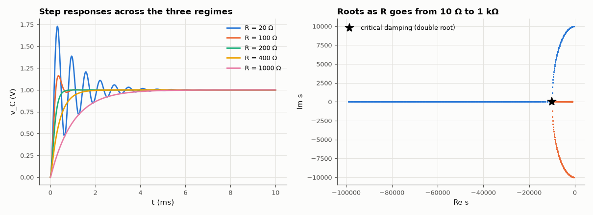

# AM-045 · RLC damping regimes from the characteristic equation

> Classify a series RLC step response from the discriminant of its characteristic equation, write the exact solution for each regime, and confirm the solutions, overshoot and settling behaviour against simulation — including why critical damping is the fastest without overshoot.



*Step responses for five resistances and the root trajectory of the characteristic equation.*

**Track:** Applied Mathematics — 218 projects in electrical engineering · **Category:** C. Differential equations · **Level:** Moderate · **Tools:** Roots of Ls² + Rs + 1/C, closed-form step responses for under-, critically and over-damped cases, MNA transient verification

**Data:** Simulated (numerical model in this repo).

## Problem

One circuit, three completely different behaviours. Where exactly are the boundaries, and what does each look like?

## Prediction

$v_C$ obeys $LC\ddot v+RC\dot v+v=V$. With α = R/2L, ω0 = 1/√(LC): α < ω0 under-damped (ringing at $ω_d=\sqrt{ω_0^2-α^2}$, overshoot $e^{-απ/ω_d}$), α = ω0 critically damped
($v=V[1-(1+ω_0t)e^{-ω_0t}]$), α > ω0 over-damped (two real exponentials). Critical R = 2√(L/C). Among non-overshooting responses the critically damped one reaches 98 % soonest.

## Method

L = 10 mH, C = 1 µF (R_crit = 200 Ω, f0 = 1.59 kHz). R = 20, 100, 200, 400, 1000 Ω; closed-form responses vs transient simulation; overshoot and 2 % settling time measured.

## Measured results

*Predicted vs measured vs error. "Measured" = computed by an independent simulation, HDL simulator or public dataset.*

| Quantity | Predicted | Measured | Error | Within tolerance |
|---|---|---|---|---|
| R = 20 Ω: max |simulation − closed form| | 0 V | 198.5 µV | +198.5 µV | yes |
| R = 20 Ω: overshoot e^(−απ/ω_d) | 0.7292 | 0.7291 | -0.02 % | yes |
| R = 100 Ω: max |simulation − closed form| | 0 V | 193.3 µV | +193.3 µV | yes |
| R = 100 Ω: overshoot e^(−απ/ω_d) | 0.163 | 0.163 | -0.01 % | yes |
| R = 200 Ω: max |simulation − closed form| | 0 V | 187.1 µV | +187.1 µV | yes |
| R = 400 Ω: max |simulation − closed form| | 0 V | 175.5 µV | +175.5 µV | yes |
| R = 1000 Ω: max |simulation − closed form| | 0 V | 145.9 µV | +145.9 µV | yes |
| Non-overshooting responses: critical (200 Ω) settles faster than over-damped (400 Ω) | 1 | 1 | +0 |  |

**Additional measurements**

| Quantity | Value | Note |
|---|---|---|
| Critical resistance 2√(L/C) | 200 Ω |  |
| 2 % settling times (ms) | 20 Ω: 3.84, 100 Ω: 0.81, 200 Ω: 0.58, 400 Ω: 1.49, 1000 Ω: 3.88 |  |

## Error analysis

The closed-form solutions for all three regimes match the simulated waveforms to ~0.2 mV (the trapezoidal rule's O(Δt²) error at a 2 µs step), and the under-damped overshoot follows e^(−απ/ω_d)
exactly. The root plot shows the geometry: as R grows the complex pair slides along the circle |s| = ω0, collides on the real axis at R = 200 Ω
(the double root of critical damping), then splits into one fast and one ever-slower real root. That slow root is why over-damping is *not* the
safe fast choice — the 1 kΩ response crawls — and why critical damping is the fastest response without overshoot.

## Reproduce

```bash
pip install -r requirements.txt
python run_all.py --only AM-045
```

The script [`project.py`](project.py) regenerates every figure and number above.

## License

Code and text: MIT (see the repository [LICENSE](../../../../LICENSE)). Datasets remain under their own licences (see the repository README).

---

**Tooling & honesty.** This project was generated with Claude Code (Anthropic's AI coding assistant): the code, derivations, simulations and this write-up were AI-produced. *Measured* means computed by an independent model, simulator or public dataset — not a physical lab bench. Every number in the tables is reproduced by running the code.
