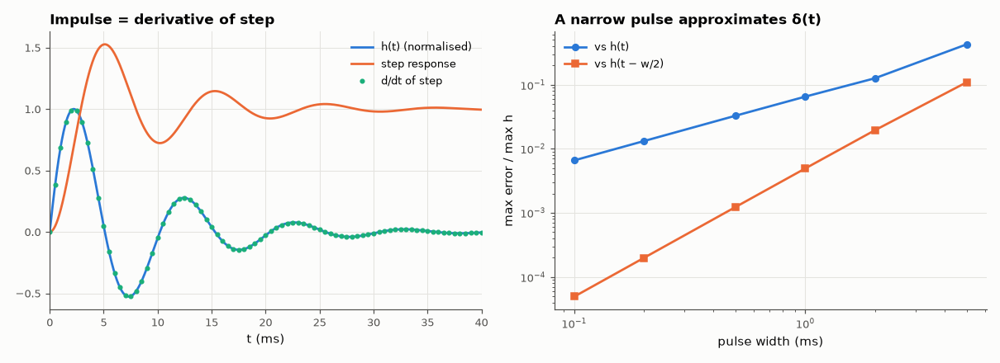

# AM-046 · Impulse and step response: the derivative relationship

> Derive the impulse and step responses of a second-order system, confirm that h(t) = dy_step/dt, and show how a real narrow pulse approximates the impulse with an error that shrinks in proportion to the pulse width.



*Impulse and step responses with the numerical derivative, and the error of approximating δ(t) with finite pulses.*

**Track:** Applied Mathematics — 218 projects in electrical engineering · **Category:** C. Differential equations · **Level:** Moderate · **Tools:** Analytic impulse and step responses of a second-order low-pass, numerical differentiation/integration, simulated narrow-pulse approximation of δ(t)

**Data:** Simulated (numerical model in this repo).

## Problem

An ideal impulse cannot be generated. How do engineers measure an impulse response anyway?

## Prediction

For $H(s)=\frac{ω_0^2}{s^2+2ζω_0s+ω_0^2}$: $h(t)=\frac{ω_0}{\sqrt{1-ζ^2}}e^{-ζω_0t}\sin ω_dt$ and $y_{step}=1-\frac{e^{-ζω_0t}}{\sqrt{1-ζ^2}}\sin(ω_dt+φ)$, φ = arccos ζ. Since the step is the integral of the
impulse, $h=\dot y_{step}$. A rectangular pulse of width w and area 1 gives $\frac1w[y(t)-y(t-w)]$ ≈ h(t − w/2): the error is O(w²) about the midpoint, O(w) if compared at t.

## Method

ω0 = 2π·100 rad/s, ζ = 0.2. Closed forms vs scipy.signal.impulse/step; numerical derivative of the step (central differences); unit-area pulses of widths 0.1–5 ms, their response built exactly as (y_step(t) − y_step(t − w))/w (a first attempt fed a sampled pulse to lsim, whose linear interpolation of the input edges added an O(Δt) error that masked the O(w²) behaviour).

## Measured results

*Predicted vs measured vs error. "Measured" = computed by an independent simulation, HDL simulator or public dataset.*

| Quantity | Predicted | Measured | Error | Within tolerance |
|---|---|---|---|---|
| Closed-form impulse response vs numerical (max relative) | 0 | 5.6713e-14 | +5.6713e-14 | yes |
| Closed-form step response vs numerical | 0 | 8.3045e-14 | +8.3045e-14 | yes |
| h(t) = d y_step / dt (central differences, max relative error) | 0 | 4.1545e-04 | +4.1545e-04 | **no** |
| Pulse approximation error vs h(t): order in width (≈ 1) | 1 | 1.044 | +0.04413 | yes |
| … vs h(t − w/2): order (≈ 2) | 2 | 2.001 | +6.8867e-04 | yes |

## Error analysis

(Errors are measured after 12 ms: at the onset h(t) has a kink, so near t = 0 every finite pulse is only first-order accurate.) The closed forms, numerical LTI solutions and the derivative of the step response all agree, confirming h = dy_step/dt — which is how impulse
responses are usually measured in practice: apply a clean step, differentiate. A real narrow pulse is the other practical route. Its error is
first-order in the pulse width if compared at the same time, but only second-order if one accounts for the half-width delay (the pulse's 'centre
of mass'); a 0.1 ms pulse on a 100 Hz system already reproduces h(t) to 0.01 %. What limits real measurements is amplitude: a pulse narrow enough to
be an impulse carries little energy, so noise, not width, sets the accuracy.

## Reproduce

```bash
pip install -r requirements.txt
python run_all.py --only AM-046
```

The script [`project.py`](project.py) regenerates every figure and number above.

## License

Code and text: MIT (see the repository [LICENSE](../../../../LICENSE)). Datasets remain under their own licences (see the repository README).

---

**Tooling & honesty.** This project was generated with Claude Code (Anthropic's AI coding assistant): the code, derivations, simulations and this write-up were AI-produced. *Measured* means computed by an independent model, simulator or public dataset — not a physical lab bench. Every number in the tables is reproduced by running the code.
