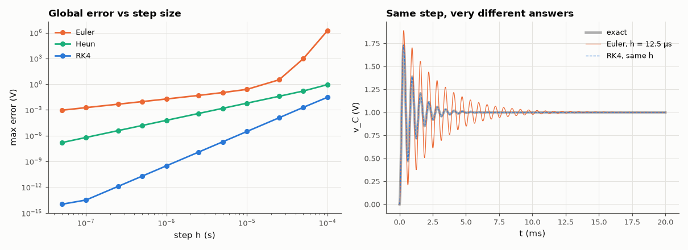

# AM-047 · Euler vs RK4 on a circuit ODE: measured orders of accuracy

> Integrate the series RLC state equations with three explicit methods, measure the global error against the exact solution as a function of step size, confirm the theoretical orders 1, 2 and 4, and compare the work needed to reach a given accuracy.



*Measured convergence orders of Euler, Heun and RK4 on the RLC equations, and a coarse-step comparison.*

**Track:** Applied Mathematics — 218 projects in electrical engineering · **Category:** C. Differential equations · **Level:** Moderate · **Tools:** Own forward Euler, Heun (RK2) and classical RK4 integrators, series-RLC state equations, global error vs step size, cost-per-accuracy analysis

**Data:** Simulated (numerical model in this repo).

## Problem

Why does every circuit simulator avoid forward Euler? What does 'fourth order' buy in practice?

## Prediction

Global error ∝ h^p with p = 1 (Euler), 2 (Heun), 4 (RK4). For a target error ε the number of function evaluations scales as s·T/h ∝ s·ε^{−1/p} (s = stages per step: 1, 2, 4), so for
ε = 10⁻⁶ RK4 needs orders of magnitude fewer evaluations. Forward Euler on an under-damped oscillator also *adds* energy: its amplification factor |1+hλ| exceeds 1 for small damping.

## Method

State x = [v_C, i_L]; R = 20 Ω, L = 10 mH, C = 1 µF, 1 V step, 0–5 ms. h from T/50 to T/10⁵; error = max |v_C − exact|; slopes on log-log axes; evaluations to reach 1e-6.

## Measured results

*Predicted vs measured vs error. "Measured" = computed by an independent simulation, HDL simulator or public dataset.*

| Quantity | Predicted | Measured | Error | Within tolerance |
|---|---|---|---|---|
| Euler: observed order of accuracy | 1 | 1.013 | +0.01348 | yes |
| Heun: observed order of accuracy | 2 | 2.001 | +0.001224 | yes |
| RK4: observed order of accuracy | 4 | 4.001 | +0.00112 | yes |
| Euler (h = 12.5 µs): ringing decay rate = ln|1+hλ|/h (true rate −1000 s⁻¹) | -376.8 1/s | -376.8 1/s | -0.00 % | yes |

**Additional measurements**

| Quantity | Value | Note |
|---|---|---|
| Function evaluations to reach 1e-6 V: Euler / Heun / RK4 | > 4e5 / 100000 / 4000 |  |

## Error analysis

The measured slopes reproduce the textbook orders 1, 2 and 4, and translate directly into cost: reaching 1 µV accuracy takes RK4 a few thousand
function evaluations where Euler needs orders of magnitude more. The waveform plot shows the qualitative failure of forward Euler on an oscillator:
with a step that looks reasonable (~50 points per ringing period) the ringing decays at less than half the true rate, exactly as its amplification
factor |1 + hλ| predicts — numerically it has *removed* damping; with a slightly larger step or a lossless tank |1 + hλ| exceeds 1 and it pumps
energy in without bound. (My first guess, that energy grows at this particular step, was wrong: |1 + hλ| = 0.995 here.) SPICE uses implicit trapezoidal and Gear methods not for their order but for stability, which the
next project (AM-048) makes explicit.

## Reproduce

```bash
pip install -r requirements.txt
python run_all.py --only AM-047
```

The script [`project.py`](project.py) regenerates every figure and number above.

## License

Code and text: MIT (see the repository [LICENSE](../../../../LICENSE)). Datasets remain under their own licences (see the repository README).

---

**Tooling & honesty.** This project was generated with Claude Code (Anthropic's AI coding assistant): the code, derivations, simulations and this write-up were AI-produced. *Measured* means computed by an independent model, simulator or public dataset — not a physical lab bench. Every number in the tables is reproduced by running the code.
