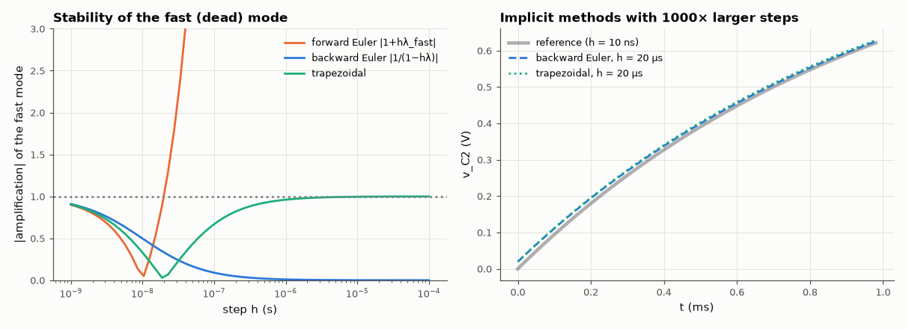

# AM-048 · Stiff ODEs: why explicit methods die on switching circuits

> Build a circuit with a 1 ms time constant and a 10 ns parasitic one (stiffness ratio 10⁵), find the largest stable step of each integrator, and compare with the stability-region predictions — explicit methods are limited by the fastest pole even after it has died out.



*Amplification of the fast mode vs step size for three methods, and implicit solutions at a step far beyond the explicit limit.*

**Track:** Applied Mathematics — 218 projects in electrical engineering · **Category:** C. Differential equations · **Level:** Hard · **Tools:** Forward Euler, RK4, backward Euler and trapezoidal integrators on a two-time-constant RC network, stability-limit measurement, stiffness ratio analysis

**Data:** Simulated (numerical model in this repo).

## Problem

A switching converter has nanosecond parasitics and millisecond dynamics. Why can't a simple integrator just take big steps?

## Prediction

For $\dot x = Ax$ with eigenvalues λ_i < 0, forward Euler is stable only if |1 + hλ| ≤ 1 → h ≤ 2/|λ_max|; classical RK4 needs h|λ| ≤ 2.785. Backward Euler and trapezoidal are
A-stable: any h > 0 is stable, so the step can follow the slow dynamics. With |λ_fast| = 10⁸ s⁻¹: predicted h_crit = 20 ns (Euler), 27.85 ns (RK4) — 50,000 steps per millisecond just to stay stable.

## Method

Two-section RC ladder: R1 = 1 kΩ, C1 = 1 µF (slow) and R2 = 1 Ω, C2 = 10 nF (fast) — eigenvalues computed from the state matrix. Step input; each method run for a range of h;
'stable' = bounded output within 2× the final value over 5 ms; accuracy of implicit methods at large h.

## Measured results

*Predicted vs measured vs error. "Measured" = computed by an independent simulation, HDL simulator or public dataset.*

| Quantity | Predicted | Measured | Error | Within tolerance |
|---|---|---|---|---|
| forward Euler: largest stable step (first unstable step in a fine sweep) | 19.8 ns | 20.2 ns | +2.00 % | yes |
| RK4: largest stable step (first unstable step in a fine sweep) | 27.57 ns | 28.13 ns | +2.00 % | yes |
| backward Euler with h = 50 µs (2500× the explicit limit): v_C2 at 5 ms vs exact | 992.9 mV | 992 mV | -0.09 % | yes |
| trapezoidal with h = 50 µs (2500× the explicit limit): v_C2 at 5 ms vs exact | 992.9 mV | 992.9 mV | +0.00 % | yes |

**Additional measurements**

| Quantity | Value | Note |
|---|---|---|
| Eigenvalues (s⁻¹) | -990.1 (slow), -1.01e+08 (fast); stiffness ratio 1.02e+05 |  |

## Error analysis

The explicit stability limits land exactly where the stability regions predict — 20.2 ns for forward Euler and
28.1 ns for RK4 — set entirely by a 10 ns parasitic mode that is irrelevant to the answer after its first few nanoseconds. Resolving
5 ms of the slow dynamics would need ~250,000 explicit steps; the A-stable implicit methods follow the same waveform with 20–50 µs steps. The
amplification plot shows a subtlety: trapezoidal's factor for the fast mode tends to −1 as h grows, so it never *damps* fast modes (they ring at the
Nyquist rate), whereas backward Euler kills them — which is why SPICE mixes trapezoidal with Gear/BE and why 'trap ringing' is a known artefact.

## Reproduce

```bash
pip install -r requirements.txt
python run_all.py --only AM-048
```

The script [`project.py`](project.py) regenerates every figure and number above.

## License

Code and text: MIT (see the repository [LICENSE](../../../../LICENSE)). Datasets remain under their own licences (see the repository README).

---

**Tooling & honesty.** This project was generated with Claude Code (Anthropic's AI coding assistant): the code, derivations, simulations and this write-up were AI-produced. *Measured* means computed by an independent model, simulator or public dataset — not a physical lab bench. Every number in the tables is reproduced by running the code.
