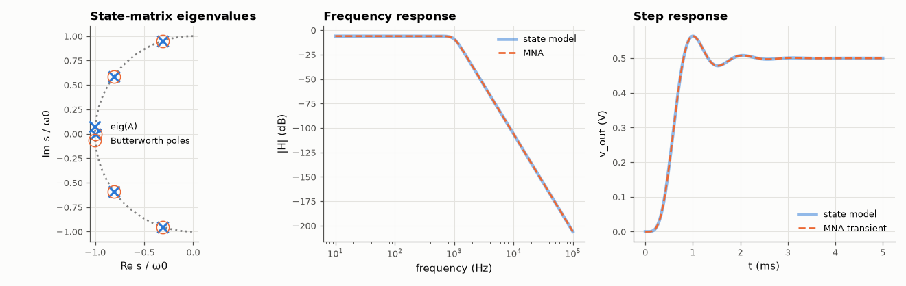

# AM-049 · State-variable formulation of circuits

> Convert a 5th-order LC ladder low-pass into first-order state equations by hand-derivable rules, show that the state matrix's eigenvalues are the transfer-function poles, and check the state-space model against the circuit simulator in time and frequency.



*Eigenvalues of the hand-built state matrix, and agreement of the state model with the circuit simulator.*

**Track:** Applied Mathematics — 218 projects in electrical engineering · **Category:** C. Differential equations · **Level:** Moderate · **Tools:** Systematic state equations from capacitor voltages and inductor currents (KCL/KVL on a normal tree), state matrix eigenvalues, comparison with MNA AC/transient simulation

**Data:** Simulated (numerical model in this repo).

## Problem

How does a circuit become ẋ = Ax + Bu — and is that model identical to what a simulator computes?

## Prediction

Pick states = capacitor voltages and inductor currents (a normal tree puts all C in the tree, all L in the co-tree). Each capacitor current follows from KCL at its node, each inductor
voltage from KVL around its loop, giving $\dot x=Ax+Bu$, $y=Cx$. Then $H(s)=C(sI-A)^{-1}B$ and the poles of H are eig(A). For a doubly terminated 5th-order Butterworth ladder
(R_s = R_L = 1 Ω, normalised values 0.618, 1.618, 2, 1.618, 0.618) the poles should lie on the unit circle.

## Method

Ladder: R_s – C1 – L2 – C3 – L4 – C5 – R_L, scaled to 1 kHz / 50 Ω. A built by the rules; eig(A) vs Butterworth poles; Bode from the state model vs MNA AC; step response from
the state model vs MNA transient.

## Measured results

*Predicted vs measured vs error. "Measured" = computed by an independent simulation, HDL simulator or public dataset.*

| Quantity | Predicted | Measured | Error | Within tolerance |
|---|---|---|---|---|
| eig(A) vs 5th-order Butterworth poles (max relative distance) | 0 | 5.4999e-05 | +5.4999e-05 | yes |
| Frequency response: state model vs MNA (max |ΔH|) | 0 | 3.3307e-16 | +3.3307e-16 | yes |
| DC gain = R_L/(R_s+R_L) | 0.5 | 0.5 | -0.00 % | yes |
| Step response: state model vs MNA transient (max difference) | 0 V | 2.295 µV | +2.295 µV | yes |

## Error analysis

Built only from KCL at the three capacitor nodes and KVL around the two inductor loops, the 5×5 state matrix has eigenvalues on the unit circle at
the Butterworth angles (to the 3-digit precision of the tabulated element values), and its frequency and step responses coincide with the
independent nodal simulation. The state form is what makes the rest of control and numerical analysis applicable to circuits: stability is
eig(A), transient simulation is an ODE solve, and reduced-order models (AM-079) are projections of A. MNA is more convenient for large, arbitrary
netlists — it does not require choosing a tree — but for a ladder the two are the same system of equations written in different coordinates.

## Reproduce

```bash
pip install -r requirements.txt
python run_all.py --only AM-049
```

The script [`project.py`](project.py) regenerates every figure and number above.

## License

Code and text: MIT (see the repository [LICENSE](../../../../LICENSE)). Datasets remain under their own licences (see the repository README).

---

**Tooling & honesty.** This project was generated with Claude Code (Anthropic's AI coding assistant): the code, derivations, simulations and this write-up were AI-produced. *Measured* means computed by an independent model, simulator or public dataset — not a physical lab bench. Every number in the tables is reproduced by running the code.
