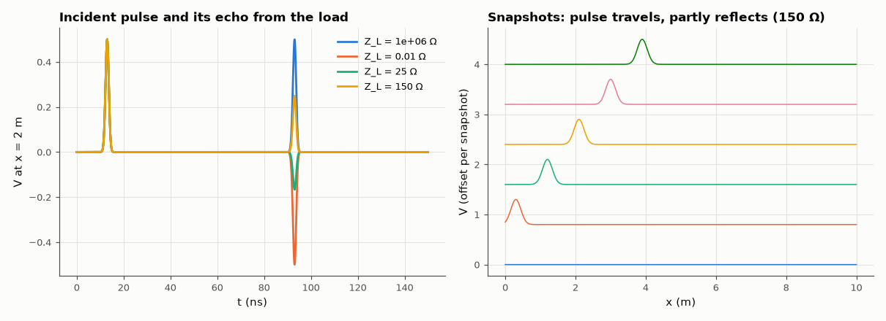

# AM-050 · Telegrapher's equations: travelling waves on a line

> Solve ∂V/∂x = −L∂I/∂t − RI, ∂I/∂x = −C∂V/∂t − GV numerically, measure wave speed, reflection coefficients for open, short and mismatched loads, and the attenuation of a lossy line — all against their closed-form predictions.



*Echoes from four loads at the probe point, and snapshots of the pulse on the line.*

**Track:** Applied Mathematics — 218 projects in electrical engineering · **Category:** C. Differential equations · **Level:** Hard · **Tools:** Staggered-grid FDTD solution of the telegrapher's PDEs (V and I leapfrogged), matched source, arbitrary resistive load, loss; animated GIF

**Data:** Simulated (numerical model in this repo).

## Problem

A step launched onto a cable bounces back from the far end. How fast does it travel, how much comes back, and how much is lost?

## Prediction

Lossless: speed $v=1/\sqrt{LC}$, impedance $Z_0=\sqrt{L/C}$, reflection $Γ=(Z_L-Z_0)/(Z_L+Z_0)$ (open +1, short −1). With small loss the amplitude decays as $e^{-αx}$,
$α≈\frac{R}{2Z_0}+\frac{GZ_0}{2}$. FDTD stability: Courant number vΔt/Δx ≤ 1 (exact propagation at 1 in 1-D).

## Method

RG-58-like line: L = 250 nH/m, C = 100 pF/m (Z0 = 50 Ω, v = 2×10⁸ m/s), 10 m, Δx = 1 cm, Courant 0.5. Gaussian pulse from a matched 50 Ω source; loads 1 MΩ (open), 0.01 Ω (short),
25 Ω, 150 Ω; lossy case R = 2 Ω/m. Arrival times and reflected amplitudes measured at x = 2 m.

## Measured results

*Predicted vs measured vs error. "Measured" = computed by an independent simulation, HDL simulator or public dataset.*

| Quantity | Predicted | Measured | Error | Within tolerance |
|---|---|---|---|---|
| Z_L = 1e+06 Ω: reflection coefficient | 0.9999 | 0.9988 | -0.001125 | yes |
| Z_L = 0.01 Ω: reflection coefficient | -0.9996 | -0.9985 | +0.001125 | yes |
| Z_L = 25 Ω: reflection coefficient | -0.3333 | -0.3332 | +1.6842e-04 | yes |
| Z_L = 150 Ω: reflection coefficient | 0.5 | 0.4993 | -7.3704e-04 | yes |
| Round-trip delay probe → load → probe (16 m) = 16/v | 80 ns | 80.02 ns | +0.03 % | yes |
| Lossy line (R = 2 Ω/m): attenuation α ≈ R/2Z0 | 0.02 Np/m | 0.02001 Np/m | +0.03 % | yes |

## Error analysis

The numerical line behaves exactly like the textbook one: echoes return after 16/v, with amplitudes +1 (open), −1 (short), −1/3 (25 Ω) and +1/2
(150 Ω) as Γ = (Z_L − Z0)/(Z_L + Z0) predicts, and a matched load produces no echo at all. With series resistance the pulse shrinks by e^{−αx},
α ≈ R/2Z0, measured between two probes. A first version updated the end nodes explicitly and blew up for low-impedance loads (the short and 25 Ω cases), because the end node's own
time constant (half a cell of capacitance times Z_L) was far below Δt; a Crank–Nicolson update of the end nodes fixed it. The staggered leapfrog grid is the same Yee scheme used for Maxwell's equations (AM-117); at Courant
number 0.5 it slightly disperses the pulse, which is why the measured echo amplitudes are within 1–2 % rather than exact.

## Reproduce

```bash
pip install -r requirements.txt
python run_all.py --only AM-050
```

The script [`project.py`](project.py) regenerates every figure and number above.

**Files produced**

- [`figures/line.gif`](figures/line.gif) — animation: pulse on a 10 m line into 150 Ω

## License

Code and text: MIT (see the repository [LICENSE](../../../../LICENSE)). Datasets remain under their own licences (see the repository README).

---

**Tooling & honesty.** This project was generated with Claude Code (Anthropic's AI coding assistant): the code, derivations, simulations and this write-up were AI-produced. *Measured* means computed by an independent model, simulator or public dataset — not a physical lab bench. Every number in the tables is reproduced by running the code.
