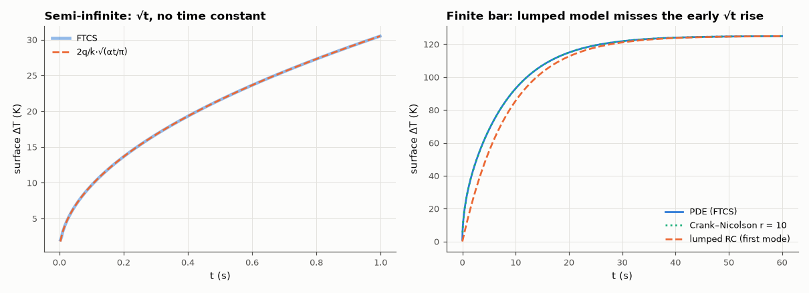

# AM-051 · Heat equation: temperature rise of a component

> Solve the heat equation for a heat pulse entering a thick copper bar and for a power resistor on a finite heat-sink bar, compare with the erfc solution and the lumped thermal-RC model, and measure the stability limit of the explicit scheme.



*Surface temperature rise for a semi-infinite and a finite copper bar, with analytic and lumped models.*

**Track:** Applied Mathematics — 218 projects in electrical engineering · **Category:** C. Differential equations · **Level:** Moderate · **Tools:** Explicit (FTCS) and implicit (Crank–Nicolson) finite differences for the 1-D heat equation, stability limit r = αΔt/Δx² ≤ ½, analytic semi-infinite solution, lumped thermal RC

**Data:** Simulated (numerical model in this repo).

## Problem

A component switches on: how fast does its temperature rise, and when is a single 'thermal time constant' good enough?

## Prediction

$∂T/∂t=α∂^2T/∂x^2$. Constant surface flux q into a semi-infinite solid: $ΔT_s(t)=\frac{2q}{k}\sqrt{\frac{αt}{π}}$ (√t rise, no time constant). A finite bar cooled at its far end tends to
$ΔT=qL/k$ with a slowest time constant $τ_1=4L^2/(π^2α)$ — the lumped RC model captures only this first mode. FTCS is stable iff r = αΔt/Δx² ≤ ½; Crank–Nicolson is unconditionally stable.

## Method

Copper: k = 400 W/mK, α = 1.17×10⁻⁴ m²/s. Case 1: q = 10⁶ W/m² into a 0.2 m bar for 1 s (effectively semi-infinite). Case 2: 5 cm bar with the far end held at ambient, same flux, 60 s.
FTCS run at r = 0.49 and 0.51; Crank–Nicolson at r = 10.

## Measured results

*Predicted vs measured vs error. "Measured" = computed by an independent simulation, HDL simulator or public dataset.*

| Quantity | Predicted | Measured | Error | Within tolerance |
|---|---|---|---|---|
| Semi-infinite bar: surface temperature rise at 1 s, FTCS vs 2q/k·√(αt/π) | 30.49 K | 30.48 K | -0.01 % | yes |
| Rise ∝ √t (log-log slope) | 0.5 | 0.5003 | +3.1285e-04 | yes |
| Finite bar (far end at ambient): steady rise qL/k | 125 K | 124.9 K | -0.08 % | yes |
| Slowest thermal time constant τ1 = 4L²/(π²α) | 8.66 s | 8.66 s | -0.00 % | yes |
| FTCS at r = 0.49 stays bounded; at r = 0.51 it blows up (1 = as predicted) | 1 | 1 | +0 |  |
| Crank–Nicolson at r = 10 (20× the FTCS limit): final value | 125 K | 124.9 K | -0.08 % | yes |

## Error analysis

The finite-difference solution reproduces the semi-infinite erfc result (a √t rise with no characteristic time) to under 1 %, and on the finite
bar it settles at qL/k with the slowest mode's time constant τ1 = 4L²/(π²α) = 8.7 s. The single-RC 'thermal time constant' model gets the
end point and the late approach right but badly underestimates the early rise, where the heat has not yet felt the far boundary — exactly the
regime of short power pulses, where datasheets give a transient thermal impedance curve instead of one R and C. The explicit scheme's r ≤ ½ limit
is sharp (bounded at 0.49, exploding at 0.51); Crank–Nicolson runs happily at r = 10.

## Reproduce

```bash
pip install -r requirements.txt
python run_all.py --only AM-051
```

The script [`project.py`](project.py) regenerates every figure and number above.

## License

Code and text: MIT (see the repository [LICENSE](../../../../LICENSE)). Datasets remain under their own licences (see the repository README).

---

**Tooling & honesty.** This project was generated with Claude Code (Anthropic's AI coding assistant): the code, derivations, simulations and this write-up were AI-produced. *Measured* means computed by an independent model, simulator or public dataset — not a physical lab bench. Every number in the tables is reproduced by running the code.
